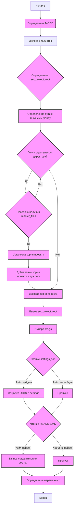

## Анализ кода `hypotez/src/endpoints/hypo69/small_talk_bot/header.py`

### 1. <алгоритм>

**Блок-схема:**

1.  **Начало**: Инициализация скрипта.
2.  **Определение `MODE`**: Устанавливается режим работы (`dev` по умолчанию).
    *   Пример: `MODE = 'dev'`
3.  **Импорт библиотек**: Импорт необходимых модулей (`sys`, `json`, `Version`, `Path`).
4.  **Определение `set_project_root`**:
    *   Находит корневую директорию проекта.
    *   Аргумент: `marker_files` (кортеж файлов для поиска корневой директории).
    *   1.  Определяет путь к текущему файлу.
        *   Пример: `__file__ = "/path/to/hypotez/src/endpoints/hypo69/small_talk_bot/header.py"`
    *   2.  Проходит по родительским директориям.
    *   3.  Если находит один из `marker_files`, устанавливает корень проекта.
        *   Пример: `marker_files` = ('pyproject.toml', 'requirements.txt', '.git')
        *   Путь: "/path/to/hypotez/", найден ".git", корень: "/path/to/hypotez/".
    *   4.  Добавляет корень проекта в `sys.path` (если его там нет).
    *   5.  Возвращает путь к корню проекта.
        *   Пример: `__root__ = "/path/to/hypotez/"`
5.  **Вызов `set_project_root`**: Устанавливает значение `__root__`.
6.  **Импорт `src.gs`**: Импортирует модуль `gs`.
7.  **Чтение `settings.json`**:
    *   Пытается открыть и прочитать `settings.json` из корня проекта.
        *   Путь: `/path/to/hypotez/src/settings.json`
    *   Если файл найден, загружает JSON в словарь `settings`.
    *   В случае ошибки `FileNotFoundError` или `json.JSONDecodeError` – пропускает.
8.  **Чтение `README.MD`**:
    *   Пытается открыть и прочитать `README.MD` из корня проекта.
        *   Путь: `/path/to/hypotez/src/README.MD`
    *   Если файл найден, читает его содержимое в переменную `doc_str`.
    *   В случае ошибки `FileNotFoundError` или `json.JSONDecodeError` – пропускает.
9.  **Определение переменных**:
    *   `__project_name__`: Из `settings`, по умолчанию `'hypotez'`.
    *   `__version__`: Из `settings`, по умолчанию ''.
    *   `__doc__`: Из `doc_str` (содержимое `README.MD`), если `doc_str` существует, иначе ''.
    *    `__details__`: Пустая строка.
    *   `__author__`: Из `settings`, по умолчанию ''.
    *   `__copyright__`: Из `settings`, по умолчанию ''.
    *   `__cofee__`: Из `settings` или строка с приглашением угостить разработчика кофе.
        *    Пример: `__cofee__ = "Treat the developer to a cup of coffee for boosting enthusiasm in development: https://boosty.to/hypo69"`
10. **Конец**: Завершение скрипта.

### 2. <mermaid>

**Анализ зависимостей `mermaid`:**

*   **`A` (Начало)**: Начальная точка скрипта.
*   **`B` (Определение MODE)**: Задает режим работы скрипта.
*   **`C` (Импорт библиотек)**: Импортирует необходимые библиотеки, такие как `sys`, `json`, `packaging.version.Version` и `pathlib.Path`.
*   **`D` (Определение `set_project_root`)**: Функция для поиска корневой директории проекта.
*   **`E` (Определение пути к текущему файлу)**: Получает абсолютный путь к текущему файлу.
*   **`F` (Поиск родительских директорий)**: Перебирает родительские директории.
*   **`G` (Проверка наличия `marker_files`)**: Проверяет, существуют ли маркерные файлы в текущей директории.
*   **`H` (Установка корня проекта)**: Устанавливает найденную директорию как корень проекта.
*   **`I` (Добавление корня проекта в `sys.path`)**: Добавляет корень проекта в список путей поиска модулей.
*   **`J` (Возврат корня проекта)**: Возвращает путь к корню проекта.
*   **`K` (Вызов `set_project_root`)**: Вызов функции `set_project_root`.
*   **`L` (Импорт `src.gs`)**: Импортирует модуль `src.gs`.
*   **`M` (Чтение `settings.json`)**: Чтение файла `settings.json`.
*   **`N` (Загрузка JSON в `settings`)**: Парсинг содержимого `settings.json`.
*   **`O` (Пропуск)**: Пропуск блока в случае ошибок.
*   **`P` (Чтение `README.MD`)**: Чтение файла `README.MD`.
*   **`Q` (Запись содержимого в `doc_str`)**: Запись содержимого `README.MD` в переменную.
*   **`R` (Пропуск)**: Пропуск блока в случае ошибок.
*   **`S` (Определение переменных)**: Определение переменных на основе загруженных данных.
*  **`T` (Конец)**: Завершающая точка скрипта.

### 3. <объяснение>

**Импорты:**

*   `sys`: Используется для работы с системными параметрами и функциями, включая добавление пути к проекту в `sys.path`.
*   `json`: Используется для работы с JSON файлами, такими как `settings.json`, для загрузки конфигурации.
*   `packaging.version.Version`: Используется для сравнения и манипулирования версиями (не используется в этом коде, но импортируется).
*   `pathlib.Path`: Используется для работы с путями к файлам и директориям, делая код более читаемым и кроссплатформенным.
*   `src.gs`: Модуль `gs` из пакета `src`, предположительно для общих настроек и путей проекта.

**Функции:**

*   **`set_project_root(marker_files)`**:
    *   **Аргументы**: `marker_files` (tuple) – кортеж имен файлов/директорий для поиска корня проекта.
    *   **Возвращаемое значение**: `Path` – путь к корневой директории проекта.
    *   **Назначение**: Находит корневую директорию проекта, начиная с директории текущего файла и поднимаясь вверх по иерархии директорий. Останавливается на первом найденном каталоге, содержащем любой из `marker_files`. Добавляет путь к корню в `sys.path`.
    *   **Пример**: Вызов `set_project_root(('pyproject.toml', 'requirements.txt', '.git'))` вернет путь к директории, в которой находится хотя бы один из этих файлов, например `Path('/path/to/hypotez')`.

**Переменные:**

*   `MODE`: (str) – Режим работы скрипта, по умолчанию 'dev'.
*   `__root__`: (Path) – путь к корневой директории проекта, полученный из `set_project_root()`.
*   `settings`: (dict) – словарь, содержащий настройки проекта из `settings.json`.
*   `doc_str`: (str) – строка, содержащая содержимое файла `README.MD`.
*   `__project_name__`: (str) – имя проекта, полученное из настроек (по умолчанию 'hypotez').
*   `__version__`: (str) – версия проекта, полученная из настроек.
*   `__doc__`: (str) – строка, содержащая содержимое документации.
*   `__details__`: (str) – строка для хранения подробностей о проекте.
*   `__author__`: (str) – автор проекта, полученный из настроек.
*   `__copyright__`: (str) – информация об авторских правах, полученная из настроек.
*   `__cofee__`: (str) - строка с приглашением угостить разработчика кофе.

**Классы:**

*   В этом файле нет явного определения классов.

**Потенциальные ошибки и области для улучшения:**

*   **Обработка ошибок чтения файлов:** В случае ошибок чтения `settings.json` и `README.MD`, код просто пропускает исключения. Это может скрыть проблемы при загрузке настроек или документации. Вместо пропускания, можно добавить логирование или выдачу предупреждения.
*   **Отсутствие `try...except` для  `sys.path.insert`:** хотя это и маловероятно, добавление  `try...except` можно сделать для избегания потенциальной ошибки.
*    **Отсутствие валидации `settings.json`**: После загрузки файла, данные не проверяются, что может привести к ошибкам, если  `settings.json` будет иметь некорректный формат.

**Цепочка взаимосвязей:**

*   `header.py` используется для определения основных констант и настроек проекта.
*   Он находит корневую директорию проекта с помощью `set_project_root()`.
*   Использует `src.gs` для получения глобальных путей и констант.
*   Загружает настройки из `settings.json` и документацию из `README.MD`.
*   Эти настройки используются другими частями проекта, включая имя проекта, версию и документацию.

Таким образом, `header.py` является ключевым компонентом, устанавливающим контекст для остального проекта, и определяет основные параметры, зависящие от конфигурации и структуры проекта.