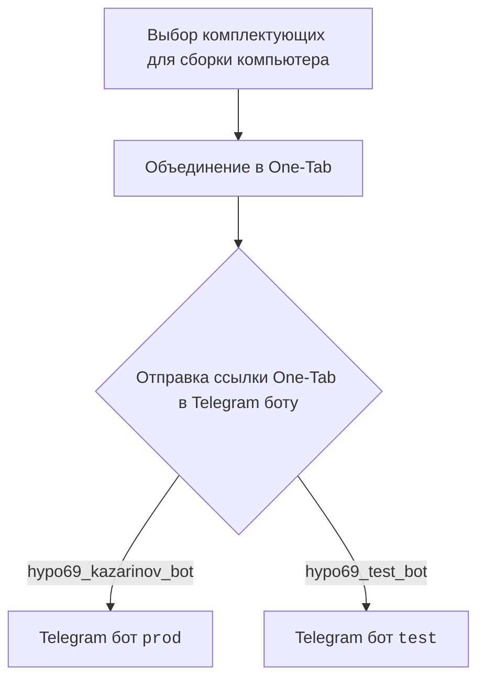
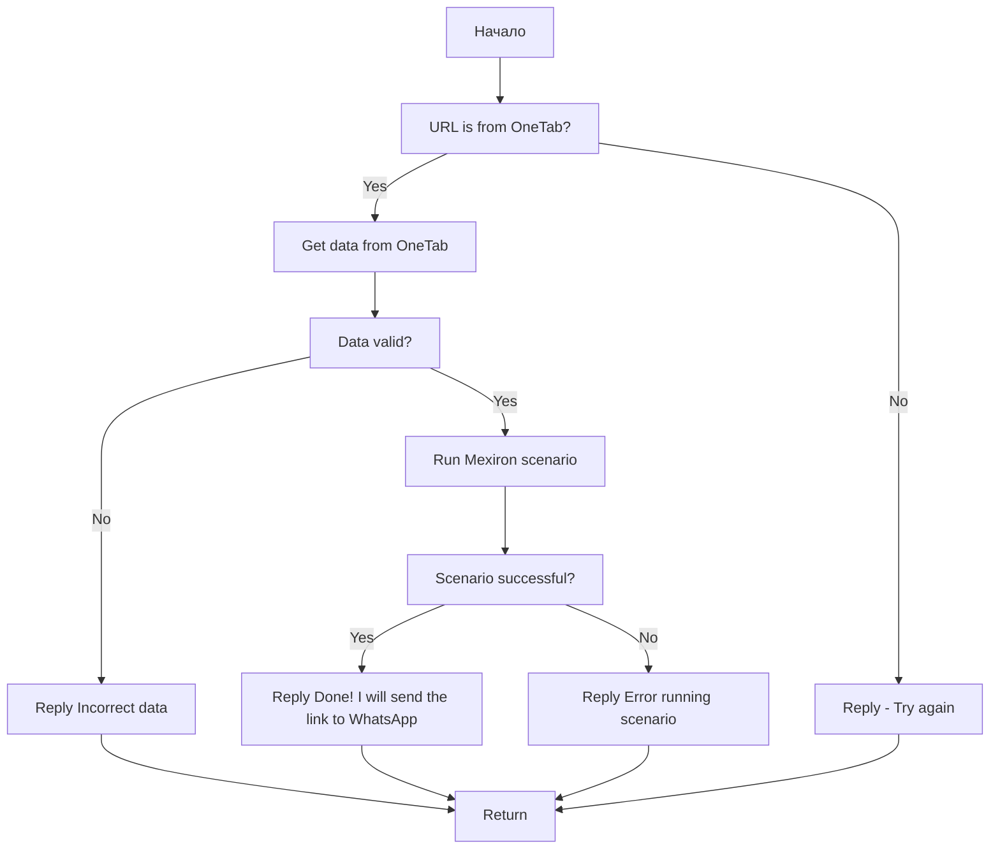

## АНАЛИЗ КОДА: `hypotez/src/endpoints/kazarinov/README.MD`

### 1. <алгоритм>

**Блок-схема работы `KazarinovTelegramBot`:**

1.  **Начало:** Пользователь выбирает комплектующие для сборки компьютера на одном из предложенных сайтов.
    *   *Пример*: Пользователь выбирает процессор, материнскую плату, видеокарту, ОЗУ и накопитель на сайте KSP.
2.  **Объединение в One-Tab:** Пользователь объединяет ссылки на выбранные комплектующие в One-Tab.
    *   *Пример*: Пользователь создает вкладку One-Tab, содержащую ссылки на все выбранные компоненты.
3.  **Отправка ссылки боту:** Пользователь отправляет ссылку на One-Tab в Telegram-бот.
    *   *Пример*: Пользователь копирует ссылку One-Tab и отправляет ее боту через Telegram.
4.  **Выбор бота:** Сообщение поступает либо в `prod` (`hypo69_kazarinov_bot`) либо в `test` (`hypo69_test_bot`) Telegram бот, в зависимости от окружения.
    *   *Пример*: Сообщение пользователя перенаправляется в тестового или продуктивного бота.

**Блок-схема обработки URL в боте:**

1.  **Начало:** Бот получает URL от пользователя.
    *   *Пример*: Бот получает ссылку на One-Tab, отправленную пользователем.
2.  **Проверка URL (OneTab?):** Бот проверяет, является ли URL ссылкой на One-Tab.
    *   *Пример*: Бот анализирует URL и проверяет, соответствует ли он формату ссылок One-Tab.
    *   **Да:** Если URL от One-Tab, то выполняется шаг 3.
    *   **Нет:** Если URL не от One-Tab, то выполняется шаг 4.
3.  **Получение данных из One-Tab:** Бот извлекает данные из URL One-Tab.
    *   *Пример*: Бот парсит веб-страницу One-Tab и получает список ссылок на товары.
4.  **Ответ - Попробуйте еще раз:** Бот возвращает пользователю сообщение с просьбой повторить ввод, так как URL не распознан как OneTab.
    *   *Пример*: "Извините, это не похоже на ссылку One-Tab, попробуйте еще раз".
5.  **Проверка данных (валидность?):** Бот проверяет, являются ли извлеченные данные корректными.
    *   *Пример*: Бот проверяет, что ссылки ведут на валидные страницы, и может распознать структуру данных.
    *   **Да:** Если данные валидные, то выполняется шаг 6.
    *   **Нет:** Если данные невалидные, то выполняется шаг 7.
6.  **Запуск сценария Mexiron:** Бот запускает сценарий обработки данных (генерация PDF).
    *   *Пример*: Бот запускает скрипт, который обрабатывает извлеченные данные, генерирует PDF файл, и подготавливает ссылку для отправки.
7.  **Ответ - Некорректные данные:** Бот отправляет сообщение пользователю о некорректных данных.
     *   *Пример*: "Извините, данные в ссылке некорректны. Проверьте и попробуйте еще раз."
8.  **Проверка сценария (успех?):** Бот проверяет, успешно ли завершился сценарий.
    *   *Пример*: Бот проверяет, был ли успешно создан PDF файл.
    *   **Да:** Если сценарий выполнен успешно, то выполняется шаг 9.
    *   **Нет:** Если сценарий завершился с ошибкой, то выполняется шаг 10.
9.  **Ответ - Готово:** Бот отправляет сообщение об успехе и сообщает, что ссылка на PDF будет отправлена в WhatsApp.
    *   *Пример*: "Отлично! Ссылка на PDF будет отправлена в WhatsApp".
10. **Ответ - Ошибка сценария:** Бот отправляет сообщение об ошибке во время выполнения сценария.
    *   *Пример*: "Извините, произошла ошибка во время генерации PDF файла. Пожалуйста, повторите запрос позже."
11. **Возврат:** Бот завершает обработку запроса.
     *   *Пример*: Процесс обработки запроса завершён.

### 2. <mermaid>

**Диаграмма процесса работы с One-Tab (клиентская часть):**

*   **Start:** Начало процесса, где пользователь выбирает комплектующие для ПК.
*   **Combine:** Объединение ссылок на выбранные компоненты в One-Tab.
*   **SendToBot:** Отправка ссылки One-Tab в Telegram-бот.
*   **ProdBot:** Продуктивный Telegram-бот (`hypo69_kazarinov_bot`).
*   **TestBot:** Тестовый Telegram-бот (`hypo69_test_bot`).

**Диаграмма обработки URL в боте (серверная часть):**

*   **Start:** Начало процесса обработки запроса от пользователя.
*   **CheckUrl:** Проверка, является ли URL ссылкой на One-Tab.
*   **GetData:** Извлечение данных из URL One-Tab.
*   **ReplyTryAgain:** Ответ пользователю с просьбой повторить ввод, если URL не распознан как OneTab.
*   **ValidateData:** Проверка валидности извлеченных данных.
*   **ReplyIncorrectData:** Ответ пользователю о некорректности данных.
*  **RunScenario:** Запуск сценария обработки данных (генерация PDF).
*   **CheckScenarioSuccess:** Проверка успешности выполнения сценария.
*   **ReplyDone:** Ответ пользователю об успешном выполнении и сообщении о отправке ссылки в WhatsApp.
*   **ReplyErrorScenario:** Ответ пользователю об ошибке во время выполнения сценария.
*   **Return:** Завершение процесса обработки запроса.

### 3. <объяснение>

**Импорты:**

В представленном коде нет явных импортов. Но подразумевается, что для реализации функциональности бота, необходимы библиотеки для работы с Telegram API, парсинга веб-страниц (например, `requests`, `BeautifulSoup`), создания PDF (например, `reportlab`), а также утилиты для работы со ссылками и строками, и возможно, `src.gs` для настроек, как указано в инструкции.

**Классы:**

*   `KazarinovTelegramBot`: Название подразумевает, что это класс, представляющий Telegram-бота. В описании нет явного определения класса, но понятно, что бот будет принимать ссылку One-Tab от пользователя, обрабатывать ее и запускать сценарий для создания PDF.
*  `BotHandler`: Название подразумевает класс, который обрабатывает сообщения от пользователя, проверяет корректность данных и запускает сценарий.

**Функции:**

В `README.MD` явно не описаны функции, но из контекста понятно, что будут как минимум следующие функции:

*   Функция для приема сообщения от пользователя в Telegram.
*   Функция для проверки URL на соответствие One-Tab.
*   Функция для извлечения данных с One-Tab.
*   Функция для проверки корректности данных.
*   Функция для запуска сценария Mexiron.
*   Функции для отправки ответов пользователю в Telegram.
*   Функция для отправки ссылки в WhatsApp.

**Переменные:**

В `README.MD` явно не определены переменные, но будут использоваться переменные:

*   `user_url`: URL, отправленный пользователем.
*   `one_tab_url`: URL от One-Tab.
*   `data`: Данные, извлеченные с One-Tab.
*   `pdf_link`: Ссылка на сгенерированный PDF файл.
*  `scenario_result`: Результат выполнения сценария Mexiron.

**Потенциальные ошибки и области для улучшения:**

*   Отсутствует явное описание обработки ошибок при извлечении данных с One-Tab, валидации данных и запуске сценария.
*   Нет обработки невалидных ссылок, не только не от One-Tab.
*  Нет явной обработки ошибок при отправке сообщений в Telegram.
*   Нет обработки ошибок при отправке сообщения в WhatsApp.
*   Не описано где именно и как будет храниться и отправляться ссылка на WhatsApp, это должно быть вынесено в отдельную логическую единицу.
*   Нет описания того, что происходит при ошибке во время работы бота, как он перезапускается, и как это отслеживается.
*  Нет подробностей о том, как именно будет выполняться сценарий Mexiron, где он определен и какие данные он принимает и выдаёт.
*   Нет детального описания того как настроен `prod` и `test` боты, и какие у них отличия, кроме названия.
*  Нет описания механизма `Return` в контексте кода.

**Цепочка взаимосвязей с другими частями проекта:**

*   Связь с `src.endpoints.kazarinov.kazarinov_bot.md`: Этот файл, судя по ссылке в конце документа, будет содержать реализацию Telegram-бота, который описан в текущем файле.
*   Связь с `src.endpoints.kazarinov.scenarios.README.MD`: Этот файл, судя по ссылке, описывает сценарии обработки данных, которые запускаются ботом, а именно сценарий Mexiron.
*   Потенциальная связь с `src.gs` (глобальные настройки): Настройки проекта могут быть использованы для Telegram API токенов, путей к файлам и другим параметрам конфигурации.
*   Потенциальная связь с `header.py`, который определяет корень проекта (как указано в инструкции).