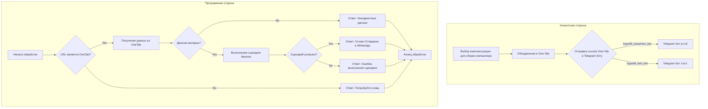

# Анализ кода `README.MD` из `src/endpoints/kazarinov`

## <алгоритм>

**Общее описание:**
Данный файл README.MD описывает работу модуля `src.endpoints.kazarinov`, который отвечает за функциональность бота Kazarinov, предназначенного для сборки компьютеров и обработки ссылок One-Tab. Модуль состоит из двух основных частей: клиентской стороны (логика взаимодействия пользователя с ботом) и программной части (логика обработки запросов).

**Клиентская сторона:**

1.  **`Start`**: Пользователь выбирает комплектующие для сборки компьютера на веб-сайтах (например, из списка, приведенного в начале файла: `https://one-tab.co.il`, `https://morlevi.co.il`, и т.д.).
    *   **Пример:** Пользователь открывает несколько вкладок в браузере с выбранными компонентами.
2.  **`Combine`**: Пользователь объединяет выбранные вкладки в One-Tab (онлайн-сервис, позволяющий сохранять и делиться наборами вкладок).
    *   **Пример:** Пользователь использует расширение One-Tab в браузере для сохранения всех открытых вкладок в виде одной ссылки.
3.  **`SendToBot`**: Пользователь отправляет ссылку One-Tab в Telegram-бота.
    *   **Пример:** Пользователь копирует ссылку One-Tab и вставляет ее в чат с Telegram ботом.
4.  **`ProdBot`/`TestBot`**: Бот обрабатывает запрос в зависимости от того, какой бот используется (`hypo69_kazarinov_bot` для production, `hypo69_test_bot` для тестирования).
    *   **Пример:** Если пользователь отправил ссылку в `@hypo69_kazarinov_bot`, запрос пойдет в `ProdBot`.

**Программная сторона (логика обработки запроса):**

1.  **`Start`**:  Начало обработки запроса.
    *   **Пример:** Пользователь отправляет сообщение с ссылкой One-Tab боту.
2.  **`URL is from OneTab?`**: Проверка, является ли предоставленная ссылка ссылкой One-Tab.
    *   **Пример:** Проверка, начинается ли URL с `https://one-tab.co.il` или подобных (возможна более сложная валидация).
3.  **`Get data from OneTab`**: Если ссылка является ссылкой One-Tab, извлекаются данные.
    *   **Пример:** Загрузка JSON данных, содержащихся по ссылке One-Tab.
4.  **`Reply - Try again`**: Если ссылка не является ссылкой One-Tab, бот отправляет сообщение об ошибке и просит повторить попытку.
    *   **Пример:** Сообщение "Пожалуйста, отправьте ссылку One-Tab".
5.  **`Data valid?`**: Проверка, что извлеченные данные валидны (содержат необходимую информацию).
    *   **Пример:** Проверка JSON данных на соответствие ожидаемой структуре (наличие цен, названий и т.д.).
6.  **`Reply Incorrect data`**: Если данные невалидны, бот отправляет сообщение об ошибке.
    *   **Пример:** Сообщение "Некорректные данные в ссылке One-Tab".
7.  **`Run Mexiron scenario`**: Если данные валидны, запускается сценарий Mexiron для обработки данных.
    *   **Пример:** Вызов функции, которая обрабатывает полученные данные и создает необходимый PDF документ.
8.  **`Scenario successful?`**: Проверка, успешно ли выполнился сценарий Mexiron.
    *   **Пример:** Проверка возвращаемого значения функции, отвечающей за сценарий.
9.  **`Reply Done! I will send the link to WhatsApp`**: Если сценарий выполнен успешно, бот отправляет сообщение об успехе и о том, что ссылка будет отправлена в WhatsApp (предположительно через другого бота).
    *   **Пример:** Сообщение "Готово! Отправляю ссылку в WhatsApp".
10. **`Reply Error running scenario`**: Если сценарий не выполнен, бот отправляет сообщение об ошибке.
     *   **Пример:** Сообщение "Ошибка при выполнении сценария".
11. **`Return`**: Возврат к ожиданию следующего запроса.

## <mermaid>

**Объяснение диаграммы `mermaid`:**

Диаграмма состоит из двух частей, каждая из которых представлена в виде `subgraph`. 

- **Клиентская сторона**:
    - `StartClient`: Начало процесса с выбора комплектующих.
    - `Combine`: Соединение вкладок в One-Tab.
    - `SendToBot`: Отправка ссылки в Telegram бот.
    - `ProdBot`/`TestBot`: Разделение потока сообщений в зависимости от environment (prod или test).
- **Программная сторона**:
    - `StartProcessing`: Начало обработки запроса.
    - `IsOneTabURL`: Проверка, является ли URL ссылкой One-Tab.
    - `GetDataFromOneTab`: Получение данных из One-Tab.
    - `ReplyTryAgain`: Ответ об ошибке при неверном URL.
    - `IsDataValid`: Проверка валидности полученных данных.
    - `ReplyIncorrectData`: Ответ об ошибке при невалидных данных.
    - `RunMexironScenario`: Запуск сценария Mexiron.
    - `IsScenarioSuccessful`: Проверка успешности сценария.
    - `ReplyDone`: Ответ об успехе с последующей отправкой в WhatsApp.
    - `ReplyError`: Ответ об ошибке выполнения сценария.
    - `EndProcessing`: Конец обработки запроса.

**Зависимости:**

В диаграмме показаны зависимости между блоками кода, которые описывают логику работы системы. Зависимостей от внешних импортов (библиотек или модулей)  диаграмма не отображает. Вместо этого показаны переходы между этапами обработки пользовательского запроса.

## <объяснение>

**Импорты:**
В данном файле `README.md` нет импортов Python. Этот файл является документацией и описывает логику работы, а не содержит исполняемый код. Зависимости от модулей можно будет увидеть в файле `kazarinov_bot.md`, который указан как "Next" в README.MD.

**Классы:**

В файле `README.md` не описаны какие-либо классы. Классы, вероятно, будут описаны в файле `kazarinov_bot.md` или связанных файлах, которые  обрабатывают логику работы Telegram бота.
**Функции:**

В файле `README.md` не описаны конкретные функции, однако из диаграммы `mermaid` можно предположить, что в проекте существуют такие функции:

-   `check_url_is_onetab(url)` - Проверяет, является ли URL ссылкой One-Tab.
    -   **Аргументы**: `url` - строка, представляющая URL.
    -   **Возвращаемое значение**: Boolean (true, если URL является ссылкой One-Tab; иначе false)
-   `get_data_from_onetab(url)` - Извлекает данные из One-Tab по предоставленному URL.
    -   **Аргументы**: `url` - строка, представляющая URL One-Tab.
    -   **Возвращаемое значение**: Данные в виде JSON/словаря или None, если данные не удалось получить.
-   `validate_data(data)` - Проверяет валидность данных, полученных из One-Tab.
    -   **Аргументы**: `data` - данные, полученные из One-Tab.
    -   **Возвращаемое значение**: Boolean (true, если данные валидны; иначе false).
-   `run_mexiron_scenario(data)` - Выполняет сценарий Mexiron с предоставленными данными.
    -   **Аргументы**: `data` - данные, полученные из One-Tab.
    -   **Возвращаемое значение**: Boolean (true, если сценарий выполнен успешно; иначе false).

**Переменные:**
В данном файле `README.md` не описаны переменные, но предполагаются такие переменные в коде:
- `url`: Строка (String) - URL, введенный пользователем.
- `data`: (JSON/Словарь) Данные, извлеченные из One-Tab
- `result`: Boolean/String результат выполнения сценария

**Потенциальные ошибки и области для улучшения:**

1.  **Обработка ошибок:** Диаграмма не показывает подробную обработку ошибок на каждом шаге. Важно реализовать логику обработки исключений, например, в функциях `get_data_from_onetab` или `run_mexiron_scenario`, чтобы бот мог корректно реагировать на неожиданные ситуации.
2.  **Формат данных:** Не указан формат данных, который ожидает сценарий Mexiron. Следует явно определить и документировать структуру данных для `data`.
3.  **Отправка в WhatsApp:** Механизм отправки ссылки в WhatsApp не описан. Нужно описать взаимодействие с WhatsApp API или другого бота для отправки.
4. **Валидация URL**: В проверке `URL is from OneTab?` стоит более детально валидировать URL, так как может не ограничиться проверкой только `https://one-tab.co.il`.

**Взаимосвязи с другими частями проекта:**

-   **`kazarinov_bot.md`**: Файл `kazarinov_bot.md`, упоминаемый в конце, является следующим шагом в описании и, вероятно, содержит описание конкретной реализации Telegram бота.
-   **`scenarios/README.MD`**: Файл `scenarios/README.MD`, также упоминаемый в конце, описывает сценарии, которые выполняются модулем Mexiron. Этот модуль можно рассматривать как независимый от Telegram Bot, но интегрированный в проект.

В целом, файл `README.md` предоставляет хорошее общее понимание процесса работы бота Kazarinov. Для более детального анализа нужно рассмотреть файлы `kazarinov_bot.md` и `scenarios/README.MD`.