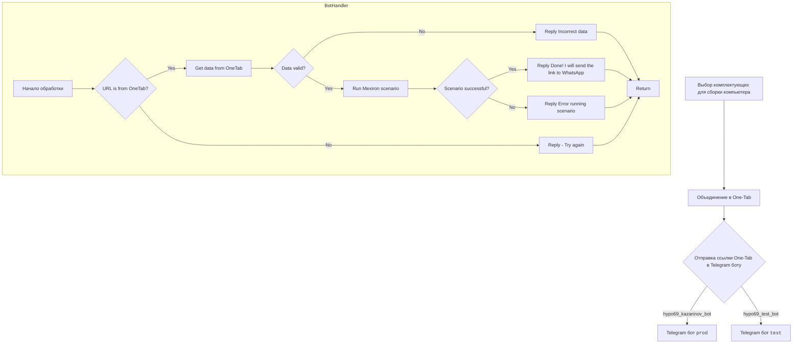

## ИНСТРУКЦИЯ:

Анализируй предоставленный код подробно и объясни его функциональность. Ответ должен включать три раздела:

1.  **<алгоритм>**: Опиши рабочий процесс в виде пошаговой блок-схемы, включая примеры для каждого логического блока, и проиллюстрируй поток данных между функциями, классами или методами.
2.  **<mermaid>**: Напиши код для диаграммы в формате `mermaid`, проанализируй и объясни все зависимости,
    которые импортируются при создании диаграммы.
    **ВАЖНО!** Убедитесь, что все имена переменных, используемые в диаграмме `mermaid`,
    имеют осмысленные и описательные имена. Имена переменных вроде `A`, `B`, `C`, и т.д., не допускаются!

    **Дополнительно**: Если в коде есть импорт `import header`, добавьте блок `mermaid` flowchart, объясняющий `header.py`:
    ```mermaid
    flowchart TD
        Start --> Header[<code>header.py</code><br> Determine Project Root]

        Header --> import[Import Global Settings: <br><code>from src import gs</code>]
    ```

3.  **<объяснение>**: Предоставьте подробные объяснения:
    *   **Импорты**: Их назначение и взаимосвязь с другими пакетами `src.`.
    *   **Классы**: Их роль, атрибуты, методы и взаимодействие с другими компонентами проекта.
    *   **Функции**: Их аргументы, возвращаемые значения, назначение и примеры.
    *   **Переменные**: Их типы и использование.
    *   Выделите потенциальные ошибки или области для улучшения.

Дополнительно, постройте цепочку взаимосвязей с другими частями проекта (если применимо).

Это обеспечивает всесторонний и структурированный анализ кода.
## Формат ответа: `.md` (markdown)
**КОНЕЦ ИНСТРУКЦИИ**

## <алгоритм>

1. **Начало процесса:** Пользователь начинает с выбора комплектующих для сборки компьютера. (Пример: Выбор материнской платы, процессора, оперативной памяти и т.д.)
2.  **Объединение в One-Tab:** Выбранные комплектующие объединяются в ссылку One-Tab. (Пример: Браузерное расширение OneTab позволяет сохранить все открытые вкладки в одну ссылку.)
3.  **Отправка ссылки боту:** Ссылка One-Tab отправляется в Telegram-бота.  Существует два бота - `prod` (продакшн) и `test` (тест), в зависимости от того, к какому боту обратился пользователь, ссылка будет отправлена либо в `hypo69_kazarinov_bot`  либо в `hypo69_test_bot`.
4.  **Проверка URL:** Бот проверяет, является ли полученный URL ссылкой из One-Tab. (Пример: Проверка домена URL на соответствие домену One-Tab). Если нет, то пользователю отправляется ответ с просьбой попробовать еще раз.
5.  **Извлечение данных:** Если URL является ссылкой из One-Tab, бот извлекает данные со страницы. (Пример: Получение списка вкладок из One-Tab).
6.  **Проверка данных:** Бот проверяет корректность полученных данных. (Пример: Проверка, что данные соответствуют ожидаемому формату). Если данные не корректны, бот отправляет сообщение об ошибке.
7.  **Запуск сценария Mexiron:** Если данные корректны, бот запускает сценарий Mexiron для обработки данных. (Пример: Сценарий Mexiron может формировать PDF файл из списка комплектующих.)
8. **Проверка выполнения сценария:** Бот проверяет, успешно ли выполнился сценарий. Если сценарий выполнился успешно, то бот отправляет сообщение пользователю об успехе и о том, что ссылка будет отправлена в WhatsApp. Если нет, то отправляется сообщение об ошибке.
9. **Завершение:** Вне зависимости от результата, процесс завершается.

## <mermaid>



## <объяснение>

**Общее описание:**

Файл `README.MD` в `src/endpoints/kazarinov/` описывает процесс взаимодействия пользователя с Telegram-ботом для создания PDF-отчетов на основе ссылок One-Tab. Основная задача - автоматизировать процесс преобразования списка комплектующих, сохраненных в One-Tab, в PDF отчет через Mexiron, с последующей отправкой ссылки на этот PDF пользователю.

**Диаграмма `Client side (Kazarinov)`:**

Представляет взаимодействие пользователя с ботом:

*   **Выбор комплектующих для сборки компьютера:** Пользователь выбирает комплектующие для своего компьютера.
*   **Объединение в One-Tab:** Пользователь объединяет открытые страницы с товарами в одну ссылку One-Tab.
*   **Отправка ссылки One-Tab в Telegram боту:** Пользователь отправляет ссылку One-Tab одному из двух ботов:
    *   `hypo69_kazarinov_bot`: продакшн бот.
    *   `hypo69_test_bot`: тестовый бот.
*   **`ProdBot` и `TestBot`:** Обозначают Telegram-ботов, которые обрабатывают запросы пользователей.

**Диаграмма `Code side`:**

Описывает логику обработки запроса внутри бота:

*   **Start:** Начало обработки запроса от пользователя.
*   **URL is from OneTab?**: Проверка, является ли полученный URL ссылкой One-Tab.
*   **Get data from OneTab**: Извлечение данных со страницы One-Tab.
*   **Reply - Try again**: Отправка сообщения пользователю, если URL не является ссылкой One-Tab.
*   **Data valid?**: Проверка корректности извлеченных данных.
*   **Reply Incorrect data**: Отправка сообщения об ошибке, если данные некорректны.
*   **Run Mexiron scenario**: Запуск сценария Mexiron для обработки данных.
*   **Scenario successful?**: Проверка, успешно ли выполнен сценарий.
*   **Reply Done! I will send the link to WhatsApp**: Сообщение пользователю об успешном выполнении и последующей отправке ссылки в WhatsApp.
*   **Reply Error running scenario**: Сообщение об ошибке при выполнении сценария.
*   **Return**: Завершение обработки запроса.

**Зависимости и взаимодействие:**

В описании нет явных импортов, но исходя из контекста:
*   Бот, вероятно, использует библиотеки для работы с Telegram API (например, `python-telegram-bot`).
*   Также используется какой-то API для работы с One-Tab, либо парсится веб-страница One-Tab.
*   Внутри Mexiron Scenario вероятно используется библиотека для создания PDF.
*   Для отправки сообщений в WhatsApp вероятно используется какой-то API.

**Потенциальные ошибки и области для улучшения:**

*   **Обработка ошибок:** Неявно обрабатываются ошибки. Желательно добавить более детальное логирование и обработку исключений, особенно при извлечении данных из One-Tab и при запуске Mexiron.
*   **Проверка данных:** Важно валидировать данные более тщательно, чтобы избежать непредсказуемых ситуаций при запуске Mexiron.
*  **Асинхронность**: Бот должен работать асинхронно, чтобы не блокировать обработку других запросов.
*   **Конфигурация:** Желательно вынести настройки, такие как API-ключи, в отдельный файл конфигурации.
*   **Мониторинг:** Не хватает мониторинга состояния работы бота.

**Взаимосвязь с другими частями проекта:**

*   Данный endpoint является частью модуля `endpoints` в проекте `hypo`.
*   Функциональность `mexiron` вынесена в модуль `scenarios`.
*   Возможна интеграция с другими частями проекта через глобальные переменные (`gs`) и общую конфигурацию.

**Цепочка взаимосвязей:**

1.  Пользователь взаимодействует с Telegram-ботом.
2.  Бот получает ссылку One-Tab.
3.  Бот извлекает данные со страницы One-Tab.
4.  Бот передает данные в Mexiron scenario.
5.  Mexiron scenario создает PDF отчет.
6.  Бот отправляет ссылку на PDF отчет пользователю.