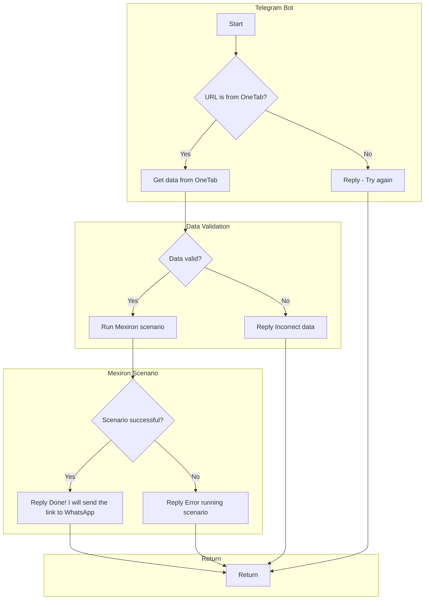

```MD
# Анализ кода `kazarinov/README.MD`

## <input code>

```
`KazarinovTelegramBot`
- https://one-tab.co.il
- https://morlevi.co.il
- https://grandavance.co.il
- https://ivory.co.il
- https://ksp.co.il
--------
`BotHandler`

На стороне клиента:
- выбор комплектующих для сборки компьютера -> объединение в one-tab -> отправка ссыли `one-tab` телеграм боту (`hypo69_kazarinov_bot` - prod or `hypo69_test_bot`) ->
На стороне кода:
- `kazarinov_bot.handle_message()` -> `kazarinov.scenarios.run_scenario()`:

```mermaid
flowchart TD
    A[Start] --> B{URL is from OneTab?}\
    B -->|Yes| C[Get data from OneTab]\
    B -->|No| D[Reply - Try again]\
    C --> E{Data valid?}\
    E -->|No| F[Reply Incorrect data]\
    E -->|Yes| G[Run Mexiron scenario]\
    G --> H{Scenario successful?}\
    H -->|Yes| I[Reply Done! I will send the link to WhatsApp]\
    H -->|No| J[Reply Error running scenario]\
    F --> K[Return]\
    I --> K[Return]\
    D --> K[Return]\
    J --> K[Return]
```
```

## <algorithm>

**Пошаговая блок-схема:**

1. **Старт (A):** Процесс начинается.
2. **Проверка источника URL (B):** Проверяется, является ли полученный URL ссылкой с сайта OneTab.
   * **Да (Yes):** Переходим к шагу 3.
   * **Нет (No):** Отправляем ответ пользователю "Попробуйте еще раз" (D) и завершаем процесс (K).
3. **Получение данных с OneTab (C):**  Извлекаются данные из предоставленной ссылки OneTab. (Пример:  информация о комплектующих).
4. **Проверка валидности данных (E):** Проверяется, что полученные данные корректны (например, соответствуют ожидаемому формату или содержат необходимую информацию).
   * **Да (Yes):** Переходим к шагу 5.
   * **Нет (No):** Отправляем ответ пользователю "Неверные данные" (F) и завершаем процесс (K).
5. **Запуск сценария Mexiron (G):** Используя полученные данные, запускается сценарий Mexiron, который, предположительно, обрабатывает данные и выполняет необходимые действия.
6. **Проверка успеха сценария (H):** Проверяется, завершился ли сценарий Mexiron успешно.
   * **Да (Yes):** Отправляем ответ пользователю "Готово! Я отправлю ссылку в WhatsApp" (I) и завершаем процесс (K).
   * **Нет (No):** Отправляем ответ пользователю "Ошибка при выполнении сценария" (J) и завершаем процесс (K).

## <mermaid>



## <explanation>

**Импорты:**  Нет импортов в предоставленном коде-фрагменте. Импорты находятся в других файлах (`src.*`).  Для обработки сообщений телеграм-бота и работы со сценариями, вероятно, необходимы импорты из соответствующих модулей (Telegram API, сценарии Mexiron).

**Классы:**
* `KazarinovTelegramBot`: Предполагаемый класс для работы с телеграм-ботом.  Необходимо, чтобы он умел обрабатывать сообщения от пользователя.
* `BotHandler`: Вероятно, класс, ответственный за логику обработки сообщений бота.

**Функции:**
* `handle_message()`: Функция внутри класса `BotHandler`. Обрабатывает входящие сообщения, вызывает сценарий Mexiron. 
* `run_scenario()`: Функция внутри `kazarinov.scenarios`. Выполняет сценарий обработки данных из OneTab.

**Переменные:**
- `URL`: Строка, хранящая URL-адрес.
- Данные, извлеченные из OneTab.

**Возможные ошибки и улучшения:**

* Не указан тип данных, используемых для хранения и передачи данных.  Необходимо определить форматы данных (`JSON`, `XML`, `строка`).
* Не описана схема обработки ошибок в случае сбоя запросов к OneTab. 
* Отсутствует описание структуры данных сценария Mexiron.
* Не указано, как передаются данные между `handle_message()` и `run_scenario()`.

**Взаимосвязи с другими частями проекта:**

* `kazarinov.scenarios`: Содержит код для реализации сценариев.
* Возможно, зависимость от библиотеки Telegram API для взаимодействия с ботом.
* Вероятно, зависимость от библиотеки для парсинга URL (или других источников данных) и валидации данных.

**Дополнительные замечания:**

* Блок-схема и диаграмма Mermaid иллюстрируют логику обработки запросов, но не показывают детали реализации (`каким образом` происходит извлечение данных, валидация и запуск сценария).
* Необходимо больше информации о структуре проекта, чтобы полностью понять взаимодействие модулей.