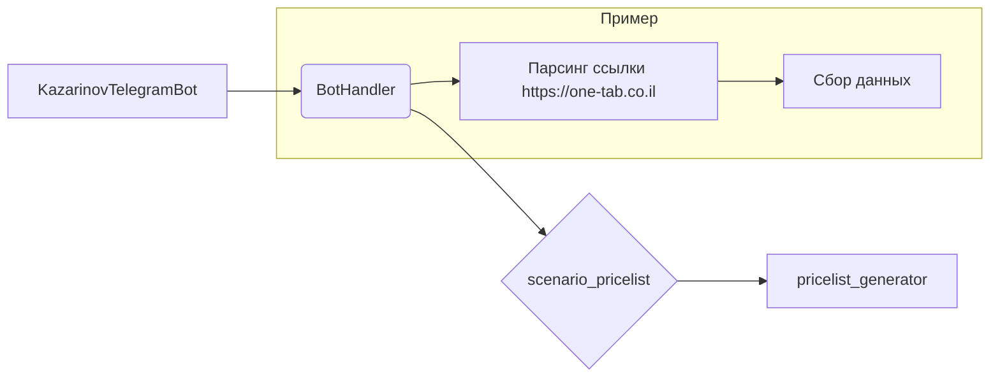

# Анализ кода `kazarinov/src/endpoints/kazarinov/README.MD`

## <input code>

```
KazarinovTelegramBot`
- https://one-tab.co.il
- https://morlevi.co.il
- https://grandavance.co.il
- https://ivory.co.il
- https://ksp.co.il 
-------- 
`BotHandler` 
- парсит линки


bot -> handler -> scenario_pricelist -> pricelist_generator
```

## <algorithm>

К сожалению, предоставленный код представляет собой не код, а текстовое описание архитектуры бота.  Пошаговую блок-схему создать невозможно, так как нет кода.  Описание архитектуры указывает на следующие компоненты:

1. **`KazarinovTelegramBot`**: Вероятно, сам бот Telegram, отвечающий за обработку входящих сообщений.
2. **`BotHandler`**: Обработчик, который парсит ссылки, полученные от бота.
3. **`scenario_pricelist`**: Компонент, который формирует сценарии ценников.
4. **`pricelist_generator`**: Компонент, генерирующий сами списки цен.

Взаимодействие происходит в следующей последовательности:

* Telegram бот (`KazarinovTelegramBot`) получает сообщение с ссылками.
* `BotHandler` обрабатывает полученные ссылки.
* `scenario_pricelist` анализирует ссылки и формирует соответствующие сценарии.
* `pricelist_generator` использует сценарии, чтобы сгенерировать конкретные списки цен.

Пример: Пользователь отправляет боту ссылки на сайты. `BotHandler` парсит эти ссылки. `scenario_pricelist` определяет, какие данные нужно собрать с этих сайтов для генерации списка цен. `pricelist_generator` формирует список цен, используя собранные данные.


## <mermaid>



Описание диаграммы:

* **`KazarinovTelegramBot`**: Начинает поток, отправляя данные.
* **`BotHandler`**: Получает ссылки и передает их на дальнейшую обработку.
* **`scenario_pricelist`**:  Анализирует ссылки и формирует алгоритм.
* **`pricelist_generator`**:  Генерирует список цен.

**Зависимости:**

Описание архитектуры предполагает зависимость `BotHandler` от `scenario_pricelist` и `pricelist_generator`.


## <explanation>

* **Импорты:** Нет импортов, так как это текстовое описание, а не код.
* **Классы:** Невозможно проанализировать классы, так как код отсутствует.
* **Функции:** Невозможно проанализировать функции, так как код отсутствует.
* **Переменные:** Невозможно проанализировать переменные, так как код отсутствует.

**Возможные ошибки или области для улучшений:**

* Не хватает детализации.  Описание архитектуры слишком общее.  Необходимо иметь код, чтобы более детально рассмотреть функциональность каждого компонента.
* Не хватает информации о том, как происходит взаимодействие между компонентами.
* Не указаны форматы данных, которые используются между компонентами.

**Цепочка взаимосвязей с другими частями проекта:**

Описание указывает на наличие компонентов `BotHandler`, `scenario_pricelist` и `pricelist_generator`.  Эти компоненты, вероятно, взаимодействуют с другими частями проекта, такими как база данных для хранения данных или библиотеки для парсинга сайтов.  Без кода невозможно определить, какие именно зависимости существуют.


**Вывод:**

Предоставленное описание архитектуры достаточно для общего понимания, но для детального анализа требуется код.