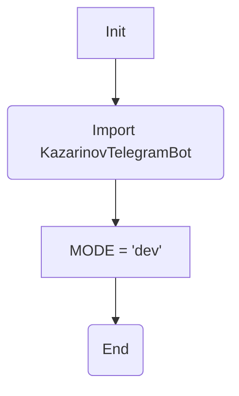
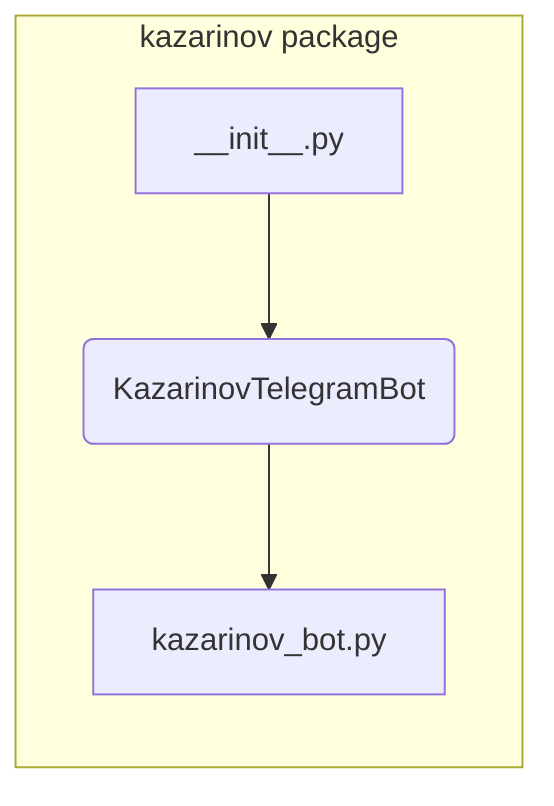

# <input code>

```python
## \file hypotez/src/endpoints/kazarinov/__init__.py
# -*- coding: utf-8 -*-\
#! venv/Scripts/python.exe
#! venv/bin/python/python3.12

"""
.. module: src.endpoints.kazarinov 
	:platform: Windows, Unix
	:synopsis:

"""
MODE = 'dev'

from .kazarinov_bot import KazarinovTelegramBot
```

# <algorithm>



Пример:
При импорте `KazarinovTelegramBot` из файла `kazarinov_bot.py` в текущем файле `__init__.py`  доступны все классы и функции, объявленные в `kazarinov_bot.py`.  `MODE = 'dev'` задает режим работы, вероятно, для последующего использования в коде.


# <mermaid>



В этой диаграмме показано, что `__init__.py` импортирует класс `KazarinovTelegramBot` из файла `kazarinov_bot.py`, который находится внутри того же пакета.


# <explanation>

* **Импорты:**
  - `from .kazarinov_bot import KazarinovTelegramBot`: Этот импорт подключает класс `KazarinovTelegramBot` из модуля `kazarinov_bot.py`, находящегося в подпапке `./kazarinov` текущего каталога.  Это стандартная импортная конструкция для модулей, находящихся в подпапках. Символ `.` указывает на текущий пакет.  Связь: этот импорт подключает функциональность бота к текущему модулю.


* **Классы:**
  - `KazarinovTelegramBot`: Этот класс, определенный в `kazarinov_bot.py` скорее всего, представляет Telegram бота. Подробная информация о классах в данном файле не может быть извлечена без анализа `kazarinov_bot.py`.

* **Функции:**
  - Нет функций в данном файле `__init__.py`, только импорт. Функции, если таковые будут, скорее всего, будут определены в `kazarinov_bot.py`.

* **Переменные:**
  - `MODE = 'dev'`: Переменная, хранящая строковое значение, вероятно, определяющее режим работы программы ('dev', 'prod', 'test' и т.д.).

* **Возможные ошибки или области для улучшений:**
    - Нет явного указания того, как используется `MODE`. Необходимо посмотреть код, использующий `__init__.py`, чтобы понять, как используется значение `MODE`. Лучше бы, если бы `__init__.py` либо возвращало значение переменной, либо передавало ее в функцию или класс, где она используется.


* **Взаимосвязь с другими частями проекта:**
  - `__init__.py` в данном случае выступает в качестве импортерного модуля для `kazarinov_bot.py`. Вероятно, существует более крупная архитектура (например, `main.py` или аналогичный файл), которая импортирует `__init__.py` или `KazarinovTelegramBot` для запуска и взаимодействия с Telegram ботом.


**Общий вывод:**
Файл `__init__.py` служит для организации пакета `kazarinov` и экспорта нужных классов и функций для использования другими частями проекта. Он подключает  `KazarinovTelegramBot` - вероятно, класс, отвечающий за взаимодействие с Telegram ботом. Необходим дополнительный анализ `kazarinov_bot.py` для полного понимания функциональности.