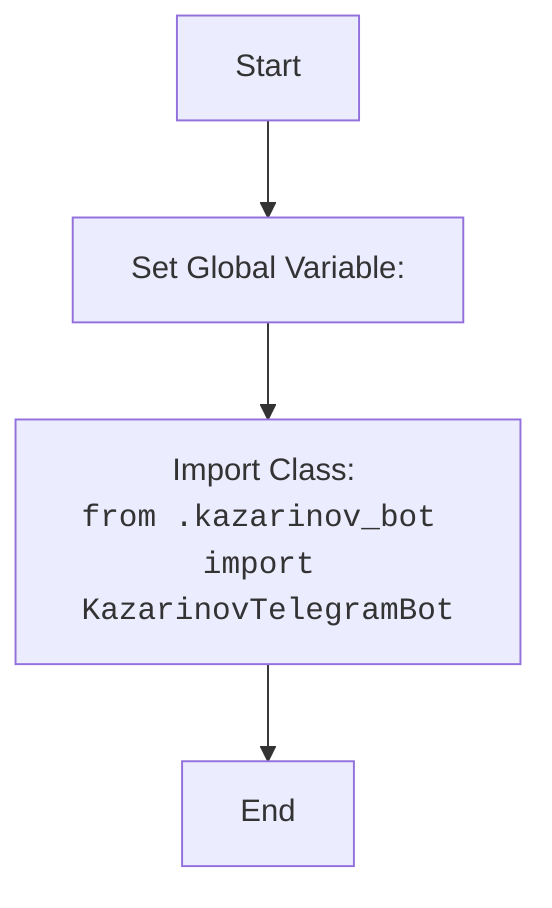

## АНАЛИЗ КОДА: `hypotez/src/endpoints/kazarinov/__init__.py`

### <алгоритм>

1.  **Начало**: Загрузка файла `__init__.py`.
2.  **Объявление MODE**: Устанавливается глобальная переменная `MODE` в значение `'dev'`. Эта переменная, вероятно, используется для определения режима работы приложения (разработка, продакшн и т.д.).
    *   _Пример:_ `MODE` = `'dev'`
3.  **Импорт KazarinovTelegramBot**: Импортируется класс `KazarinovTelegramBot` из модуля `kazarinov_bot.py` в текущем пакете `kazarinov`. Это класс, вероятно, отвечает за функциональность Telegram-бота.
    *   _Пример:_ `from .kazarinov_bot import KazarinovTelegramBot`
4.  **Конец**: Завершение выполнения файла.

### <mermaid>



### <объяснение>

*   **Импорты:**
    *   `from .kazarinov_bot import KazarinovTelegramBot`: Импортирует класс `KazarinovTelegramBot` из модуля `kazarinov_bot.py`, который находится в той же директории. Это позволяет использовать класс `KazarinovTelegramBot` в текущем модуле `__init__.py`. Точка `.` в начале пути указывает на относительный импорт, то есть импорт из текущего пакета.
*   **Классы:**
    *   В коде напрямую не используются классы, но импортируется класс `KazarinovTelegramBot`. Этот класс, вероятно, представляет собой основной компонент Telegram-бота, который будет использоваться в других частях проекта.
*   **Функции:**
    *   В коде нет функций.
*   **Переменные:**
    *   `MODE`: Глобальная переменная типа `str`, устанавливается в значение `'dev'`. Это указывает на то, что приложение находится в режиме разработки. Значение этой переменной может влиять на поведение приложения (например, вывод отладочной информации, использование тестовых данных и т.д.)
*   **Потенциальные ошибки и области для улучшения:**
    *   Хотя код сам по себе не содержит явных ошибок, важно понимать контекст, в котором он используется.
    *   Значение `MODE` может быть жестко закодировано и, вероятно, должно определяться переменной окружения или конфигурационным файлом.
    *   Установка режима через переменную `MODE`, а не через переменные окружения или файл конфигурации, считается плохой практикой.
*   **Взаимосвязь с другими частями проекта:**
    *   Этот файл является частью пакета `src.endpoints.kazarinov` и, вероятно, используется как точка входа для этого модуля.
    *   Класс `KazarinovTelegramBot` будет использоваться в других файлах этого пакета или в других пакетах, импортируя его из `__init__.py` файла.

**Дополнительно:**

Файл `__init__.py` в Python используется для инициализации пакета и позволяет сделать доступными определенные модули и классы внутри пакета при импорте пакета. В данном случае, благодаря этому файлу, можно будет импортировать класс `KazarinovTelegramBot` из пакета `src.endpoints.kazarinov`, например, так:
```python
from src.endpoints.kazarinov import KazarinovTelegramBot
```