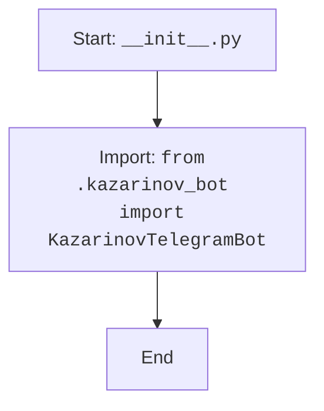

## АНАЛИЗ КОДА: `src/endpoints/kazarinov/__init__.py`

### 1. <алгоритм>

1.  **Начало**: Запуск скрипта `__init__.py`.
2.  **Импорт**: Импорт класса `KazarinovTelegramBot` из модуля `kazarinov_bot.py` (который находится в том же каталоге).
3.  **Завершение**: Скрипт завершает выполнение после импорта.

Пример:
    -  `from .kazarinov_bot import KazarinovTelegramBot`: Эта строка импортирует класс `KazarinovTelegramBot`. Если бы в `kazarinov_bot.py` был класс `KazarinovBot`, то мы бы импортировали его как `from .kazarinov_bot import KazarinovBot`.

### 2. <mermaid>

**Объяснение зависимостей в mermaid:**

*   `Start`: Начало выполнения скрипта `__init__.py`.
*   `ImportModule`: Импортирует класс `KazarinovTelegramBot` из файла `kazarinov_bot.py`, расположенного в том же каталоге.
*   `End`: Конец выполнения скрипта после импорта.

### 3. <объяснение>

**Импорты:**

*   `from .kazarinov_bot import KazarinovTelegramBot`: Этот импорт означает, что из файла `kazarinov_bot.py`, находящегося в текущем каталоге (`.`), импортируется класс `KazarinovTelegramBot`. Это позволяет использовать этот класс в других частях проекта, импортировав `src.endpoints.kazarinov`

**Классы:**

*   `KazarinovTelegramBot`: Этот класс, вероятно, предназначен для работы с Telegram ботом (судя по названию). Детали его реализации содержатся в файле `kazarinov_bot.py`. Его методы и атрибуты доступны после импорта в `__init__.py`.

**Функции:**
*   В этом файле функции не определены, он используется для импорта и дальнейшего использования в других модулях проекта.

**Переменные:**
*   Переменные в данном файле не определены.

**Потенциальные ошибки и области для улучшения:**

*   **Отсутствие документации:** Отсутствие docstring для модуля в файле.
*   **Неявные зависимости:**  В коде явно не указано, что файл `kazarinov_bot.py` должен существовать и содержать класс `KazarinovTelegramBot`. Если файл или класс отсутствуют, импорт выдаст ошибку.

**Цепочка взаимосвязей с другими частями проекта:**

1.  `src.endpoints.kazarinov` является пакетом.
2.  `__init__.py` делает класс `KazarinovTelegramBot` доступным для импорта в другие модули. Например, модуль `src.main.py` может импортировать: `from src.endpoints.kazarinov import KazarinovTelegramBot` и использовать его.
3.   Наличие `__init__.py` делает `kazarinov` каталогом-пакетом. Это позволяет организовывать код логически и избегать конфликтов имен.