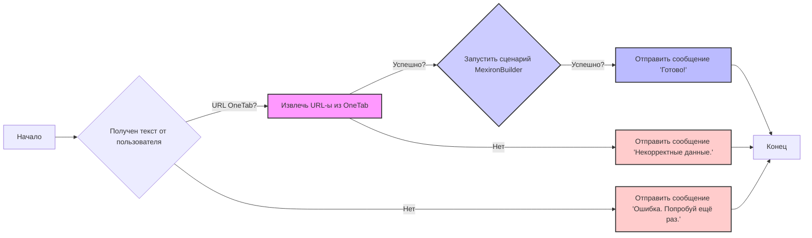
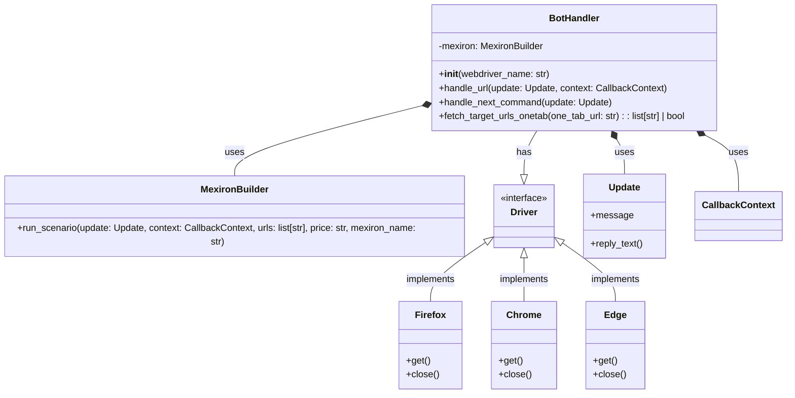

## Анализ кода `hypotez/src/endpoints/kazarinov/bot_handlers.py`

### 1. <алгоритм>

**Блок-схема:**

**Примеры для каждого блока:**

*   **A[Начало]:** Бот ожидает ввода от пользователя.
*   **B{Получен текст от пользователя}:**
    *   **Пример 1 (URL OneTab):**  `https://one-tab.com/1234567890`
    *   **Пример 2 (Не URL OneTab):**  `Привет, бот!`
*   **C[Извлечь URL-ы из OneTab]:**
    *   Вход: `https://one-tab.com/1234567890`
    *   Выход (успешно): `price = 100`, `mexiron_name = 'Some Group'`, `urls = ['https://example1.com', 'https://example2.com']`
    *   Выход (неуспешно): `None`
*   **D{Запустить сценарий MexironBuilder}:**
    *   Вход: `urls = ['https://example1.com', 'https://example2.com']`, `price = 100`, `mexiron_name = 'Some Group'`, `update`, `context`
    *   Выход (успешно): `True`
    *   Выход (неуспешно): `False`
*   **E[Отправить сообщение 'Готово!']:** Бот отправляет сообщение `Готово!` пользователю.
*    **G[Отправить сообщение 'Некорректные данные.']:** Бот отправляет сообщение `Некорректные данные.` пользователю.
*   **H[Отправить сообщение 'Ошибка. Попробуй ещё раз.']:** Бот отправляет сообщение `Ошибка. Попробуй ещё раз.` пользователю.
*   **F[Конец]:** Завершение обработки сообщения.

**Поток данных:**

1.  Пользователь отправляет сообщение боту.
2.  `handle_url` принимает сообщение.
3.  Если сообщение - URL OneTab, `fetch_target_urls_onetab` извлекает URL-ы, цену и название.
4.  `handle_url` передает извлеченные данные в `mexiron.run_scenario`.
5.  В зависимости от успеха `run_scenario`, `handle_url` отправляет соответствующее сообщение пользователю.

### 2. <mermaid>

**Объяснение зависимостей:**

*   `BotHandler` зависит от `MexironBuilder` для выполнения сценариев.
*   `BotHandler` агрегирует  интерфейс `Driver`, конкретная реализация которого зависит от `webdriver_name` (Firefox, Chrome, Edge)
*  `BotHandler` использует `Update` и `CallbackContext` для обработки сообщений Telegram.
*   `MexironBuilder` имеет метод `run_scenario`, который принимает `Update`, `CallbackContext`,  список URL, цену и название, необходимые для выполнения сценария.
*   `Driver` это интерфейс, который реализуют `Firefox`, `Chrome`, и `Edge`. Это позволяет абстрагироваться от конкретного браузера.

### 3. <объяснение>

**Импорты:**

*   `header`: Предположительно, кастомный модуль для добавления заголовка файла (неясно, что он делает, нет в стандартной библиотеке).
*   `random`: Модуль для генерации случайных чисел, используется в `handle_next_command`.
*   `asyncio`: Модуль для асинхронного программирования, используется для параллельного выполнения `reply_text` в `handle_next_command`.
*   `requests`: Модуль для выполнения HTTP-запросов, используется в `fetch_target_urls_onetab` для загрузки HTML.
*   `typing.Optional`, `typing.Any`: Используются для аннотации типов, делая код более читаемым и надежным.
*   `bs4.BeautifulSoup`: Модуль для парсинга HTML, используется в `fetch_target_urls_onetab`.
*   `src.gs`: Кастомный модуль, предположительно содержит глобальные переменные, такие как `now` (текущая дата/время).
*   `src.logger.logger`: Кастомный модуль для логирования, используется для отладки и ошибок.
*   `src.webdriver.driver`, `src.webdriver.chrome`, `src.webdriver.firefox`, `src.webdriver.edge`: Кастомные модули для управления веб-драйверами, абстрагирующие детали управления браузерами.
*   `src.ai.gemini`: Кастомный модуль для работы с Google Gemini, используется в `handle_next_command` для получения ответов на вопросы.
*  `src.endpoints.kazarinov.scenarios.scenario_pricelist`: Кастомный модуль для запуска сценариев, `MexironBuilder`
*   `src.utils.url`:  Кастомный модуль для работы с URL, здесь используется `is_url`
*   `src.utils.printer`: Кастомный модуль для вывода данных, здесь используется `pprint`
*   `telegram.Update`: Класс, представляющий обновление от Telegram, используется в качестве аргумента в обработчиках.
*   `telegram.ext.CallbackContext`: Класс контекста, используемый в обработчиках Telegram.

**Классы:**

*   `BotHandler`:
    *   **Роль**: Обрабатывает сообщения, приходящие от Telegram-бота. Инициирует выполнение сценариев.
    *   **Атрибуты**:
        *   `mexiron`: Экземпляр класса `MexironBuilder`, используемый для выполнения сценариев.
    *   **Методы**:
        *   `__init__(self, webdriver_name: str)`: Конструктор класса, инициализирует `MexironBuilder` с выбранным веб-драйвером (Firefox, Chrome или Edge).
        *   `async handle_url(self, update: Update, context: CallbackContext) -> Any`: Обрабатывает URL, присланный пользователем. Извлекает URL-ы из OneTab и запускает сценарий через `mexiron.run_scenario`.
        *   `async handle_next_command(self, update: Update) -> None`: Обрабатывает команду `--next`, генерирует случайный вопрос и отправляет вопрос и ответ в телеграмм.
        *   `fetch_target_urls_onetab(self, one_tab_url: str) -> list[str] | bool`: Извлекает целевые URL, цену и название из URL OneTab.

**Функции:**

*   `__init__(self, webdriver_name: str)`:
    *   **Аргументы**: `webdriver_name` (str) - название веб-драйвера.
    *   **Возвращаемое значение**: Нет.
    *   **Назначение**: Инициализирует класс `BotHandler`, создавая экземпляр `MexironBuilder` с выбранным веб-драйвером.
    *   **Пример**: `handler = BotHandler(webdriver_name='firefox')`
*   `async handle_url(self, update: Update, context: CallbackContext) -> Any`:
    *   **Аргументы**: `update` (Update) - объект обновления от Telegram, `context` (CallbackContext) - контекст выполнения.
    *   **Возвращаемое значение**: `True` в случае успешной обработки, `None` в случае ошибки.
    *   **Назначение**: Обрабатывает URL, присланный пользователем, вызывает `fetch_target_urls_onetab` для извлечения URL, запускает сценарий `mexiron.run_scenario`.
    *   **Пример**: `await handler.handle_url(update, context)`
*   `async handle_next_command(self, update: Update) -> None`:
    *   **Аргументы**: `update` (Update) - объект обновления от Telegram.
    *   **Возвращаемое значение**: Нет.
    *   **Назначение**: Обрабатывает команду `--next`, выбирает случайный вопрос, отправляет вопрос и ответ в Telegram
    *   **Пример**: `await handler.handle_next_command(update)`
*   `fetch_target_urls_onetab(self, one_tab_url: str) -> list[str] | bool`:
    *   **Аргументы**: `one_tab_url` (str) - URL страницы OneTab.
    *   **Возвращаемое значение**: `list[str]` - список URL-ов или `None` в случае ошибки.
    *   **Назначение**: Выполняет HTTP-запрос к URL OneTab, парсит HTML и извлекает URL-ы, цену и название.
    *   **Пример**: `urls = handler.fetch_target_urls_onetab('https://one-tab.com/1234567890')`

**Переменные:**

*   `MODE`: Строковая переменная, устанавливает режим работы (в данном случае `dev`).
*   `webdriver_name`: Строковая переменная, передаваемая в конструктор `BotHandler`, определяет тип веб-драйвера.
*   `response`: Используется для хранения ответа от пользователя или HTTP-запроса.
*   `urls`: Список строк, содержащий URL-ы, извлеченные из OneTab.
*   `update`: Объект класса `telegram.Update`, представляющий сообщение от пользователя.
*   `context`: Объект класса `telegram.ext.CallbackContext`, представляющий контекст выполнения.
* `price`: Строка, представляющая цену.
* `mexiron_name`: Строка, представляющая имя.

**Потенциальные ошибки и области для улучшения:**

*   **Обработка ошибок**: В коде есть блоки `try...except`, но логирование ошибок и возврат значений `None` может быть недостаточным. Нужно проработать обработку ошибок и возвращать информативные сообщения для пользователя.
*   **Зависимости**: Зависимость от кастомных модулей (`src.gs`, `src.logger.logger`, `src.webdriver.*`, `src.ai.gemini`, `src.utils.*`) затрудняет понимание кода.
*   **Неявные зависимости**: Класс `BotHandler` полагается на то, что `update.message.text` всегда будет существовать, что может привести к ошибкам, если сообщение не является текстовым.
*   **Режим `dev`**: Использование глобальной переменной `MODE` не очень удобно для переключения режимов.
*   **Обработка `price`**: Код может сломаться, если `price` не целое число или если данные не в формате "число строка", стоит добавить проверку.
*   **Дублирование кода**: Повторяющееся использование `update.message.reply_text` в нескольких местах можно вынести в отдельную функцию.
*   **Управление браузерами**: Код не управляет процессом веб-драйвера (например, его закрытием) явно, что может привести к утечке ресурсов.

**Взаимосвязи с другими частями проекта:**

*   Код зависит от `src.endpoints.kazarinov.scenarios.scenario_pricelist`, который, вероятно, содержит логику для выполнения конкретного сценария, связанного с прайс-листами.
*   Используются кастомные драйверы из `src.webdriver.*`, что указывает на то, что проект имеет свою реализацию управления веб-браузерами.
*   Используется `src.ai.gemini`, что говорит о интеграции с Google Gemini для генерации ответов на вопросы.
*   Код использует кастомный `src.logger.logger` для логирования, что указывает на собственную систему логирования в проекте.

В целом, код представляет собой обработчик команд Telegram-бота, который умеет извлекать URL из OneTab и запускать сценарии с помощью `MexironBuilder`. Код имеет некоторые недостатки в обработке ошибок, зависимостях и общих принципах проектирования, которые можно улучшить.