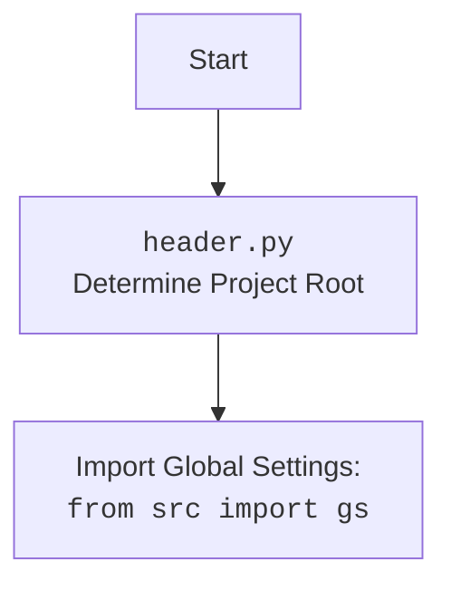

## ИНСТРУКЦИЯ:

Анализируй предоставленный код подробно и объясни его функциональность. Ответ должен включать три раздела:

1.  **<алгоритм>**: Опиши рабочий процесс в виде пошаговой блок-схемы, включая примеры для каждого логического блока, и проиллюстрируй поток данных между функциями, классами или методами.
2.  **<mermaid>**: Напиши код для диаграммы в формате `mermaid`, проанализируй и объясни все зависимости,
    которые импортируются при создании диаграммы.
    **ВАЖНО!** Убедитесь, что все имена переменных, используемые в диаграмме `mermaid`,
    имеют осмысленные и описательные имена. Имена переменных вроде `A`, `B`, `C`, и т.д., не допускаются!

    **Дополнительно**: Если в коде есть импорт `import header`, добавьте блок `mermaid` flowchart, объясняющий `header.py`:
    ```mermaid
    flowchart TD
        Start --> Header[<code>header.py</code><br> Determine Project Root]

        Header --> import[Import Global Settings: <br><code>from src import gs</code>]
    ```

3.  **<объяснение>**: Предоставьте подробные объяснения:
    -   **Импорты**: Их назначение и взаимосвязь с другими пакетами `src.`.
    -   **Классы**: Их роль, атрибуты, методы и взаимодействие с другими компонентами проекта.
    -   **Функции**: Их аргументы, возвращаемые значения, назначение и примеры.
    -   **Переменные**: Их типы и использование.
    -   Выделите потенциальные ошибки или области для улучшения.

Дополнительно, постройте цепочку взаимосвязей с другими частями проекта (если применимо).

Это обеспечивает всесторонний и структурированный анализ кода.
## Формат ответа: `.md` (markdown)
**КОНЕЦ ИНСТРУКЦИИ**
```md
## <алгоритм>

**1. `BotHandler.__init__(webdriver_name)`:**
   -   Инициализирует класс `BotHandler` с заданным именем веб-драйвера (`webdriver_name`).
   -   Создает экземпляр `Firefox` с опциями "--kiosk" и "--headless".
   -   Создает экземпляр `MexironBuilder`, передавая ему объект `Driver`, который в свою очередь инициализируется одним из веб-драйверов: `Firefox`, `Chrome` или `Edge` в зависимости от параметра `webdriver_name`.
   
   Пример:
   
    ```python
    handler = BotHandler(webdriver_name='firefox')
    # OR
    handler = BotHandler(webdriver_name='chrome')
    # OR
    handler = BotHandler(webdriver_name='edge')
    ```

**2. `BotHandler.handle_url(update, context)`:**
   -   Получает текстовое сообщение (`response`) из объекта `update`.
   -   Проверяет, начинается ли сообщение с префиксов `https://one-tab.com` или `http://one-tab.com`.
   -   Если сообщение является ссылкой OneTab, вызывает метод `fetch_target_urls_onetab(response)` для извлечения цены, имени и списка целевых URL-ов.
   -   Если `urls` пустой, отправляет сообщение об ошибке.
   -   Если `urls` валидный, запускает сценарий `mexiron.run_scenario`, передавая ему `update`, `context`, `urls` (убедившись, что это список), `price`, и `mexiron_name`.
   -   Если сценарий выполнен успешно, отправляет сообщение "Готово!".
   -   Если сообщение не является ссылкой OneTab, отправляет сообщение "Ошибка. Попробуй ещё раз."

    Пример:
    ```python
    # update.message.text = "https://one-tab.com/..."
    await handler.handle_url(update, context)
    # OR
    # update.message.text = "Some random text"
     await handler.handle_url(update, context)
    ```

**3. `BotHandler.handle_next_command(update)`:**
   -   Выбирает случайный вопрос из списка `self.questions_list` (предположительно, атрибут класса, не показан в коде).
   -   Вызывает метод `ask` объекта `self.model` (предположительно, экземпляр `GoogleGenerativeAI`, не показан в коде), передавая выбранный вопрос.
   -   Отправляет пользователю выбранный вопрос и полученный ответ.
   -   В случае ошибки логирует её и отправляет сообщение об ошибке.

    Пример:
   ```python
    await handler.handle_next_command(update)
   ```

**4. `BotHandler.fetch_target_urls_onetab(one_tab_url)`:**
    - Отправляет GET запрос по `one_tab_url`, устанавливая таймаут 10 секунд.
    - Проверяет `response.status_code` на 200. Если код не равен 200, то логирует ошибку и возвращает `None`
    -   Парсит HTML-содержимое с помощью `BeautifulSoup`.
    -   Извлекает все ссылки из тегов `<a>` с классом `tabLink`.
    -   Извлекает текст из элемента `<div>` с классом `tabGroupLabel`.
        - Если элемент не найден, то  `price = ''`, `mexiron_name = gs.now`.
        - Если элемент найден, разбивает текст на части, определяя `price` (первое слово) и `mexiron_name` (остальные слова).
    - Возвращает кортеж `price`, `mexiron_name`, `urls`.
    - В случае исключения `requests.exceptions.RequestException`, логирует ошибку и возвращает `None`.
   
   Пример:
    ```python
    price, mexiron_name, urls = handler.fetch_target_urls_onetab('https://one-tab.com/...')
    ```
## <mermaid>
```mermaid
flowchart TD
    Start[Start] --> InitBotHandler[<code>BotHandler.__init__(webdriver_name)</code><br>Initialize with webdriver name]
    InitBotHandler --> CreateDriver[Create Webdriver Instance:<br>Firefox/Chrome/Edge]
    CreateDriver --> CreateMexironBuilder[Create MexironBuilder Instance<br><code>MexironBuilder(Driver)</code>]
    CreateMexironBuilder --> HandleURL[<code>BotHandler.handle_url(update, context)</code><br>Handle user URL]
    HandleURL -- Starts with OneTab URL --> FetchURLs[<code>BotHandler.fetch_target_urls_onetab(url)</code><br>Extract URLs, price, and name from OneTab]
    HandleURL -- Not a OneTab URL --> ReplyError[Send Error Message to user]
    FetchURLs --> RunScenario[<code>mexiron.run_scenario(update, context, urls, price, mexiron_name)</code><br>Run Mexiron Scenario]
    RunScenario -- Success --> ReplySuccess[Send Success Message to user]
    RunScenario -- Fail --> ReplyError
    ReplySuccess --> End[End]
    ReplyError --> End
    Start --> HandleNextCommand[<code>BotHandler.handle_next_command(update)</code><br>Handle Next Command]
    HandleNextCommand --> SelectQuestion[Select random question from <code>self.questions_list</code>]
    SelectQuestion --> AskModel[<code>self.model.ask(question)</code><br>Get answer from AI Model]
    AskModel --> SendQuestionAndAnswer[Send Question and Answer to user]
    SendQuestionAndAnswer --> End
    Start --> End
    
    style Start fill:#f9f,stroke:#333,stroke-width:2px
    style End fill:#ccf,stroke:#333,stroke-width:2px
```

**Объяснение зависимостей `mermaid`:**

1.  **`Start`**: Начало процесса.
2.  **`InitBotHandler`**: Инициализация обработчика бота с указанием имени веб-драйвера (`webdriver_name`).
3.  **`CreateDriver`**: Создание экземпляра веб-драйвера (`Firefox`, `Chrome` или `Edge`) на основе `webdriver_name`.
4.   **`CreateMexironBuilder`**: Создает экземпляр `MexironBuilder` с передачей ему созданного веб-драйвера.
5.  **`HandleURL`**: Обработка URL, отправленного пользователем.
6.  **`FetchURLs`**: Извлечение списка URL, цены и имени из предоставленной ссылки OneTab.
7.  **`RunScenario`**: Запуск сценария с полученными URL и данными.
8.  **`ReplySuccess`**: Отправка сообщения об успешном выполнении.
9.  **`ReplyError`**: Отправка сообщения об ошибке.
10. **`HandleNextCommand`**: Обработка команды для получения следующего вопроса и ответа от AI-модели.
11. **`SelectQuestion`**: Выбор случайного вопроса.
12. **`AskModel`**: Получение ответа от AI-модели.
13. **`SendQuestionAndAnswer`**: Отправка вопроса и ответа пользователю.
14. **`End`**: Конец процесса.

## <объяснение>

### Импорты:
-   `header`: Предположительно, модуль для определения корневого каталога проекта и импорта глобальных настроек.
-   `random`: Используется для выбора случайного вопроса в `handle_next_command`.
-   `asyncio`: Используется для асинхронного выполнения `handle_next_command`.
-   `requests`: Используется для отправки HTTP-запросов в `fetch_target_urls_onetab`.
-   `typing.Optional`, `typing.Any`: Используется для аннотации типов.
-   `bs4.BeautifulSoup`: Используется для парсинга HTML-содержимого в `fetch_target_urls_onetab`.
-   `src.gs`: Глобальные настройки проекта.
-   `src.logger.logger`: Логирование событий.
-   `src.webdriver.driver.Driver`: Абстрактный класс драйвера веб-браузера.
-   `src.webdriver.chrome.Chrome`, `src.webdriver.firefox.Firefox`, `src.webdriver.edge.Edge`: Конкретные драйверы веб-браузеров.
-   `src.ai.gemini.GoogleGenerativeAI`: Модуль для взаимодействия с Google Gemini AI.
-   `src.endpoints.kazarinov.scenarios.scenario_pricelist.MexironBuilder`: Класс для создания и запуска сценариев.
-   `src.utils.url.is_url`: Функция для проверки URL.
-   `src.utils.printer.pprint`: Функция для красивой печати данных.
-   `telegram.Update`, `telegram.ext.CallbackContext`: Классы для работы с Telegram API.

### Классы:

-   `BotHandler`:
    -   **Роль**: Обрабатывает команды, полученные от телеграм-бота.
    -   **Атрибуты**:
        -   `mexiron`: Экземпляр `MexironBuilder` для управления сценариями.
    -   **Методы**:
        -   `__init__(webdriver_name)`: Инициализация обработчика с указанием веб-драйвера.
        -   `handle_url(update, context)`: Обработка URL-сообщения.
        -    `handle_next_command(update)`: Обработка следующей команды.
        -   `fetch_target_urls_onetab(one_tab_url)`: Извлечение целевых URL из OneTab.
        

### Функции:

-   `BotHandler.__init__(webdriver_name)`:
    -   **Аргументы**:
        -   `webdriver_name` (str): Имя веб-драйвера (`firefox`, `chrome`, `edge`).
    -   **Возвращаемое значение**: `None`
    -   **Назначение**: Инициализирует объект `BotHandler` и настраивает веб-драйвер.
    -   **Пример**: `handler = BotHandler(webdriver_name='chrome')`

-   `BotHandler.handle_url(update, context)`:
    -   **Аргументы**:
        -   `update` (Update): Объект обновления Telegram.
        -   `context` (CallbackContext): Контекст выполнения.
    -   **Возвращаемое значение**: `Any`
    -   **Назначение**: Обрабатывает входящие сообщения, проверяет, является ли сообщение ссылкой OneTab, извлекает данные, запускает сценарий и отправляет ответы пользователю.
    -   **Пример**: `await handler.handle_url(update, context)`

-  `BotHandler.handle_next_command(update)`:
    -   **Аргументы**:
          - `update` (Update): Объект обновления Telegram.
     -   **Возвращаемое значение**: `None`
     -   **Назначение**: Выбирает случайный вопрос и отправляет его вместе с ответом от AI.
    -   **Пример**: `await handler.handle_next_command(update)`

-   `BotHandler.fetch_target_urls_onetab(one_tab_url)`:
    -   **Аргументы**:
        -   `one_tab_url` (str): URL страницы OneTab.
    -   **Возвращаемое значение**: `tuple[str, str, list[str]] | None`: кортеж (price, mexiron_name, urls) или `None`.
    -   **Назначение**: Извлекает целевые URL-ы из HTML-содержимого страницы OneTab и данные для сценария.
    -   **Пример**: `price, mexiron_name, urls = handler.fetch_target_urls_onetab('https://one-tab.com/...')`

### Переменные:
-   `MODE`: Строка, указывающая режим работы (`dev`).
-   `webdriver_name`: Строка, указывающая используемый веб-драйвер.
-   `response`: Ответ от HTTP-запроса.
-   `soup`: Объект `BeautifulSoup` для парсинга HTML.
-   `urls`: Список извлеченных URL-ов.
-   `price`: Цена извлеченная из описания вкладки OneTab.
-   `mexiron_name`: Имя извлеченное из описания вкладки OneTab.
-   `update`: Объект обновления Telegram.
-   `context`: Контекст выполнения Telegram.
-   `one_tab_url`: URL страницы OneTab.
-   `question`: Случайный вопрос из `self.questions_list`
-   `answer`: Ответ от AI-модели.
### Потенциальные ошибки и области для улучшения:

-   В `handle_next_command` обращение к `self.questions_list` и `self.model` происходит без явной инициализации, что может привести к ошибкам `AttributeError`.
-   В `fetch_target_urls_onetab`, если `element` не найден, то `price` устанавливается как пустая строка, а `mexiron_name` как текущее время. Возможно, следует предусмотреть другое поведение для этого случая.
-   Отсутствует обработка ошибок при выполнении сценария `mexiron.run_scenario`.
-   Не хватает проверок типов, чтобы избежать ошибок в runtime.
-   Код содержит заглушки `...` которые нужно заменить на логику приложения.

### Взаимосвязь с другими частями проекта:

-   `header`: Используется для определения корневого каталога проекта, и загрузки глобальных настроек из модуля `src.gs`.
-   `src.logger.logger`: Используется для логирования событий, что позволяет отслеживать и анализировать работу бота.
-   `src.webdriver`: Модули `src.webdriver.driver`, `src.webdriver.chrome`, `src.webdriver.firefox`, `src.webdriver.edge` позволяют управлять браузером для автоматического сбора данных со страниц.
-   `src.ai.gemini`: Используется для работы с AI моделью.
-   `src.endpoints.kazarinov.scenarios.scenario_pricelist`: Модуль для создания и запуска сценариев, которые автоматизируют взаимодействие с веб-страницами.
-   `src.utils`: Модули `src.utils.url` и `src.utils.printer` предоставляют утилиты для работы с URL-ами и красивого вывода данных.
-   `telegram`: Модуль `telegram` используется для взаимодействия с API Telegram, позволяя получать сообщения от пользователей и отправлять ответы.
```