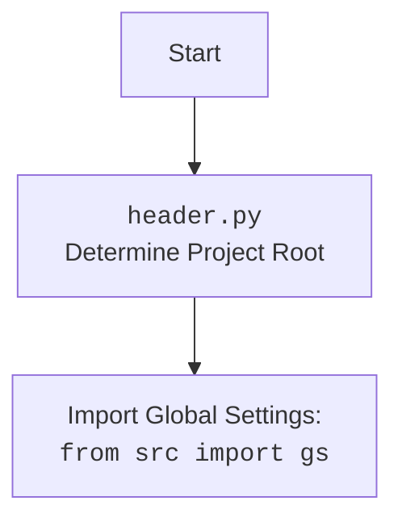

## ИНСТРУКЦИЯ:

Анализируй предоставленный код подробно и объясни его функциональность. Ответ должен включать три раздела:

1.  **<алгоритм>**: Опиши рабочий процесс в виде пошаговой блок-схемы, включая примеры для каждого логического блока, и проиллюстрируй поток данных между функциями, классами или методами.
2.  **<mermaid>**: Напиши код для диаграммы в формате `mermaid`, проанализируй и объясни все зависимости,
    которые импортируются при создании диаграммы.
    **ВАЖНО!** Убедитесь, что все имена переменных, используемые в диаграмме `mermaid`,
    имеют осмысленные и описательные имена. Имена переменных вроде `A`, `B`, `C`, и т.д., не допускаются!

    **Дополнительно**: Если в коде есть импорт `import header`, добавьте блок `mermaid` flowchart, объясняющий `header.py`:
    ```mermaid
    flowchart TD
        Start --> Header[<code>header.py</code><br> Determine Project Root]

        Header --> import[Import Global Settings: <br><code>from src import gs</code>]
    ```

3.  **<объяснение>**: Предоставьте подробные объяснения:
    - **Импорты**: Их назначение и взаимосвязь с другими пакетами `src.`.
    - **Классы**: Их роль, атрибуты, методы и взаимодействие с другими компонентами проекта.
    - **Функции**: Их аргументы, возвращаемые значения, назначение и примеры.
    - **Переменные**: Их типы и использование.
    - Выделите потенциальные ошибки или области для улучшения.

Дополнительно, постройте цепочку взаимосвязей с другими частями проекта (если применимо).

Это обеспечивает всесторонний и структурированный анализ кода.
## Формат ответа: `.md` (markdown)
**КОНЕЦ ИНСТРУКЦИИ**
## <алгоритм>

```mermaid
graph TD
    A[Начало] --> B{Получено сообщение от пользователя};
    B -- "?" --> C[Отправить картинку user_flowchart.png];
    C --> G[Конец];
    B -- URL --> D[Обработать URL];
    B -- "--next" или аналог --> E[Обработать команду --next];
    B -- Другой текст --> F[Ответить с помощью модели Gemini];
    D --> D1{URL OneTab?};
    D1 -- Да --> D2[Извлечь данные из OneTab];
    D2 --> D3{Данные корректны?};
     D3 -- Нет --> D4[Ответить "Некорректные данные"];
     D4 --> G
    D3 -- Да --> D5[Запустить сценарий Mexiron];
    D5 --> D6{Сценарий выполнен успешно?};
    D6 -- Да --> D7[Ответить "Готово"];
    D7 --> G
    D6 -- Нет --> G
    D1 -- Нет --> D8[Ответить "Ошибка. Попробуй ещё раз"];
    D8 --> G;
    E --> E1[Выбрать случайный вопрос];
    E1 --> E2[Получить ответ от модели];
    E2 --> E3[Отправить вопрос и ответ];
    E3 --> G;
    E -- Ошибка --> E4[Сообщить об ошибке чтения вопросов];
    E4 --> G;
    F --> F1[Ответить на текст пользователя];
    F1 --> G;
    
    
    

    subgraph "Обработка URL"
    D1
    D2
    D3
    D4
    D5
    D6
    D7
    D8
    end
    
    subgraph "Обработка команды --next"
    E1
    E2
    E3
     E4
    end

    subgraph "Обработка текстового сообщения"
        F
        F1
    end
```

**Примеры:**

1.  **Получено сообщение от пользователя**:
    *   Пользователь отправил сообщение `?`. Бот отправит изображение `user_flowchart.png` и завершит обработку.
    *   Пользователь отправил сообщение `https://one-tab.com/123`. Бот начнёт обработку URL.
    *   Пользователь отправил сообщение `--next`. Бот начнёт обработку команды `--next`.
    *   Пользователь отправил сообщение `Как дела?`. Бот ответит с помощью модели Gemini.
2.  **Обработка URL**:
    *   Пользователь отправил ссылку `https://one-tab.com/123`. Бот проверит, является ли это ссылкой OneTab.
    *   Если это ссылка OneTab, бот извлечет данные и URL, запустит сценарий `Mexiron` и ответит "Готово", если всё прошло успешно.
    *   Если это не ссылка OneTab, бот ответит "Ошибка. Попробуй ещё раз".
3.  **Обработка команды `--next`**:
    *   Бот выбирает случайный вопрос из списка `self.questions_list`.
    *   Бот запрашивает у модели ответ на этот вопрос.
    *   Бот отправляет пользователю вопрос и ответ.
    *   Если произошла ошибка, бот отправит сообщение об ошибке чтения вопросов.
4.  **Ответить с помощью модели Gemini**:
    *   Пользователь отправляет любой текст.
    *   Бот запрашивает у модели ответ на этот текст.
    *   Бот отправляет ответ пользователю.

## <mermaid>

```mermaid
flowchart TD
    Start[Start] --> BotHandlerInit[BotHandler: __init__];
    BotHandlerInit --> MexironBuilderInit[MexironBuilder: __init__];
    BotHandlerInit --> HandleMessage[BotHandler: handle_message];
    HandleMessage --> CheckQuestionMark{Message = "?"};
    CheckQuestionMark -- Yes --> SendUserFlowchart[Send user_flowchart.png];
    CheckQuestionMark -- No --> CheckURL{is_url?};
    CheckURL -- Yes --> HandleURL[BotHandler: handle_url];
    CheckURL -- No --> CheckNextCommand{Message in (--next, -next, etc.)?};
     CheckNextCommand -- Yes --> HandleNextCommand[BotHandler: handle_next_command];
    CheckNextCommand -- No --> ChatWithModel[Gemini: chat()];
    ChatWithModel --> ReplyText[Send chat answer to user];
    HandleURL --> CheckOneTabURL{Message starts with OneTab URL?};
    CheckOneTabURL -- Yes --> FetchOneTabURLs[BotHandler: fetch_target_urls_onetab];
    FetchOneTabURLs --> CheckURLs{URLs are valid?};
    CheckURLs -- No --> ReplyInvalidData[Reply "Некорректные данные"];
    CheckURLs -- Yes --> RunMexironScenario[MexironBuilder: run_scenario];
    RunMexironScenario --> CheckScenarioSuccess{Scenario Success?};
    CheckScenarioSuccess -- Yes --> ReplySuccess[Reply "Готово!"];
    CheckOneTabURL -- No --> ReplyTryAgain[Reply "Ошибка. Попробуй ещё раз."];
    HandleNextCommand --> ChooseRandomQuestion[Choose random question from list];
    ChooseRandomQuestion --> AskModel[Gemini: ask()];
    AskModel --> ReplyQuestionAndAnswer[Send question and answer to user];
    FetchOneTabURLs --> ProcessData[Parse HTML, extract data];
    ProcessData --> ReturnPriceNameUrls[Return price, name and URLs];
    ReplySuccess --> End[End];
    ReplyInvalidData --> End;
    ReplyTryAgain --> End;
    ReplyQuestionAndAnswer --> End;
    ReplyText --> End;
    SendUserFlowchart --> End;
    
    
    
    
    subgraph BotHandler
    BotHandlerInit
    HandleMessage
    HandleURL
    FetchOneTabURLs
    HandleNextCommand
    end
    
    subgraph MexironBuilder
    MexironBuilderInit
    RunMexironScenario
    end
    
    subgraph Gemini
    ChatWithModel
    AskModel
    end
```
**Зависимости `mermaid` диаграммы:**

1.  `BotHandler`: Главный класс, управляющий обработкой сообщений. Зависимости:
    *   `MexironBuilder` -  используется для запуска сценариев.
    *   `Gemini` - используется для ответов на сообщения.

2.  `MexironBuilder`: Класс для создания и запуска сценариев обработки прайс-листов.
    Зависимостей от других модулей в этом файле нет.

3.  `Gemini`: Класс для взаимодействия с моделью искусственного интеллекта Gemini.
    Зависимостей от других модулей в этом файле нет.

4.  **Логические блоки**:
    *   `handle_message`, `handle_url`, `handle_next_command`, `fetch_target_urls_onetab`: Методы `BotHandler`, обеспечивающие логику обработки.
    *   `run_scenario`: Метод `MexironBuilder`, запускающий сценарий.
    *   `chat`, `ask`: Методы `Gemini`, предоставляющие ответы на запросы.


## <объяснение>

### Импорты

*   `random`: Используется для выбора случайного вопроса в `handle_next_command`.
*   `asyncio`: Используется для асинхронного выполнения операций в `handle_next_command`.
*   `requests`: Используется для отправки HTTP-запросов в `fetch_target_urls_onetab`.
*   `typing.Optional`, `typing.Any`: Используются для аннотации типов.
*   `bs4.BeautifulSoup`: Используется для парсинга HTML в `fetch_target_urls_onetab`.
*   `header`: Предположительно, модуль для определения корня проекта и настройки путей.
*   `src.gs`: Глобальные настройки проекта.
*   `src.logger.logger`: Модуль для логирования.
*   `src.webdriver.playwright`: Используется для управления браузером.
*   `src.ai.gemini`: Класс для работы с моделью Gemini.
*   `src.endpoints.kazarinov.scenarios.scenario_pricelist`: Содержит класс `MexironBuilder` для сценариев обработки прайс-листов.
*   `src.utils.url`: Содержит функцию `is_url` для проверки, является ли строка URL.
*   `src.utils.printer`: Модуль для форматирования вывода.
*   `telegram.Update`: Класс для представления обновления от Telegram.
*   `telegram.ext.CallbackContext`: Класс для контекста выполнения обработчиков Telegram.

**Взаимосвязь с другими пакетами `src`:**

*   `src.gs`: Глобальные настройки, используемые для доступа к путям, времени и другим общим параметрам.
*   `src.logger.logger`: Централизованное логирование для отслеживания ошибок и событий.
*   `src.webdriver`: Обеспечивает взаимодействие с веб-браузером (в данном случае, используется `playwright`).
*   `src.ai`: Содержит модули для работы с ИИ, включая `gemini`.
*   `src.endpoints.kazarinov`: Специфичные сценарии для телеграм-бота Каzаринова.
*   `src.utils`: Утилиты для обработки URL и вывода.

### Классы

*   **`BotHandler`**:
    *   **Роль**: Управляет обработкой сообщений от телеграм-бота.
    *   **Атрибуты**:
        *   `mexiron`: Экземпляр `MexironBuilder` для запуска сценариев.
    *   **Методы**:
        *   `__init__`: Инициализирует `BotHandler`, создает экземпляр `MexironBuilder`.
        *   `handle_message`: Основной метод для обработки входящих сообщений. Маршрутизирует обработку в зависимости от содержимого сообщения (вопроса, URL, команды).
        *   `handle_url`: Обрабатывает URL, присланные пользователем.
        *   `handle_next_command`: Обрабатывает команду `--next` (и её аналоги), предоставляя следующий вопрос.
        *   `fetch_target_urls_onetab`: Извлекает целевые URL из страницы OneTab.
    *   **Взаимодействие**:
        *   Взаимодействует с `MexironBuilder` для запуска сценариев.
        *   Взаимодействует с `Gemini` для получения ответов на вопросы.
        *   Использует `is_url` для проверки, является ли строка URL.
        *   Использует `requests` для отправки HTTP-запросов.
        *   Использует `BeautifulSoup` для парсинга HTML.

### Функции

*   `__init__(self)`:
    *   **Аргументы**: `self`.
    *   **Возвращаемое значение**: `None`.
    *   **Назначение**: Инициализирует объект `BotHandler`, создавая экземпляр `MexironBuilder`.
*   `handle_message(self, update: Update, context: CallbackContext) -> None`:
    *   **Аргументы**:
        *   `update`: Объект `Update` от Telegram.
        *   `context`: Контекст выполнения.
    *   **Возвращаемое значение**: `None`.
    *   **Назначение**: Обрабатывает входящее текстовое сообщение. Проверяет, является ли сообщение URL, командой или обычным текстом, и вызывает соответствующий метод.
    *   **Пример**: Если пользователь отправит `https://one-tab.com/123`, вызовется `handle_url`. Если отправит `--next`, вызовется `handle_next_command`. Если `Привет!`, будет использована модель Gemini.
*    `handle_url(self, update: Update, context: CallbackContext) -> Any`:
    *   **Аргументы**:
        *   `update`: Объект `Update` от Telegram.
        *   `context`: Контекст выполнения.
    *   **Возвращаемое значение**: `Any`.
    *    **Назначение**: Обрабатывает URL, присланный пользователем. Проверяет, является ли это ссылкой OneTab. Если да, то извлекает данные и запускает сценарий, в противном случае возвращает ошибку.
*   `handle_next_command(self, update: Update) -> None`:
    *   **Аргументы**:
        *   `update`: Объект `Update` от Telegram.
    *   **Возвращаемое значение**: `None`.
    *   **Назначение**: Обрабатывает команду `--next` (или её аналоги). Выбирает случайный вопрос из списка, запрашивает ответ у модели и отправляет вопрос и ответ пользователю.
    *   **Пример**: Если пользователь отправит `--next`, бот выберет случайный вопрос, получит на него ответ и отправит их пользователю.
*   `fetch_target_urls_onetab(self, one_tab_url: str) -> list[str] | bool`:
    *   **Аргументы**:
        *   `one_tab_url`: URL страницы OneTab.
    *   **Возвращаемое значение**: `list[str]` (список URL) или `bool` (False в случае ошибки).
    *   **Назначение**: Извлекает URL из страницы OneTab. Выполняет GET-запрос к URL, парсит HTML и извлекает ссылки из тегов `<a>` с классом `tabLink`.
    *   **Пример**: Если `one_tab_url` - `https://one-tab.com/123`, функция вернет список URL, найденных на этой странице, и данные из `div` с классом `tabGroupLabel`.

### Переменные

*   `self.mexiron`: Экземпляр класса `MexironBuilder`, который создается при инициализации `BotHandler`.
*   `q`: Текст сообщения от пользователя в `handle_message`.
*   `user_id`: Идентификатор пользователя в `handle_message`.
*  `response`: Текст сообщения от пользователя в `handle_url`.
*   `price`, `mexiron_name`, `urls`: Извлеченные данные в `fetch_target_urls_onetab`.
*  `question`, `answer` : Текст вопроса и ответа в `handle_next_command`
*   `one_tab_url`: URL страницы OneTab в `fetch_target_urls_onetab`.
*  `data`: Текст из `div` с классом `tabGroupLabel` в `fetch_target_urls_onetab`.
*   `parts`: Разделенные данные из `data` в `fetch_target_urls_onetab`.

### Потенциальные ошибки и области для улучшения

1.  **Обработка ошибок**:
    *   В `fetch_target_urls_onetab` и `handle_next_command` используются общие блоки `try/except`. Следует добавить более специфичные исключения для различных типов ошибок, что упростит отладку и обработку различных ситуаций.
    *   Отсутствует логика обработки ошибок при выполнении сценария `Mexiron`, что может приводить к непредсказуемому поведению.
2.  **Асинхронность**:
    *   Следует использовать `async` и `await` для всех взаимодействий с внешними сервисами (например, Gemini, запросы к OneTab) для повышения производительности.
3.  **Валидация данных**:
    *   При извлечении данных из OneTab не хватает проверок на корректность данных (например, является ли цена числом), что может приводить к ошибкам.
4.  **Улучшение кода**:
    *   Можно использовать `enums` для кодирования команд (например, `"--next"` и его аналоги) вместо сравнения строк.
    *   Добавить валидацию URL, чтобы проверить, является ли это URL OneTab (например, с использованием регулярных выражений), для надежной обработки данных.

### Взаимосвязи с другими частями проекта

*   **`src.endpoints.kazarinov.scenarios.scenario_pricelist`**: `BotHandler` запускает сценарии из этого модуля с помощью `MexironBuilder`. Это показывает, что `BotHandler` управляет рабочим процессом и использует сценарии для выполнения конкретных задач.
*   **`src.ai.gemini`**:  `BotHandler` использует `Gemini` для ответов на вопросы, что обеспечивает функциональность чат-бота.
*   **`src.webdriver.playwright`**: Используется для взаимодействия с браузером, что позволяет обрабатывать динамический контент.

Этот анализ обеспечивает подробное понимание функциональности и структуры кода, а также предоставляет конкретные рекомендации по улучшению.