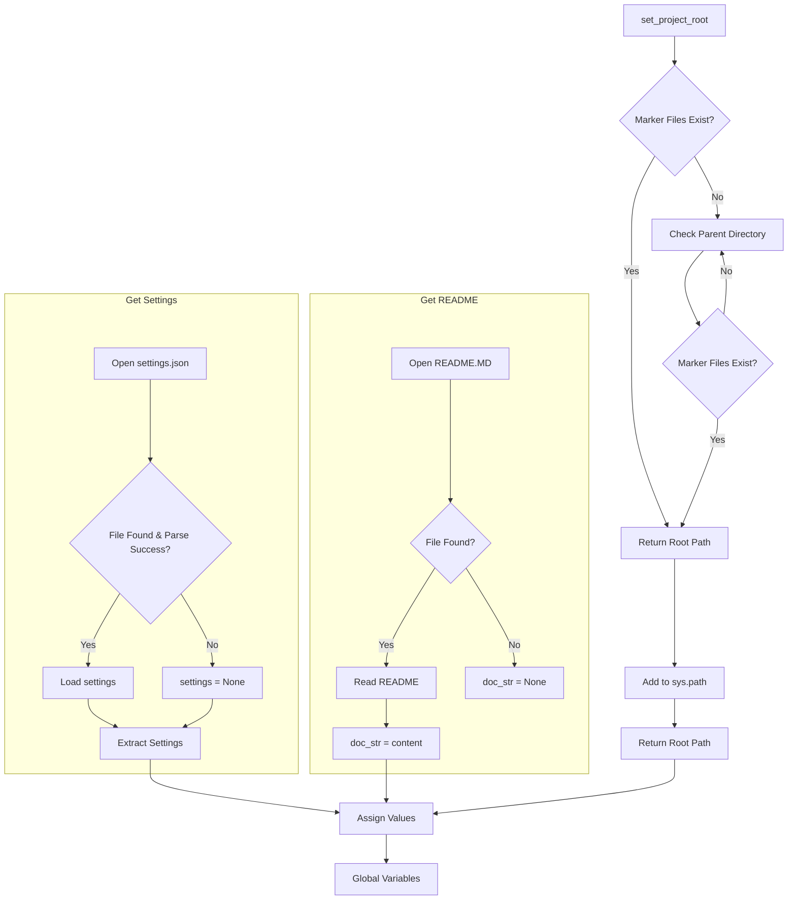

# <input code>

```python
## \file hypotez/src/endpoints/kazarinov/header.py
# -*- coding: utf-8 -*-
#! venv/Scripts/python.exe
#! venv/bin/python/python3.12

"""
.. module:: src.endpoints.kazarinov 
	:platform: Windows, Unix
	:synopsis:

"""
MODE = 'dev'

import sys
import json
from packaging.version import Version

from pathlib import Path
def set_project_root(marker_files=('pyproject.toml', 'requirements.txt', '.git')) -> Path:
    """
    Finds the root directory of the project starting from the current file's directory,
    searching upwards and stopping at the first directory containing any of the marker files.

    Args:
        marker_files (tuple): Filenames or directory names to identify the project root.
    
    Returns:
        Path: Path to the root directory if found, otherwise the directory where the script is located.
    """
    __root__:Path
    current_path:Path = Path(__file__).resolve().parent
    __root__ = current_path
    for parent in [current_path] + list(current_path.parents):
        if any((parent / marker).exists() for marker in marker_files):
            __root__ = parent
            break
    if __root__ not in sys.path:
        sys.path.insert(0, str(__root__))
    return __root__


# Get the root directory of the project
__root__ = set_project_root()
"""__root__ (Path): Path to the root directory of the project"""

from src import gs

settings:dict = None
try:
    with open(gs.path.root / 'src' /  'settings.json', 'r') as settings_file:
        settings = json.load(settings_file)
except (FileNotFoundError, json.JSONDecodeError):
    ...

doc_str:str = None
try:
    with open(gs.path.root / 'src' /  'README.MD', 'r') as settings_file:
        doc_str = settings_file.read()
except (FileNotFoundError, json.JSONDecodeError):
    ...


__project_name__ = settings.get("project_name", 'hypotez') if settings  else 'hypotez'
__version__: str = settings.get("version", '')  if settings  else ''
__doc__: str = doc_str if doc_str else ''
__details__: str = ''
__author__: str = settings.get("author", '')  if settings else ''
__copyright__: str = settings.get("copyrihgnt", '')  if settings else ''
__cofee__: str = settings.get("cofee", "Treat the developer to a cup of coffee for boosting enthusiasm in development: https://boosty.to/hypo69")  if settings else "Treat the developer to a cup of coffee for boosting enthusiasm in development: https://boosty.to/hypo69"
```

# <algorithm>

**Шаг 1:**  Функция `set_project_root` находит корневую директорию проекта.
* Входные данные: кортеж `marker_files`, содержащий имена файлов или папок, которые указывают на корень проекта.
* Выходные данные: `Path` объект, представляющий путь к корневой директории проекта или текущей директории, если корень не найден.
* Логика: функция итерирует по родительским директориям текущей директории. Для каждой директории проверяется наличие файлов из `marker_files`. Если один из файлов найден, то функция возвращает путь к родительской директории. В противном случае функция продолжает поиск в родительских директориях.  Если ни один из файлов не найден, то возвращается путь текущей директории.  Если корень проекта не найден в `sys.path`, то он добавляется в `sys.path` для правильной импортации модулей.

**Шаг 2:**  Извлекается корневая директория проекта с помощью `__root__ = set_project_root()`.

**Шаг 3:**  Импортируется модуль `gs` из пакета `src`.

**Шаг 4:**  Файл `settings.json` в папке `src` пытается быть прочитан и распарсен как JSON. 
* Если файл найден и парсинг прошел успешно, то данные из `settings.json` сохраняются в переменной `settings`.
* В противном случае `settings` остается `None`.

**Шаг 5:** Файл `README.MD` в папке `src` пытается быть прочитан.
* Если файл найден, то содержимое файла сохраняется в переменную `doc_str`.
* В противном случае `doc_str` остается `None`.

**Шаг 6:**  Извлекаются значения настроек из `settings` или устанавливаются значения по умолчанию.
* Значения настроек извлекаются с помощью `settings.get()` и устанавливаются в соответствующие переменные.
* Если `settings` равно `None`, то используется значение по умолчанию.


# <mermaid>



**Объяснение диаграммы:**

Диаграмма показывает последовательность действий в коде. Функция `set_project_root` ищет корень проекта, затем происходит чтение настроек из `settings.json` и `README.MD`. Результаты этих операций используются для задания значений глобальных переменных.


# <explanation>

**Импорты:**

* `sys`: Предоставляет доступ к системным переменным и функциям. Используется для добавления корневой директории проекта в `sys.path`, чтобы Python мог находить модули.
* `json`: Для работы с JSON-файлами, используется для чтения настроек из `settings.json`.
* `packaging.version`: Для работы с версиями пакетов.  В данном случае, скорее всего, не используется, но импортирован для потенциального использования в будущем.
* `pathlib`: Для работы с путями к файлам и папкам. Используется для эффективного и безопасного доступа к файлам.
* `gs`:  Предполагается, что это модуль из пакета `src`, предназначенный для работы с ресурсами проекта, например, указанием пути к файлам. Подробно о его функциональности судить трудно, без анализа самого модуля `gs`.

**Классы:**

Код не содержит классов.

**Функции:**

* `set_project_root(marker_files)`:  Находит корневую директорию проекта.  Аргумент `marker_files` позволяет указать список маркеров, которые будут использованы для поиска корня (например, `pyproject.toml`). Возвращает `Path` объект.  Критически важна для корректной работы остальных частей кода, т.к. позволяет найти корневую директорию проекта.  Возвращает путь до корня проекта, добавляет его в `sys.path` если он там еще не был.

**Переменные:**

* `__root__`: `Path`-объект, хранящий путь к корневой директории проекта.
* `settings`: Словарь (`dict`) с настройками проекта, загруженный из `settings.json`.
* `doc_str`: Строка, содержащая содержимое файла `README.MD` или `None`, если файл не найден.
* `__project_name__`, `__version__`, `__doc__`, `__details__`, `__author__`, `__copyright__`, `__cofee__`:  Глобальные переменные, содержащие информацию о проекте, извлеченную из `settings.json` (или значения по умолчанию).

**Возможные ошибки и улучшения:**

* **Обработка исключений:** Обработка `FileNotFoundError` и `json.JSONDecodeError` в блоках `try...except` - это хорошо, но можно добавить более подробные сообщения об ошибках для лучшей диагностики проблем.
* **Типы данных:** Использование аннотаций типов (`-> Path`) улучшает читабельность и позволяет статическим анализаторам кода выявлять потенциальные ошибки.
* **`gs`:**  Необходимо понимать, что делает модуль `gs`.  Проверка наличия файлов и корректность пути - критическая часть, которая не видна в приведенном фрагменте.
* **Документация:** Документация внутри кода (`"""Docstring"""`) должна быть более подробной и точной.
* **Использование `Path`:** Используйте `Path` везде, где это возможно, для лучшей совместимости и обработки путей на разных платформах.

**Цепочка взаимосвязей:**

Этот файл `header.py` является частью проекта, который, скорее всего, использует настройки из `settings.json` и/или `README.MD` для конфигурации и документации.  Он устанавливает корневой путь для проекта, необходимый для корректной работы последующих импортов.  Связь с другими частями проекта косвенная через `gs` и потенциально другие импорты.  Важно детальное понимание `gs`, чтобы оценить эту взаимосвязь.