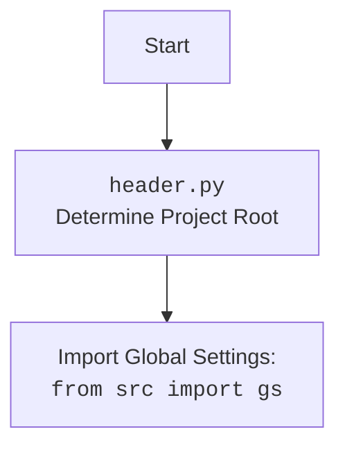

## ИНСТРУКЦИЯ:

Анализируй предоставленный код подробно и объясни его функциональность. Ответ должен включать три раздела:

1. **<алгоритм>**: Опиши рабочий процесс в виде пошаговой блок-схемы, включая примеры для каждого логического блока, и проиллюстрируй поток данных между функциями, классами или методами.
2. **<mermaid>**: Напиши код для диаграммы в формате `mermaid`, проанализируй и объясни все зависимости,
    которые импортируются при создании диаграммы.
    **ВАЖНО!** Убедитесь, что все имена переменных, используемые в диаграмме `mermaid`,
    имеют осмысленные и описательные имена. Имена переменных вроде `A`, `B`, `C`, и т.д., не допускаются!

    **Дополнительно**: Если в коде есть импорт `import header`, добавьте блок `mermaid` flowchart, объясняющий `header.py`:
    ```mermaid
    flowchart TD
        Start --> Header[<code>header.py</code><br> Determine Project Root]

        Header --> import[Import Global Settings: <br><code>from src import gs</code>]
    ```

3. **<объяснение>**: Предоставьте подробные объяснения:
   - **Импорты**: Их назначение и взаимосвязь с другими пакетами `src.`.
   - **Классы**: Их роль, атрибуты, методы и взаимодействие с другими компонентами проекта.
   - **Функции**: Их аргументы, возвращаемые значения, назначение и примеры.
   - **Переменные**: Их типы и использование.
   - Выделите потенциальные ошибки или области для улучшения.

Дополнительно, постройте цепочку взаимосвязей с другими частями проекта (если применимо).

Это обеспечивает всесторонний и структурированный анализ кода.
## Формат ответа: `.md` (markdown)
**КОНЕЦ ИНСТРУКЦИИ**

## <алгоритм>

1. **Определение корневой директории проекта (функция `set_project_root`)**:
    -   **Начало**: Функция принимает кортеж `marker_files` (по умолчанию `('__root__', '.git')`) в качестве аргумента.
    -   **Инициализация**:
        -   Путь к текущей директории файла (`__file__`) сохраняется в переменной `current_path`.
        -   Значение `current_path` присваивается переменной `__root__`, которая будет хранить путь к корню проекта.
    -   **Поиск родительских директорий**:
        -   Цикл `for` перебирает текущую директорию и все её родительские директории.
        -   Для каждой родительской директории `parent` проверяется наличие одного из `marker_files`.
        -   Если хотя бы один `marker_file` найден, родительская директория становится новым корнем проекта `__root__`, и цикл прерывается.
    -   **Добавление в sys.path**:
        -   Проверяется, содержится ли путь к корню проекта `__root__` в `sys.path`. Если нет, путь добавляется в начало списка `sys.path`.
    -   **Возврат**: Функция возвращает `__root__` (путь к корневой директории проекта).
    -   **Пример**:
        -   Если скрипт находится в `/home/user/project/src/endpoints/kazarinov/header.py`, а файл `.git` находится в `/home/user/project`, то `set_project_root()` вернёт `/home/user/project`.

2. **Инициализация глобальных переменных**:
    -   **Получение пути к корню проекта**: Вызывается `set_project_root()`, результат сохраняется в глобальной переменной `__root__`.
    -   **Загрузка настроек из `settings.json`**:
        -   Пытается открыть файл `settings.json`, расположенный в `<root>/src/settings.json`.
        -   Если файл найден, JSON-содержимое загружается в словарь `settings`.
        -   В случае `FileNotFoundError` или `json.JSONDecodeError` переменная `settings` остается `None`.
    -   **Загрузка документации из `README.MD`**:
        -   Пытается открыть файл `README.MD`, расположенный в `<root>/src/README.MD`.
        -   Если файл найден, его содержимое считывается и сохраняется в `doc_str`.
        -   В случае `FileNotFoundError` или `json.JSONDecodeError` переменная `doc_str` остается `None`.
    -   **Определение глобальных переменных**: На основе полученных `settings` (или значений по умолчанию) инициализируются:
        -   `__project_name__`: Имя проекта.
        -   `__version__`: Версия проекта.
        -   `__doc__`: Документация проекта.
        -   `__details__`: Детали проекта (пока пустая строка).
        -   `__author__`: Автор проекта.
        -   `__copyright__`: Копирайт.
        -   `__cofee__`: Сообщение про поддержку автора.

3. **Импорт глобальных настроек (`from src import gs`)**:
    - Импортирует модуль `gs` из пакета `src`, который, вероятно, содержит глобальные настройки и константы, включая путь к корневой директории проекта.

## <mermaid>

```mermaid
flowchart TD
    Start --> FindRoot[<code>set_project_root()</code><br> Найти корень проекта]
    FindRoot --> CheckMarkers{Проверить наличие<br>маркерных файлов}
    CheckMarkers -- Да --> SetRoot[Установить корень]
    CheckMarkers -- Нет --> CheckParent[Перейти к<br>родительской директории]
    SetRoot --> AddToPath[Добавить в sys.path]
    CheckParent --> FindRoot
    AddToPath --> LoadSettings[Загрузить<br>настройки из settings.json]
     
    LoadSettings --> LoadReadme[Загрузить<br>документацию из README.MD]
   
    LoadReadme --> InitVars[Инициализировать<br>глобальные переменные]
    InitVars --> ImportGS[Импорт глобальных настроек<br><code>from src import gs</code>]
   
    ImportGS --> End

    subgraph set_project_root
        FindRoot
        CheckMarkers
        CheckParent
        SetRoot
         AddToPath
    end
    
    subgraph Load
        LoadSettings
        LoadReadme
    end    

    subgraph Main
       InitVars
       ImportGS
    end
```


## <объяснение>

**Импорты:**

*   `sys`: Используется для доступа к параметрам командной строки и изменения пути поиска модулей (`sys.path`).
*   `json`: Используется для работы с JSON-файлами (загрузка настроек).
*   `packaging.version.Version`: Используется для сравнения версий (в этом коде не используется).
*   `pathlib.Path`: Используется для работы с путями к файлам и директориям.

**Функции:**

*   `set_project_root(marker_files=('__root__', '.git')) -> Path`:
    *   **Аргументы**:
        *   `marker_files`: Кортеж с именами файлов или папок, которые указывают на корень проекта (по умолчанию `('__root__', '.git')`).
    *   **Возвращает**: Объект `Path`, представляющий путь к корневой директории проекта.
    *   **Назначение**: Определяет корневую директорию проекта, начиная с директории текущего файла и поднимаясь вверх по структуре каталогов. Ищет маркерные файлы, которые указывают на корень проекта. После нахождения корня, добавляет его в `sys.path`.
    *   **Пример**:
        -   Если `marker_files` = `('.git', '__root__')`, и `.git` файл найден в `/home/user/project`, то функция вернёт `/home/user/project`.

**Переменные:**

*   `__root__` (`Path`): Путь к корневой директории проекта, полученный из `set_project_root()`.
*   `settings` (`dict` или `None`): Словарь с настройками проекта, загруженный из `settings.json`.
*   `doc_str` (`str` или `None`): Строка с содержимым файла `README.MD`.
*   `__project_name__` (`str`): Имя проекта (из `settings.json` или по умолчанию `hypotez`).
*   `__version__` (`str`): Версия проекта (из `settings.json` или пустая строка).
*   `__doc__` (`str`): Содержимое файла `README.MD`.
*   `__details__` (`str`): Детали проекта (по умолчанию пустая строка).
*   `__author__` (`str`): Автор проекта (из `settings.json` или пустая строка).
*   `__copyright__` (`str`): Копирайт (из `settings.json` или пустая строка).
*   `__cofee__` (`str`): Сообщение о возможности угостить автора кофе (из `settings.json` или стандартное сообщение со ссылкой на boosty).

**Объяснения:**

1.  **Определение корня проекта**: Функция `set_project_root` критически важна, поскольку она автоматически определяет корень проекта на основе наличия маркерных файлов. Это делает код переносимым и не зависит от конкретного пути. Добавление пути к корню в `sys.path` позволяет импортировать модули проекта относительно корня, а не текущей директории, что облегчает управление зависимостями.

2.  **Загрузка настроек**: Загрузка настроек из `settings.json` и документации из `README.MD` позволяет централизованно хранить метаданные проекта (имя, версию, авторство, т.п.). Использование `try-except` блоков обеспечивает, что код не сломается, если файлы настроек и документации отсутствуют или имеют неправильный формат.

3.  **Инициализация глобальных переменных**: Глобальные переменные, такие как `__project_name__`, `__version__`, `__doc__` и другие, предоставляют доступ к основным характеристикам проекта из любой части кода.

4. **Связь с `src`:** Импорт `from src import gs` предполагает, что `gs` - это модуль в пакете `src`, который содержит глобальные переменные и настройки. `gs.path.root` используется для получения пути к корню проекта и поиска файлов `settings.json` и `README.MD`.
   
**Возможные ошибки и улучшения:**

*   **Обработка ошибок**: В коде используются пустые блоки `except`, что может затруднить отладку и диагностику проблем с загрузкой настроек или документации. Было бы лучше добавлять запись в лог или выводить сообщение об ошибке.
*  **Отсутствие валидации:** Было бы полезно добавить валидацию для содержимого `settings.json`. Например, проверить наличие необходимых ключей и их типов.
*   **Использование `os.path`**: Использование `pathlib.Path` делает код более читаемым и удобным.

**Связь с другими частями проекта:**

*   Этот модуль (скорее всего) предназначен для использования во всем проекте. Он устанавливает основные настройки, которые могут быть использованы другими модулями и классами для получения информации о проекте и его среде.
*   Путь к корневой директории, определенный в этом модуле, используется для загрузки различных ресурсов проекта.
*  Глобальные переменные, такие как `__project_name__` и `__version__`, могут использоваться для формирования метаданных, например, при создании CLI приложения или API.

**Общий вывод:**

Код в `header.py` является ключевым для проекта. Он определяет корень проекта, загружает настройки и документацию, и инициализирует глобальные переменные, которые будут использоваться другими частями проекта.  Код является хорошо структурированным и относительно понятным, однако, есть области для улучшения в части обработки ошибок и валидации.