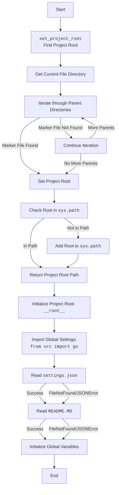
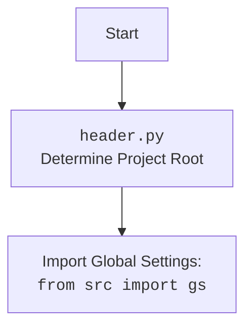

## Анализ кода `header.py`

### <алгоритм>

1.  **Инициализация**:
    *   Устанавливается переменная `MODE` в значение `'dev'`.
    *   Импортируются необходимые модули: `sys`, `json`, `Version` из `packaging.version` и `Path` из `pathlib`.

2.  **Определение корня проекта `set_project_root`**:
    *   Функция `set_project_root` принимает кортеж `marker_files` (по умолчанию `('__root__',)`), который содержит имена файлов или каталогов, которые идентифицируют корень проекта.
    *   Определяется текущий каталог, в котором находится скрипт.
    *   Итерируется по текущему каталогу и всем его родительским каталогам.
    *   Для каждого каталога проверяется, существует ли в нем хотя бы один из файлов или каталогов, указанных в `marker_files`.
        *   Пример: Если `marker_files` = `('__root__',)` и папка `C:\projects\hypotez` содержит файл `__root__`, то она будет распознана как корень проекта.
    *   Если такой каталог найден, он назначается корнем проекта (`__root__`), и цикл прерывается.
    *   Если корень проекта (`__root__`) отсутствует в `sys.path`, он добавляется в начало списка путей поиска модулей.
        *   Пример: Если корень проекта — `C:\projects\hypotez`, то этот путь будет добавлен в `sys.path`, чтобы скрипт мог импортировать модули из этого каталога.
    *   Функция возвращает объект `Path` к корню проекта.

3.  **Инициализация `__root__`**:
    *   Вызывается функция `set_project_root`, результат которой присваивается глобальной переменной `__root__`.

4.  **Импорт `gs`**:
    *   Импортируется модуль `gs` из пакета `src`. Модуль `gs` (global settings) содержит глобальные настройки проекта, включая путь к корню проекта `gs.path.root`.

5.  **Чтение файла `settings.json`**:
    *   Пытается открыть файл `settings.json`, расположенный в каталоге `src` относительно корня проекта, и загрузить его содержимое в словарь `settings`.
    *   Если файл не найден или при чтении возникает ошибка JSONDecodeError, блок `try` пропускается.

6.  **Чтение файла `README.MD`**:
    *   Пытается открыть файл `README.MD`, расположенный в каталоге `src` относительно корня проекта, и прочитать его содержимое в строку `doc_str`.
    *   Если файл не найден или при чтении возникает ошибка JSONDecodeError, блок `try` пропускается.

7.  **Инициализация глобальных переменных**:
    *   `__project_name__` инициализируется значением из `settings` по ключу `"project_name"` или строкой `'hypotez'`, если `settings` не определен или ключ `"project_name"` отсутствует.
    *   `__version__` инициализируется значением из `settings` по ключу `"version"` или пустой строкой, если `settings` не определен или ключ `"version"` отсутствует.
    *   `__doc__` инициализируется значением `doc_str` или пустой строкой, если `doc_str` не определен.
    *   `__details__` инициализируется пустой строкой.
    *   `__author__` инициализируется значением из `settings` по ключу `"author"` или пустой строкой, если `settings` не определен или ключ `"author"` отсутствует.
    *   `__copyright__` инициализируется значением из `settings` по ключу `"copyrihgnt"` или пустой строкой, если `settings` не определен или ключ `"copyrihgnt"` отсутствует.
    *   `__cofee__` инициализируется значением из `settings` по ключу `"cofee"` или стандартной строкой о поддержке разработчика, если `settings` не определен или ключ `"cofee"` отсутствует.

### <mermaid>

### <объяснение>

**Импорты:**

*   `sys`: Модуль `sys` используется для взаимодействия с интерпретатором Python. В данном коде он используется для модификации `sys.path`, что позволяет импортировать модули из каталога, который был определен как корень проекта.
*   `json`: Модуль `json` используется для работы с JSON-файлами, в данном случае для чтения файла `settings.json`.
*   `packaging.version.Version`: Используется для работы с версиями программного обеспечения. В этом коде он не используется напрямую, хотя и импортирован. Это может быть подготовка к дальнейшему использованию.
*   `pathlib.Path`: Модуль `pathlib` используется для работы с путями к файлам и каталогам. Обеспечивает удобный объектно-ориентированный подход для работы с файловой системой.
*   `src.gs`: Модуль `gs` из пакета `src`, предположительно, содержит глобальные настройки проекта. Он используется для доступа к пути к корню проекта `gs.path.root`, а также, возможно, к другим настройкам. Связь с другими частями проекта происходит через этот `gs`.

**Функции:**

*   `set_project_root(marker_files=('__root__',)) -> Path`:
    *   Аргументы: `marker_files` (кортеж строк, по умолчанию `('__root__',)`) — список имен файлов или каталогов, которые считаются маркерами корня проекта.
    *   Возвращает: Объект `pathlib.Path`, представляющий путь к корню проекта.
    *   Назначение: Функция определяет корень проекта, начиная с текущего каталога файла и ища вверх по иерархии каталогов. Она останавливается на первом каталоге, в котором найден хотя бы один из маркеров.  
    *   Пример: Если `marker_files` = `('__root__', '.git')` и файл `__root__` или каталог `.git` находятся в папке `C:\projects\my_project`, то функция вернет `Path('C:/projects/my_project')`

**Переменные:**

*   `MODE`: Строковая переменная, устанавливающая режим работы приложения (в данном случае `'dev'`).
*   `__root__`:  Объект `pathlib.Path`, который представляет путь к корню проекта. Этот путь используется для определения расположения файла настроек `settings.json` и `README.MD`.
*  `settings`:  Словарь, содержащий настройки проекта, прочитанные из `settings.json`. Может быть `None`, если не удалось прочитать файл.
*  `doc_str`: Строка, содержащая содержимое файла `README.MD`. Может быть `None`, если не удалось прочитать файл.
*   `__project_name__`: Строка, содержащая имя проекта (по умолчанию `'hypotez'`). Значение берется из `settings` или устанавливается по умолчанию.
*   `__version__`: Строка, содержащая версию проекта. Значение берется из `settings` или устанавливается пустой строкой по умолчанию.
*   `__doc__`: Строка, содержащая документацию проекта, считанную из `README.MD`.
*   `__details__`: Строка, содержащая дополнительные детали проекта (в данном случае пустая строка).
*  `__author__`: Строка, содержащая имя автора проекта. Значение берется из `settings` или устанавливается пустой строкой по умолчанию.
*  `__copyright__`: Строка, содержащая информацию об авторских правах. Значение берется из `settings` или устанавливается пустой строкой по умолчанию.
* `__cofee__`: Строка, содержащая призыв поддержать разработчика. Значение берется из `settings` или устанавливается стандартным значением по умолчанию.

**Потенциальные ошибки и области для улучшения:**

*   **Обработка ошибок**: В блоках `try`/`except` при чтении `settings.json` и `README.MD` используется `...` (Ellipsis), что не информативно.  Лучше логировать ошибки или устанавливать значения по умолчанию.
*   **Версионирование**: Хотя `packaging.version.Version` импортирован, он нигде не используется. Возможно, его стоит добавить для полноценной работы с версиями.
*   **Конфигурация**: Использование `settings.json` для конфигурации может быть не гибким в будущем.  Лучше рассмотреть использование более мощных библиотек для работы с конфигурациями.
*   **Документация:** Отсутствие docstring для глобальных переменных (кроме `__root__`) может затруднить понимание кода в будущем.

**Взаимосвязь с другими частями проекта:**

*   Этот файл является частью процесса инициализации проекта. Он определяет корень проекта и загружает общие настройки. Он используется в других модулях, которые зависят от пути к корню проекта и общих настроек. Модуль `src.gs` играет центральную роль в этой связи.
*   Глобальные переменные, такие как `__project_name__`, `__version__` и `__doc__` могут использоваться в других частях проекта для определения метаданных.