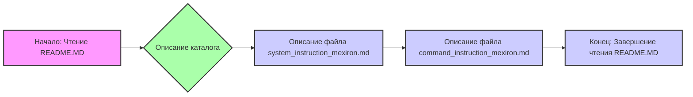

## Анализ кода README.MD

### <алгоритм>

1. **Начало**: Чтение файла `README.MD`.

2. **Описание каталога**: Указано, что каталог содержит инструкции и системные подсказки для AI-модели.
   * _Пример_: Текст начинается с "This directory contains instructions and system prompts for the AI model."

3. **Описание файла `system_instruction_mexiron.md`**:
    * Указано, что этот файл содержит подсказку (prompt), которая загружается при инициализации модели и описывает ее поведение.
        * _Пример_: Строка "The prompt is loaded during the model's initialization and describes the behavior of the initialized model: `system_instruction_mexiron.md`".

4. **Описание файла `command_instruction_mexiron.md`**:
    * Указано, что этот файл содержит инструкцию, которая является кратким указанием для модели. Она описывает шаблон ответа модели.
        * _Пример_: Строка "The instruction is a short directive for the model, outlining the template for the model's response: `command_instruction_mexiron.md`".

5. **Конец**: Завершение чтения файла `README.MD`.

### <mermaid>

**Анализ зависимостей `mermaid`:**

Диаграмма в формате `mermaid` представляет собой блок-схему, описывающую последовательность обработки файла `README.MD`. 

- `A` – начало обработки. Это начальная точка потока.
- `B` – блок, представляющий общее описание каталога, в котором находится файл `README.MD`.
- `C` – блок, описывающий файл `system_instruction_mexiron.md`.
- `D` – блок, описывающий файл `command_instruction_mexiron.md`.
- `E` – конец обработки файла `README.MD`.

Стрелки `-->` показывают последовательность операций, иллюстрируя, как данные или поток управления переходят от одного блока к другому.

### <объяснение>

**Общее назначение:**
   Файл `README.MD` предоставляет краткое описание каталога, содержащего важные файлы:
   - `system_instruction_mexiron.md` (системная инструкция/подсказка для модели)
   - `command_instruction_mexiron.md` (инструкция для шаблона ответа модели).
   Эти файлы используются для управления поведением и форматированием ответов AI-модели.

**Разбор:**

   - **Импорты:** В данном файле не используются импорты. Этот файл является обычным текстовым файлом с разметкой Markdown и не содержит кода на Python.

   - **Классы:**  Классы в данном файле не используются, так как это Markdown файл.

   - **Функции:** Функции в данном файле не используются, так как это Markdown файл.

   - **Переменные:** В файле не используются переменные, поскольку это Markdown файл, предназначенный для чтения человеком, а не для интерпретации.

**Цепочка взаимосвязей с другими частями проекта:**

   1. **Загрузка инструкций:** `system_instruction_mexiron.md` и `command_instruction_mexiron.md` загружаются AI-моделью при инициализации. Это означает, что они играют важную роль в определении поведения и ответов модели.
   2. **Конфигурация модели:** Эти файлы являются частью конфигурации модели, определяя как она будет взаимодействовать с пользователем, понимать запросы и генерировать ответы.
   3. **Управление поведением:** `system_instruction_mexiron.md` (системная инструкция) определяет общий контекст и поведение модели. `command_instruction_mexiron.md` (инструкция для шаблона ответа) определяет формат и структуру ответов модели.
   4. **Гибкость:** Разделение на два файла обеспечивает гибкость в управлении моделью. Можно менять общий контекст и поведение (через `system_instruction_mexiron.md`) или формат ответа (через `command_instruction_mexiron.md`) независимо друг от друга.

**Потенциальные ошибки и области для улучшения:**

1. **Отсутствие подробностей:** `README.MD` предоставляет лишь краткое описание. Для полноценного понимания функциональности системы потребуется обращаться к файлам `system_instruction_mexiron.md` и `command_instruction_mexiron.md`.
2. **Неявные зависимости:** Зависимости от этих файлов внутри модели не описаны явно. Для лучшего понимания было бы полезно включить более подробное описание того, как именно инициируется модель и загружаются эти файлы.
3. **Версионирование:** Нет информации о версионировании этих файлов, что может привести к проблемам, если разные версии будут использоваться с разными частями системы.
4. **Уточнения**: Можно добавить более подробное описание формата файлов `system_instruction_mexiron.md` и `command_instruction_mexiron.md` и их связи друг с другом.

В целом, файл `README.MD` предоставляет базовое описание каталога с инструкциями, но требуется более детальная документация для полного понимания работы системы.