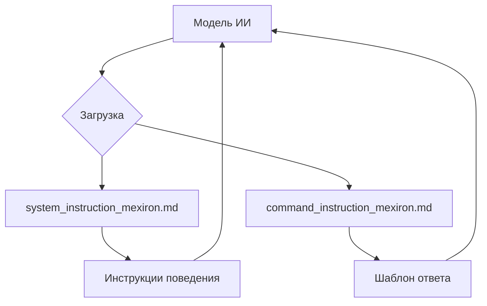
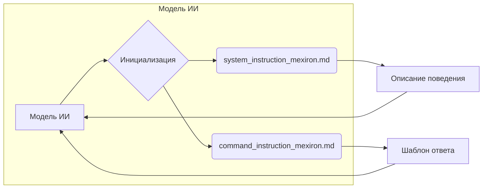

# Анализ кода

Этот код не содержит функционального кода на языке программирования.  Он представляет собой текстовое описание структуры файлов в директории `hypotez/src/endpoints/kazarinov/instructions`, содержащей инструкции и системные подсказки для модели ИИ.

## <input code>

```
This directory contains instructions and system prompts for the AI model.
=========================================================================

- The prompt is loaded during the model's initialization and describes the behavior of the initialized model:
  `system_instruction_mexiron.md`

- The instruction is a short directive for the model, outlining the template for the model's response:
  `command_instruction_mexiron.md`
```

## <algorithm>

Код не содержит алгоритма в традиционном смысле.  Он описывает организацию данных, используемых моделью ИИ.  Нет циклов, ветвлений или вычислений. Алгоритм можно представить как "загрузку инструкций".



## <mermaid>



## <explanation>

**Импорты:**

Нет импортов, так как код не содержит программного кода.

**Классы:**

Нет классов.

**Функции:**

Нет функций.

**Переменные:**

Нет переменных.

**Возможные ошибки или области для улучшений:**

Нет ошибок и областей для улучшений, так как это текстовое описание, а не программный код.

**Взаимосвязи с другими частями проекта:**

Файлы `system_instruction_mexiron.md` и `command_instruction_mexiron.md` содержат данные, которые загружаются при инициализации модели ИИ. Эта модель скорее всего используется в рамках какого-то приложения или сервиса, и эти файлы предоставляют ей необходимые инструкции для правильной работы.

**Дополнительные замечания:**

Этот код описывает структуризацию данных для обучения и работы модели ИИ.  Важно, чтобы эти файлы содержали чёткие и понятные инструкции для корректного поведения модели, особенно при взаимодействии с пользователем.