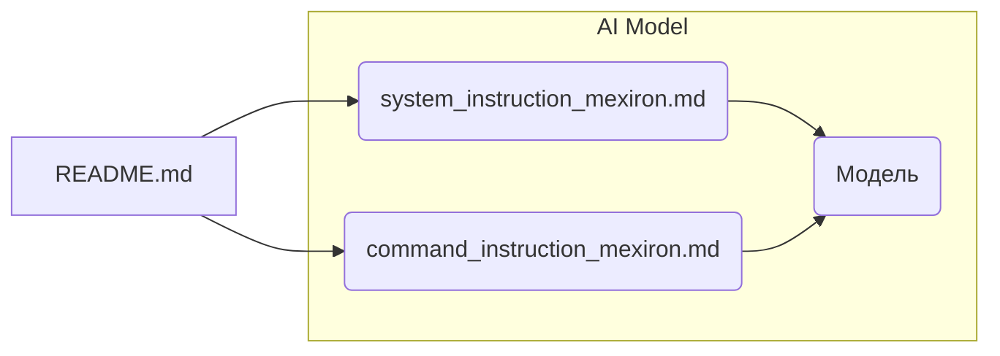

# Анализ кода из README.md

## 1. <input code>

```
This directory contains instructions and system prompts for the AI model.
=========================================================================

- The prompt is loaded during the model's initialization and describes the behavior of the initialized model:
  `system_instruction_mexiron.md`

- The instruction is a short directive for the model, outlining the template for the model's response:
  `command_instruction_mexiron.md`
```

## 2. <algorithm>

Данный код представляет собой описание структуры директории, содержащей инструкции и системные подсказки для AI модели.  Алгоритм работы кода - это просто **описание**, а не исполняемый код.  Пошаговая блок-схема не применима.  Данные не перемещаются между функциями, классами или методами в данном случае.

## 3. <mermaid>



**Описание диаграммы:**

Диаграмма показывает взаимосвязь файлов внутри директории `hypotez/src/endpoints/kazarinov/instructions/`. `README.md` содержит описание, которое ссылается на файлы `system_instruction_mexiron.md` и `command_instruction_mexiron.md`.  Эти файлы, в свою очередь, содержат инструкции, используемые AI моделью во время работы. Модель получает указания из обоих файлов.

## 4. <explanation>

**Импорты**:

Нет импортов. Данный код — это текстовое описание структуры директории, а не фрагмент кода, содержащий импорты.

**Классы**:

Нет классов.  Это не код программы, а текстовое описание.

**Функции**:

Нет функций.  Это описание структуры директории.

**Переменные**:

Нет переменных.

**Возможные ошибки или области для улучшений**:

Нет ошибок и нет необходимости в улучшениях.  Описание предоставлено в корректном формате, позволяющем понять назначение файлов.

**Цепочка взаимосвязей с другими частями проекта**:

Файлы `system_instruction_mexiron.md` и `command_instruction_mexiron.md`  формируют интерфейс для AI модели.  Они управляют поведением модели и определяют формат её ответов.  Таким образом, эти файлы являются важными элементами взаимодействия с основной системой.  Без данных инструкций модель не будет иметь необходимых данных для работы.

**Вывод**:

Код представляет собой описание структуры файлов, содержащих инструкции и подсказки для AI модели.  Эти файлы определяют поведение модели.  Анализ кода не может быть полноценным без доступа к коду самой модели.