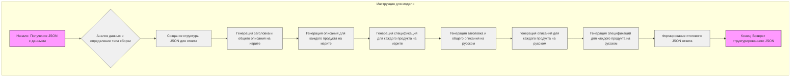

## ИНСТРУКЦИЯ:

Анализируй предоставленный код подробно и объясни его функциональность. Ответ должен включать три раздела:

1.  **<алгоритм>**: Опиши рабочий процесс в виде пошаговой блок-схемы, включая примеры для каждого логического блока, и проиллюстрируй поток данных между функциями, классами или методами.
2.  **<mermaid>**: Напиши код для диаграммы в формате `mermaid`, проанализируй и объясни все зависимости,
    которые импортируются при создании диаграммы.
    **ВАЖНО!** Убедитесь, что все имена переменных, используемые в диаграмме `mermaid`,
    имеют осмысленные и описательные имена. Имена переменных вроде `A`, `B`, `C`, и т.д., не допускаются!

    **Дополнительно**: Если в коде есть импорт `import header`, добавьте блок `mermaid` flowchart, объясняющий `header.py`:
    ```mermaid
    flowchart TD
        Start --> Header[<code>header.py</code><br> Determine Project Root]

        Header --> import[Import Global Settings: <br><code>from src import gs</code>]
    ```

3.  **<объяснение>**: Предоставьте подробные объяснения:
    *   **Импорты**: Их назначение и взаимосвязь с другими пакетами `src.`.
    *   **Классы**: Их роль, атрибуты, методы и взаимодействие с другими компонентами проекта.
    *   **Функции**: Их аргументы, возвращаемые значения, назначение и примеры.
    *   **Переменные**: Их типы и использование.
    *   Выделите потенциальные ошибки или области для улучшения.

Дополнительно, постройте цепочку взаимосвязей с другими частями проекта (если применимо).

Это обеспечивает всесторонний и структурированный анализ кода.
## Формат ответа: `.md` (markdown)
**КОНЕЦ ИНСТРУКЦИИ**

## <алгоритм>

Представленный код - это инструкция для модели, предназначенная для обработки данных о компьютерных компонентах. Алгоритм работы можно представить в виде следующей блок-схемы:

```mermaid
graph LR
    A[Начало: Получение JSON с данными о компонентах] --> B(Анализ JSON: определение build type (gaming/workstation));
    B --> C{Создание структуры данных для ответа};
    C --> D[Генерация заголовка и описания на иврите];
    D --> E[Генерация описаний компонентов на иврите];
    E --> F[Генерация спецификаций компонентов на иврите];
     F --> G[Генерация заголовка и описания на русском];
    G --> H[Генерация описаний компонентов на русском];
    H --> I[Генерация спецификаций компонентов на русском];
    I --> J{Формирование итогового JSON};
    J --> K[Конец: Возврат JSON с информацией];
    
    style A fill:#f9f,stroke:#333,stroke-width:2px
     style K fill:#f9f,stroke:#333,stroke-width:2px
    
    subgraph "Примеры данных и действий"
    
        B --> B1("Пример: Build type gaming: 90%, workstation: 10%")
        D --> D1("Пример: title: 'מחשב גיימינג בעל ביצועים גבוהים', description: 'מחשב ...'")
        E --> E1("Пример: Для RTX 4070: 'כרטיס מסך מתקדם של Nvidia... '")
    
       G --> G1("Пример: title: 'Высокопроизводительный игровой компьютер', description: 'Современный компьютер ...'")
       H --> H1("Пример: Для RTX 4070: 'Продвинутая видеокарта от Nvidia... '")
     
    end
```
1.  **Начало**: Получается JSON с информацией о компьютерных компонентах.
2.  **Анализ JSON**: Определяется тип сборки (например, gaming или workstation) и выставляется оценка уверенности в процентах. Например, для игровой сборки это может быть 90% gaming, 10% workstation.
3.  **Создание структуры ответа**: Подготавливается структура JSON для будущего ответа.
4.  **Генерация заголовка и описания на иврите**: Генерируется заголовок (title) и описание (description) сборки на иврите. Например, "מחשב גיימינג בעל ביצועים גבוהים" и соответствующее описание.
5.  **Генерация описаний компонентов на иврите**: Генерируются описания (product\_description) для каждого компонента на иврите. Например, для RTX 4070 – "כרטיס מסך מתקדם של Nvidia…". Если создать спецификацию невозможно, поле оставляется пустым.
6. **Генерация спецификаций компонентов на иврите**: Генерируются спецификации (product\_specification) для каждого компонента на иврите. Если создать спецификацию невозможно, поле оставляется пустым.
7.  **Генерация заголовка и описания на русском**: Генерируется заголовок и описание сборки на русском языке. Например, "Высокопроизводительный игровой компьютер" и соответствующее описание.
8.  **Генерация описаний компонентов на русском**: Генерируются описания для каждого компонента на русском языке. Например, для RTX 4070 - "Продвинутая видеокарта от Nvidia...". Если создать спецификацию невозможно, поле оставляется пустым.
9.   **Генерация спецификаций компонентов на русском**: Генерируются спецификации (product\_specification) для каждого компонента на русском языке. Если создать спецификацию невозможно, поле оставляется пустым.
10. **Формирование итогового JSON**: Собирается итоговый JSON, который включает все сгенерированные данные.
11. **Конец**: Возвращается готовый JSON с информацией.

## <mermaid>



Диаграмма описывает процесс обработки данных о компьютерных компонентах.  Нет импортов или зависимостей от внешних модулей, так как это всего лишь описание алгоритма обработки данных.

## <объяснение>

**Общее описание:**

Представленный код является инструкцией (или промптом) для языковой модели. Он описывает задачу, которую модель должна выполнить: проанализировать данные о компьютерных компонентах в формате JSON, классифицировать тип сборки (например, игровая или рабочая станция), предоставить заголовки и описания на иврите и русском языках, перевести детали компонентов и сформировать структурированный JSON в качестве результата.

**Основные аспекты:**

1.  **Цель инструкции:** Инструкция призвана направлять языковую модель при обработке JSON данных о компьютерных компонентах.
2.  **Ожидаемый результат**: Модель должна выдать структурированный JSON, в котором будут содержаться переведенные и отформатированные данные о компонентах, а также определения типа сборки и оценки уверенности (confidence scores).
3.  **Шаблон JSON:** В инструкции представлен пример JSON структуры, которой должна придерживаться модель в своем ответе. В этом шаблоне есть два основных раздела: "he" (иврит) и "ru" (русский), каждый из которых содержит "title", "description", "build_types" и массив "products".
4.  **Словарь терминов:** Дается пояснение, что "product" и "component" являются синонимами в данном контексте.
5. **Обработка данных**: Инструкция предписывает модели оставлять некоторые поля (например, "product\_id", "image\_local\_saved\_path") без изменений, как они представлены во входных данных.
6.  **Требования к тексту:**
    *   Все текстовые поля должны быть в кодировке UTF-8.
    *   Названия и описания компонентов должны быть созданы моделью, а не взяты из входных данных.
    *   Если невозможно сгенерировать спецификацию, поле "specification" должно оставаться пустым.
7.  **Языки:** Выходные данные должны быть представлены на двух языках: иврите и русском.

**Потенциальные области для улучшения и возможные ошибки:**

1.  **Ограниченность контекста:** Инструкция предполагает, что модель способна понимать контекст сборки компьютеров и может генерировать адекватные описания и спецификации. Это может не всегда быть так, и точность ответов будет зависеть от возможностей модели.
2.  **Неопределенность**: Инструкция не оговаривает, откуда модель должна получать информацию для генерации описаний и спецификаций. Она должна либо использовать контекст предоставленных данных, либо использовать собственные знания и языковые возможности.
3.  **Ошибки перевода**: Модель может допускать ошибки при переводе с одного языка на другой.
4.  **Форматирование**: Модель должна строго следовать предоставленному шаблону, и ошибки форматирования могут нарушить структуру JSON.
5.  **Ограниченные данные**: Инструкция не описывает, что делать, если входящие данные неполные или отсутствуют.

**Взаимосвязь с другими частями проекта:**

Эта инструкция является частью системы, где модель используется для обработки данных о компьютерных компонентах. Она не связана напрямую с другими частями проекта, которые могут включать код, выполняющий запросы к модели, обработку данных и вывод результатов.

**Итог:**

Инструкция является четкой и подробной, устанавливая понятные требования к языковой модели. Ее качество будет определяться способностью модели точно следовать инструкциям и генерировать релевантные и правильно отформатированные данные. Важно отметить, что в инструкции нет прямых импортов, классов, функций или переменных, поскольку это инструкция для модели, а не программный код.