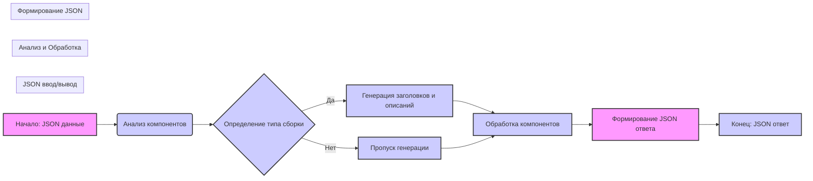

# Анализ кода инструкции command_instruction_mexiron.md

## <алгоритм>

1.  **Получение JSON данных**: На вход поступает JSON, содержащий информацию о компонентах компьютера.
2.  **Анализ компонентов**:
    *   Идентифицируются и анализируются компоненты компьютера (процессор, видеокарта, память и т.д.).
    *   Определяется тип сборки (например, игровой, рабочая станция) на основе анализа компонентов.
3.  **Генерация заголовков и описаний**:
    *   Генерируются заголовки и описания на иврите и русском языках для всей сборки.
    *   Пример:
        *   Заголовок (иврит): "מחשב גיימינג בעל ביצועים גבוהים"
        *   Описание (иврит): "מחשב מודרני למשחקים ותוכנות תובעניים. כולל מעבד Intel i7-14700F, כרטיס מסך Gigabyte RTX 4070, זיכרון RAM DDR4 בנפח 16GB ו-SSD Kingston בנפח 4TB."
        *   Заголовок (русский): "Высокопроизводительный игровой компьютер"
        *   Описание (русский): "Современный компьютер для требовательных игр и приложений. Включает Intel i7-14700F, Gigabyte RTX 4070, DDR4 RAM 16GB и SSD Kingston 4TB."
4.  **Классификация типа сборки**:
    *   Определяется тип сборки компьютера (игровой, рабочая станция) и присваивается уверенность (confidence score) для каждого типа.
        *   Пример:
            ```json
            "build_types": {
              "gaming": 0.9,
              "workstation": 0.1
            }
            ```
5.  **Обработка компонентов**:
    *   Для каждого компонента генерируются:
        *   `product_title` (название компонента на иврите и русском)
        *   `product_description` (описание компонента на иврите и русском, если возможно)
        *   `product_specification` (спецификация компонента на иврите и русском, если возможно)
    *   Поля `product_id` и `image_local_saved_path` остаются без изменений (как в исходных данных).
6.  **Формирование структурированного JSON ответа**:
    *   Создается JSON, содержащий:
        *   Заголовки и описания сборки на иврите и русском.
        *   Типы сборки с их уверенностью.
        *   Массив компонентов, каждый из которых содержит информацию, сгенерированную на предыдущем шаге.
    *   Пример структуры JSON:
        ```json
        {
          "he": {
            "title": "...",
            "description": "...",
            "build_types": {
              "gaming": 0.9,
              "workstation": 0.1
            },
            "products": [
              {
                "product_id": "<input_data>",
                "product_title": "<generated_hebrew_name>",
                "product_description": "<generated_hebrew_description>",
                "specification": "<generated_hebrew_specification>",
                "image_local_saved_path": "<input_data>"
              },
              ...
            ]
          },
           "ru": {
            "title": "...",
            "description": "...",
            "build_types": {
              "gaming": 0.9,
              "workstation": 0.1
            },
            "products": [
              {
                "product_id": "<input_data>",
                "product_title": "<generated_russian_name>",
                "product_description": "<generated_russian_description>",
                "specification": "<generated_russian_specification>",
                "image_local_saved_path": "<input_data>"
              },
              ...
            ]
          }
        }
        ```
7.  **Возврат JSON**:
    *   Сформированный JSON возвращается в качестве ответа.

## <mermaid>


**Объяснение зависимостей в mermaid диаграмме:**

*   **A[Начало: JSON данные]**: Начальная точка, представляющая входные JSON данные о компонентах компьютера.
*   **B(Анализ компонентов)**: Этап, на котором анализируется каждый компонент компьютера.
*   **C{Определение типа сборки}**: Логический блок, определяющий тип сборки (например, gaming, workstation) на основе анализа компонентов.
*   **D[Генерация заголовков и описаний]**: Этап генерации заголовков и описаний на иврите и русском языках.
*   **E[Пропуск генерации]**: Этап пропуска генерации если нет необходимости в генерации.
*   **F[Обработка компонентов]**:  Этап, где для каждого компонента генерируются названия, описания и спецификации на иврите и русском.
*   **G[Формирование JSON ответа]**: Этап, где формируется структурированный JSON ответ.
*   **H[Конец: JSON ответ]**: Конечная точка, представляющая JSON ответ.

## <объяснение>

### Импорты:

В данном коде нет явных импортов, так как это инструкция для модели, а не исполняемый код. Однако, предполагается, что модель будет использовать необходимые библиотеки для работы с JSON, перевода текста и анализа текста.

### Классы:

В данном коде нет классов. Инструкция подразумевает, что модель будет использовать внутренние механизмы или сторонние API для обработки данных.

### Функции:

В данном коде нет явных функций. Инструкция описывает последовательность действий, которые должна выполнить модель. Фактически, модель будет использовать свои внутренние функции для выполнения следующих задач:

*   **`analyze_components(json_data)`**: Функция для анализа компонентов из входных JSON данных.
*   **`classify_build_type(components)`**: Функция для определения типа сборки компьютера на основе анализа компонентов. Возвращает словарь с уверенностью для каждого типа.
*   **`generate_titles_descriptions(build_type, components, language)`**: Функция для генерации заголовков и описаний для сборки и компонентов на заданном языке.
*   **`translate_component_details(component_details, language)`**: Функция для перевода деталей компонента на заданный язык.
*   **`create_json_response(titles_descriptions, build_types, translated_components)`**: Функция для создания структурированного JSON ответа.

### Переменные:

*   **`json_data`**: Входные JSON данные о компонентах компьютера.
*   **`components`**: Список или словарь компонентов, полученных из `json_data`.
*   **`build_type`**: Строка, представляющая тип сборки компьютера (например, "gaming", "workstation").
*   **`build_types`**: Словарь с типом сборки и уверенностью, например: `{"gaming": 0.9, "workstation": 0.1}`.
*   **`language`**: Строка, представляющая язык ("he" для иврита, "ru" для русского).
*   **`titles_descriptions`**: Словарь с заголовком и описанием сборки и для каждого компонента, сгенерированные на иврите и русском языках.
*   **`translated_components`**: Список компонентов, где каждое поле переведено на нужный язык.
*   **`response_json`**: Результирующий JSON ответ.
*   `product_id` - идентификатор продукта
*   `product_title` - название продукта
*   `product_description` - описание продукта
*   `product_specification` - спецификация продукта
*   `image_local_saved_path` - локальный путь до изображения продукта

### Потенциальные ошибки и области для улучшения:

1.  **Отсутствие обработки ошибок**: В инструкции не указано, как обрабатывать ошибки при анализе компонентов, переводе или создании JSON. Необходимо добавить обработку ошибок, чтобы гарантировать стабильную работу.
2.  **Универсальность перевода**: Инструкция предполагает, что модель может переводить любые описания и спецификации, хотя в реальности это может быть сложно. Нужно убедиться в наличии качественного переводчика.
3.  **Точность классификации**: Классификация типа сборки на основе компонентов может быть не всегда точной. Необходимо использовать надежный механизм классификации.
4.  **Полнота данных**:  Необходимо убедиться, что все компоненты из входных данных имеют все необходимые поля.
5.  **Согласованность ответов**: Важно, чтобы структура JSON ответа всегда соответствовала шаблону, что обеспечит корректную интерпретацию ответа.

### Взаимосвязи с другими частями проекта:

Эта инструкция может быть связана с другими частями проекта, которые отвечают за:

*   **Получение данных о компонентах**: Модули, отвечающие за загрузку данных о компонентах из баз данных или API.
*   **Интерфейс пользователя**: Модули, отвечающие за отображение информации о сборках и компонентах пользователю.
*   **Перевод текста**: Модули, предоставляющие функциональность для перевода текста на разные языки.
*   **Модели машинного обучения**: Модули, которые будут использоваться для классификации типов сборки и генерации текста.