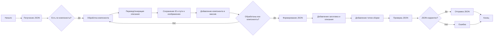

## Анализ кода инструкции command_instruction_mexiron_he.md

### 1. **<алгоритм>**

1.  **Получение JSON на входе:** На вход поступает JSON, который содержит данные о компьютерных компонентах. Эти компоненты могут быть представлены в виде списка продуктов (products), где каждый продукт содержит `product_id`, `image_local_saved_path`, и другие параметры. Также могут присутствовать данные о типе сборки.

2.  **Обработка данных:**
    *   **Перевод и генерация описаний:** Для каждого компонента генерируются или переводятся (если нужно)  `product_title`, `product_description` и `specification` на иврит. Если информации для создания описания/спецификации недостаточно, поля остаются пустыми.
    *   **Определение типа сборки:** Определяется тип сборки компьютера (например, гейминг, рабочая станция) и присваивается соответствующий рейтинг (число от 0 до 1).
    *   **Сохранение исходных данных:** Поля `product_id` и `image_local_saved_path` сохраняются без изменений.

3.  **Формирование JSON на выходе:**
    *   Создается JSON структура, соответствующая шаблону.
    *   В структуре содержатся ключи `"he"` с вложенными:
        *   `"title"`: Заголовок сборки на иврите.
        *   `"description"`: Описание сборки на иврите.
        *   `"build_types"`: Словарь с типами сборки и их рейтингами.
        *   `"products"`: Массив объектов, каждый из которых представляет собой компонент с переведенными и сгенерированными полями.

4.  **Проверка целостности JSON:** Перед отправкой сформированный JSON проверяется на наличие недостающих полей или ошибок в структуре.

5.  **Отправка JSON:** Сформированный JSON отправляется в кодировке UTF-8 без использования Unicode Escape Sequence.

**Пример:**

*   **Входной JSON:** (предположительный)
    ```json
    {
      "components": [
        {
          "product_id": "cpu_123",
          "product_title": "Intel i7-14700F",
          "image_local_saved_path": "/images/cpu.jpg"
        },
        {
          "product_id": "gpu_456",
           "product_title": "Gigabyte RTX 4070",
           "image_local_saved_path": "/images/gpu.jpg"
        }
      ]
    }
    ```

*   **Обработка:**
    1.  Создаются описания на иврите для процессора и видеокарты.
    2.  Определяется, что это сборка скорее для игр (например, `gaming: 0.9`).

*   **Выходной JSON:**
    ```json
    {
      "he": {
        "title": "מחשב גיימינג בעל ביצועים גבוהים",
        "description": "מחשב מודרני למשחקים ותוכנות תובעניים. כולל מעבד Intel i7-14700F, כרטיס מסך Gigabyte RTX 4070, זיכרון RAM DDR4 בנפח 16GB ו-SSD Kingston בנפח 4TB.",
        "build_types": {
          "gaming": 0.9,
          "workstation": 0.1
        },
        "products": [
          {
            "product_id": "cpu_123",
            "product_title": "מעבד Intel i7-14700F",
            "product_description": "מעבד מתקדם מבית אינטל",
            "specification": "מהירות שעון 3.4 GHz, 20 ליבות",
            "image_local_saved_path": "/images/cpu.jpg"
          },
          {
            "product_id": "gpu_456",
            "product_title": "כרטיס מסך Gigabyte RTX 4070",
            "product_description": "כרטיס מסך עוצמתי למשחקים",
            "specification": "זיכרון 12GB GDDR6X, תמיכה ב-Ray Tracing",
            "image_local_saved_path": "/images/gpu.jpg"
           }
        ]
      }
    }
    ```

### 2. **<mermaid>**



**Зависимости:**

*   Нет импорта внешних библиотек.
*   Предполагается, что операции перевода/генерации описаний могут использовать внутренние функции или модели, но это не отражено в диаграмме.
*   Функция для проверки JSON должна быть доступна.

### 3. **<объяснение>**

**Импорты:**

*   В предоставленном коде нет явных импортов. Инструкция полагается на то, что необходимые функции для обработки JSON, перевода и генерации текста, а также проверки JSON, уже существуют и доступны в рамках проекта.

**Классы:**

*   В предоставленном коде нет определения классов. Весь процесс представлен как последовательность инструкций. Однако, для организации и переиспользования кода можно было бы создать классы для:
    *   `ComponentProcessor`: Обработка отдельных компонентов.
    *   `JsonBuilder`: Сборка JSON из полученных данных.
    *   `JsonValidator`: Проверка корректности JSON.

**Функции:**

*   **Основная функция (не явно указана, но подразумевается):**
    *   Аргументы: Входной JSON с данными о компонентах.
    *   Возвращаемое значение: JSON, соответствующий шаблону, с переведенными описаниями и спецификациями.
    *   Назначение: Основной процесс, описанный в алгоритме.

*   **Функции для обработки компонентов:**
    *   `translate_product_title(product_title)`: Переводит название продукта на иврит.
    *   `generate_product_description(product)`: Генерирует описание продукта на иврите.
    *   `generate_product_specification(product)`: Генерирует спецификацию продукта на иврите.

*   **Функции для сборки JSON:**
    *   `build_json(title, description, build_types, products)`: Собирает JSON из полученных данных.

*   **Функция для проверки JSON:**
    *   `validate_json(json)`: Проверяет JSON на наличие ошибок структуры и соответствие шаблону.

**Переменные:**

*   `product_id` (string): Идентификатор продукта из входных данных.
*   `product_title` (string): Название продукта, сгенерированное или переведенное на иврит.
*   `product_description` (string): Описание продукта на иврите.
*   `specification` (string): Спецификация продукта на иврите.
*   `image_local_saved_path` (string): Локальный путь к изображению продукта из входных данных.
*   `build_types` (dict): Словарь типов сборки и их рейтингов (например, `{"gaming": 0.9, "workstation": 0.1}`).
*   `products` (list): Список объектов, представляющих обработанные компоненты.
*   `json_output` (dict): Финальный JSON для вывода.

**Потенциальные ошибки и области для улучшения:**

*   **Отсутствие обработки ошибок:** Неясно, как обрабатываются ошибки при переводе или генерации описаний.
*   **Недостаточная обработка данных:** Инструкция предполагает, что все необходимые данные присутствуют и корректны. Не учитывается обработка отсутствующих или неправильных данных.
*   **Неоднозначность перевода:** Перевод может зависеть от контекста. Инструкция не указывает, как обрабатываются неоднозначные ситуации.
*   **Жестко заданные типы сборки:** Типы сборки и их рейтинги не динамические. Возможно, их следует брать из входных данных.
*   **Зависимость от внешних сервисов:** Инструкция не описывает как именно происходит перевод и генерация текста на иврите.

**Цепочка взаимосвязей:**

1.  **Вводные данные:** JSON с компонентами, полученные из внешнего источника.
2.  **Обработка данных:** Код (который описан в алгоритме) обрабатывает JSON, переводит/генерирует описания, и формирует JSON.
3.  **Выходные данные:** JSON, соответствующий заданному шаблону, отправляется в качестве результата.
4.  **Использование результатов:** JSON используется другой частью системы (например, для отображения данных пользователю).

**В итоге:**

Предоставленный код представляет собой инструкцию для обработки данных о компьютерных компонентах. Для корректной работы необходима реализация функций для перевода, генерации описаний, сборки и проверки JSON. Важно добавить обработку ошибок и предусмотреть возможность динамической настройки типов сборки, а также обеспечить перевод на иврит.