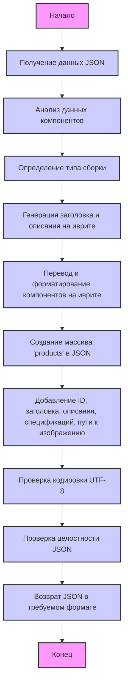

## ИНСТРУКЦИЯ:

Анализируй предоставленный код подробно и объясни его функциональность. Ответ должен включать три раздела:

1. **<алгоритм>**: Опиши рабочий процесс в виде пошаговой блок-схемы, включая примеры для каждого логического блока, и проиллюстрируй поток данных между функциями, классами или методами.
2. **<mermaid>**: Напиши код для диаграммы в формате `mermaid`, проанализируй и объясни все зависимости,
    которые импортируются при создании диаграммы.
    **ВАЖНО!** Убедитесь, что все имена переменных, используемые в диаграмме `mermaid`,
    имеют осмысленные и описательные имена. Имена переменных вроде `A`, `B`, `C`, и т.д., не допускаются!

    **Дополнительно**: Если в коде есть импорт `import header`, добавьте блок `mermaid` flowchart, объясняющий `header.py`:
    ```mermaid
    flowchart TD
        Start --> Header[<code>header.py</code><br> Determine Project Root]

        Header --> import[Import Global Settings: <br><code>from src import gs</code>]
    ```

3. **<объяснение>**: Предоставьте подробные объяснения:
   - **Импорты**: Их назначение и взаимосвязь с другими пакетами `src.`.
   - **Классы**: Их роль, атрибуты, методы и взаимодействие с другими компонентами проекта.
   - **Функции**: Их аргументы, возвращаемые значения, назначение и примеры.
   - **Переменные**: Их типы и использование.
   - Выделите потенциальные ошибки или области для улучшения.

Дополнительно, постройте цепочку взаимосвязей с другими частями проекта (если применимо).

Это обеспечивает всесторонний и структурированный анализ кода.
## Формат ответа: `.md` (markdown)
**КОНЕЦ ИНСТРУКЦИИ**

## <алгоритм>

Представленный текст — это инструкция для модели, а не исполняемый код. Он описывает, как модель должна обрабатывать входные данные в формате JSON, содержащие информацию о компьютерных компонентах, и формировать структурированный JSON-ответ на иврите.

**Блок-схема:**

```
flowchart TD
    A[Начало] --> B{Получение JSON с данными о компонентах};
    B --> C{Анализ данных компонентов};
    C --> D[Определение типа сборки (gaming/workstation)];
    D --> E{Генерация заголовка и описания на иврите};
    E --> F{Перевод и формирование описаний и спецификаций компонентов на иврите};
    F --> G{Создание массива 'products' в JSON};
    G --> H[Добавление ID, заголовка, описания, спецификаций, пути изображения для каждого компонента];
    H --> I{Соблюдение формата UTF-8 и отсутствие Unicode Escape Sequence};
    I --> J{Проверка целостности JSON};
    J --> K[Возвращение JSON в требуемом формате];
    K --> L[Конец];
    
    style A fill:#f9f,stroke:#333,stroke-width:2px
    style L fill:#f9f,stroke:#333,stroke-width:2px
    style B fill:#ccf,stroke:#333,stroke-width:2px
    style C fill:#ccf,stroke:#333,stroke-width:2px
    style D fill:#ccf,stroke:#333,stroke-width:2px
    style E fill:#ccf,stroke:#333,stroke-width:2px
    style F fill:#ccf,stroke:#333,stroke-width:2px
    style G fill:#ccf,stroke:#333,stroke-width:2px
    style H fill:#ccf,stroke:#333,stroke-width:2px
    style I fill:#ccf,stroke:#333,stroke-width:2px
    style J fill:#ccf,stroke:#333,stroke-width:2px
    style K fill:#ccf,stroke:#333,stroke-width:2px    
```

**Примеры:**

1.  **Получение JSON:**
    Входной JSON может содержать информацию о процессоре, видеокарте, оперативной памяти и т.д. с описаниями на английском.
    ```json
     {
      "components": [
        {
          "product_id": "cpu_123",
          "product_title": "Intel Core i7-14700F",
          "product_description": "High-performance CPU for gaming and workstation.",
           "specification": "16 cores, 24 threads",
           "image_local_saved_path": "/images/cpu.jpg"
        },
        {
          "product_id": "gpu_456",
          "product_title": "Gigabyte RTX 4070",
          "product_description": "Powerful GPU for demanding games.",
           "specification": "12GB GDDR6X",
           "image_local_saved_path": "/images/gpu.jpg"
        }
       ]
     }
    ```

2.  **Анализ и перевод:**
    Модель анализирует данные, определяя, что это компьютерная сборка (например, "игровая"). Затем она переводит описания на иврит.
    Например, `Intel Core i7-14700F` переводится как `מעבד Intel i7-14700F`, а `High-performance CPU for gaming and workstation.` как `מעבד בעל ביצועים גבוהים למשחקים ותחנות עבודה.`.

3.  **Формирование JSON:**
    Исходящий JSON имеет четкую структуру с заголовком, описанием, типом сборки и массивом `products` с информацией о каждом компоненте на иврите.

    ```json
    {
      "he": {
        "title": "מחשב גיימינג בעל ביצועים גבוהים",
        "description": "מחשב מודרני למשחקים ותוכנות תובעניים. כולל מעבד Intel i7-14700F, כרטיס מסך Gigabyte RTX 4070, זיכרון RAM DDR4 בנפח 16GB ו-SSD Kingston בנפח 4TB.",
        "build_types": {
          "gaming": 0.9,
          "workstation": 0.1
        },
        "products": [
          {
            "product_id": "cpu_123",
            "product_title": "מעבד Intel i7-14700F",
            "product_description": "מעבד בעל ביצועים גבוהים למשחקים ותחנות עבודה.",
            "specification": "16 ליבות, 24 חוטים",
            "image_local_saved_path": "/images/cpu.jpg"
          },
          {
            "product_id": "gpu_456",
            "product_title": "כרטיס מסך Gigabyte RTX 4070",
            "product_description": "כרטיס מסך עוצמתי למשחקים תובעניים.",
             "specification": "12GB GDDR6X",
            "image_local_saved_path": "/images/gpu.jpg"
          }
        ]
      }
    }
    ```

## <mermaid>



**Анализ зависимостей:**

-   **`Start`**: Начало процесса обработки.
-   **`InputData`**: Получение входных данных в формате JSON. Это начальная точка для обработки.
-   **`AnalyzeData`**: Проводит анализ полученных данных, чтобы понять структуру и содержание компонентов.
-   **`DetermineBuildType`**: Определяет тип сборки (например, "игровая" или "рабочая станция") на основе анализа.
-   **`GenerateHeTitleAndDescription`**: Создает заголовок и описание для всей сборки на иврите.
-   **`TranslateAndFormatComponents`**: Переводит и форматирует описания каждого компонента на иврите.
-   **`CreateProductsArray`**: Создает массив `products` в JSON, в котором будут храниться данные о каждом компоненте.
-   **`AddComponentInfo`**: Добавляет в массив `products` информацию о каждом компоненте: `product_id`, `product_title`, `product_description`, `specification`, `image_local_saved_path`.
-   **`ValidateUtf8Format`**: Проверяет, что все строки в JSON имеют формат UTF-8 и не содержат Unicode escape sequence.
-   **`ValidateJsonStructure`**: Проверяет, что структура JSON соответствует заданному формату и не имеет ошибок.
-   **`ReturnJsonOutput`**: Возвращает результат в формате JSON.
-   **`End`**: Конец процесса.

**Примечание:** Данный код является инструкцией для модели, поэтому он не имеет прямых импортов.

## <объяснение>

**Общее назначение:**

Инструкция предназначена для модели обработки естественного языка, которая должна понимать требования к анализу данных о компьютерных компонентах, их категоризации, переводу на иврит и форматированию вывода в JSON.

**Детали:**

*   **Инструкция:**
    Инструкция состоит из текстового описания и примера требуемого JSON-формата. Она описывает, как модель должна обрабатывать входные данные в формате JSON, содержащие информацию о компьютерных компонентах. Модель должна определить тип сборки (например, игровая или рабочая станция), перевести все описания и спецификации компонентов на иврит, а также сформировать JSON-ответ с четкой структурой.
*   **Требования:**
    *   **Язык**: Все тексты во входных данных, а также в конечном результате должны быть обработаны и представлены на иврите.
    *   **Кодировка**: Необходимо использовать кодировку UTF-8 и избегать Unicode escape sequence.
    *   **Формат JSON**: Модель должна соблюдать жесткую структуру JSON, включая обязательные поля и правильное расположение данных.
    *   **Соответствие формату**: JSON-ответ должен полностью соответствовать шаблону.
    *   **Проверка**: Модель должна проводить валидацию выходного JSON на наличие ошибок перед его отправкой.

*   **Структура JSON:**
    *   `he`: Ключ верхнего уровня, указывающий на то, что все данные представлены на иврите.
    *   `title`: Заголовок для сборки компьютера.
    *   `description`: Общее описание сборки компьютера.
    *   `build_types`:  Объект, указывающий на вероятность принадлежности сборки к определенному типу, например `gaming` или `workstation`.
    *   `products`: Массив, содержащий информацию о каждом компоненте.
        *   `product_id`: ID компонента, как во входных данных.
        *   `product_title`: Заголовок компонента на иврите.
        *   `product_description`: Описание компонента на иврите.
        *   `specification`: Спецификация компонента на иврите.
        *   `image_local_saved_path`: Путь к изображению компонента, как во входных данных.

*   **Пример JSON:**
    В инструкции приведен пример желаемого JSON-ответа, который служит образцом для модели. Он включает ивритский заголовок, описание и данные о двух компонентах: `מעבד Intel i7-14700F` и `כרטיס מסך Gigabyte RTX 4070`.

*   **Взаимосвязи:**
    Инструкция определяет, как модель должна взаимодействовать с входными данными и формировать выходные данные.
    *   **Входные данные:** JSON с данными о компонентах на английском (или другом) языке.
    *   **Выходные данные:** JSON со структурированными данными о компонентах на иврите.

**Потенциальные ошибки и области для улучшения:**

1.  **Неоднозначность перевода:**
    Перевод может быть неоднозначным, особенно технические термины. Необходим контекст для точного перевода.
2.  **Сложность определения типа сборки:**
    Определение типа сборки (игровая, рабочая станция) может быть сложным. Модель может неправильно классифицировать сборку.
3.  **Обработка спецификаций:**
    Необходимо иметь алгоритм для перевода и форматирования спецификаций компонентов на иврите.
4.  **Валидация:**
    Валидация должна быть строгой, чтобы гарантировать отсутствие ошибок.
5.  **Обработка ошибок:**
    Должен быть предусмотрен механизм обработки ошибок, если модель не сможет перевести или отформатировать данные.
6. **Генерация описаний и спецификаций**: Модели может потребоваться более продвинутый механизм генерации описаний, а не только перевод, чтобы правильно охарактеризовать каждый компонент, в случае, если из входных данных предоставляется очень мало информации.

**Дополнительно:**

Эта инструкция является частью большего проекта, связанного с анализом и обработкой компьютерных компонентов, где модель выступает в качестве компонента, преобразующего данные в определенный формат.