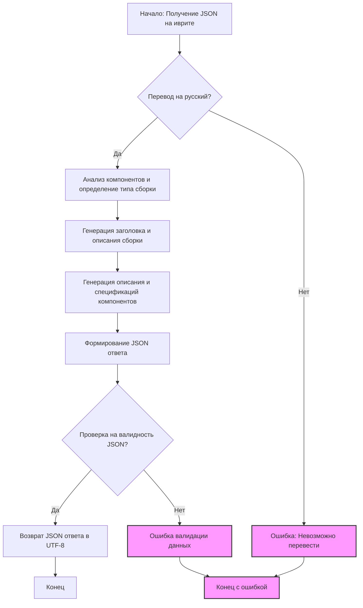

## ИНСТРУКЦИЯ:

Анализируй предоставленный код подробно и объясни его функциональность. Ответ должен включать три раздела:

1.  **<алгоритм>**: Опиши рабочий процесс в виде пошаговой блок-схемы, включая примеры для каждого логического блока, и проиллюстрируй поток данных между функциями, классами или методами.
2.  **<mermaid>**: Напиши код для диаграммы в формате `mermaid`, проанализируй и объясни все зависимости,
    которые импортируются при создании диаграммы.
    **ВАЖНО!** Убедитесь, что все имена переменных, используемые в диаграмме `mermaid`,
    имеют осмысленные и описательные имена. Имена переменных вроде `A`, `B`, `C`, и т.д., не допускаются!

    **Дополнительно**: Если в коде есть импорт `import header`, добавьте блок `mermaid` flowchart, объясняющий `header.py`:
    ```mermaid
    flowchart TD
        Start --> Header[<code>header.py</code><br> Determine Project Root]

        Header --> import[Import Global Settings: <br><code>from src import gs</code>]
    ```

3.  **<объяснение>**: Предоставьте подробные объяснения:
    -   **Импорты**: Их назначение и взаимосвязь с другими пакетами `src.`.
    -   **Классы**: Их роль, атрибуты, методы и взаимодействие с другими компонентами проекта.
    -   **Функции**: Их аргументы, возвращаемые значения, назначение и примеры.
    -   **Переменные**: Их типы и использование.
    -   Выделите потенциальные ошибки или области для улучшения.

Дополнительно, постройте цепочку взаимосвязей с другими частями проекта (если применимо).

Это обеспечивает всесторонний и структурированный анализ кода.
## Формат ответа: `.md` (markdown)
**КОНЕЦ ИНСТРУКЦИИ**

## <алгоритм>

1. **Получение JSON данных:**
   - Получает на вход JSON, описывающий компоненты компьютера на иврите.
   - Пример:
     ```json
        {
          "products":[
                {
                    "product_id":"123",
                    "product_title":"מעבד Intel i7-14700F",
                    "image_local_saved_path":"/path/to/image1.jpg"
                },
                {
                    "product_id":"456",
                    "product_title":"כרטיס מסך Gigabyte RTX 4070",
                    "image_local_saved_path":"/path/to/image2.jpg"
                  }
                ]
        }
     ```

2. **Перевод на русский язык:**
   -   Переводит все текстовые данные (заголовки, описания) из иврита на русский язык.
   -   Пример:
     *   "מעבד Intel i7-14700F" -> "Процессор Intel i7-14700F"
     *   "כרטיס מסך Gigabyte RTX 4070" -> "Видеокарта Gigabyte RTX 4070"

3. **Анализ компонентов:**
    - Определяет тип сборки (например, игровой, рабочая станция) на основе списка компонентов.
    - Выставляет оценки уверенности для каждого типа сборки.
    - Пример:
      *   Набор компонентов: CPU i7-14700F, RTX 4070 -> "gaming": 0.9, "workstation": 0.1

4.  **Генерация заголовка и описания:**
    -   Генерирует общий заголовок и описание для сборки компьютера на русском языке.
    -   Пример:
        *   Заголовок: "Высокопроизводительный игровой компьютер"
        *   Описание: "Современный компьютер для требовательных игр и приложений. Включает Intel i7-14700F, Gigabyte RTX 4070, DDR4 RAM 16GB и SSD Kingston 4TB."

5.  **Генерация описания и спецификаций компонентов:**
    -   Генерирует описание и спецификации для каждого компонента на русском языке.
    -   Пример:
      *   "Процессор Intel i7-14700F":
          *   Описание: "Мощный процессор Intel i7 14-го поколения для современных игр и ресурсоемких приложений."
          *   Спецификация: "Количество ядер: 16, Тактовая частота: 5.4 ГГц, Кэш: 33 МБ"
    - Если невозможно создать спецификацию, оставляется поле пустым.

6.  **Формирование JSON ответа:**
    -   Формирует JSON ответ в соответствии с заданным шаблоном.
    -   Пример:
        ```json
        {
          "ru": {
            "title": "Высокопроизводительный игровой компьютер",
            "description": "Современный компьютер для требовательных игр и приложений. Включает Intel i7-14700F, Gigabyte RTX 4070, DDR4 RAM 16GB и SSD Kingston 4TB.",
            "build_types": {
              "gaming": 0.9,
              "workstation": 0.1
            },
            "products": [
              {
                "product_id": "123",
                "product_title": "Процессор Intel i7-14700F",
                "product_description": "Мощный процессор Intel i7 14-го поколения для современных игр и ресурсоемких приложений.",
                "specification": "Количество ядер: 16, Тактовая частота: 5.4 ГГц, Кэш: 33 МБ",
                "image_local_saved_path": "/path/to/image1.jpg"
              },
              {
                "product_id": "456",
                "product_title": "Видеокарта Gigabyte RTX 4070",
                "product_description": "Высокопроизводительная видеокарта для современных игр и графических приложений.",
                "specification": "Объем памяти: 12 ГБ GDDR6X, Частота: 1920 МГц, Шина: 192 бит",
                "image_local_saved_path": "/path/to/image2.jpg"
              }
            ]
          }
        }
        ```

7. **Валидация данных:**
   - Перед отправкой JSON проверяется на валидность данных.

8. **Возврат JSON ответа:**
   - Возвращает JSON ответ в кодировке UTF-8 без использования Unicode Escape Sequence.

## <mermaid>


### Пояснения к `mermaid` диаграмме:

*   **A**: `Начало: Получение JSON на иврите` - Начальная точка процесса, получение входных данных в формате JSON на иврите.
*   **B**: `Перевод на русский?` - Проверка, нужно ли переводить текст на русский язык. Если нет, то ошибка.
*   **C**: `Анализ компонентов и определение типа сборки` - Анализ входных данных, определение типа сборки (игровая, рабочая станция и т.д.) и установка оценок уверенности для каждого типа.
*   **D**: `Генерация заголовка и описания сборки` - Создание общего заголовка и описания для сборки компьютера на русском языке.
*   **E**: `Генерация описания и спецификаций компонентов` - Создание описаний и спецификаций для каждого компонента на русском языке.
*   **F**: `Формирование JSON ответа` - Сборка всех данных в JSON-формат согласно заданному шаблону.
*   **G**: `Проверка на валидность JSON?` - Проверка сформированного JSON на валидность данных.
*   **H**: `Возврат JSON ответа в UTF-8` - Возврат JSON в формате UTF-8.
*   **I**: `Конец` - Конечная точка успешного выполнения программы.
*   **Error**: `Ошибка: Невозможно перевести` - Завершение программы при невозможности перевода входных данных.
*  **Validation_Error**: `Ошибка валидации данных` - Завершение программы в случае, если проверка валидации JSON не пройдена.
*   **End_Error**: `Конец с ошибкой` - Конечная точка в случае возникновения ошибки в процессе выполнения.

## <объяснение>

**Общее описание:**

Предоставленный код предназначен для обработки данных о компьютерных компонентах, представленных в JSON формате на иврите. Он выполняет следующие действия: переводит все текстовые данные на русский, анализирует компоненты, определяет тип сборки (игровой, рабочая станция и т.д.), генерирует заголовки, описания и спецификации, формирует структурированный JSON ответ в соответствии с шаблоном и возвращает его в UTF-8.

**Импорты:**

В данном примере кода нет импортов. Если бы был импорт `import header`, то это бы указывало на использование общих настроек проекта. Например, это может быть `header.py`, где определяется корневая директория проекта и импортируются глобальные настройки.

**Классы:**
В данном примере кода нет классов.

**Функции:**

В предоставленном коде нет определения функций, но подразумевается наличие следующих:

1.  **`translate_text(text, from_lang, to_lang)`:**
    -   Аргументы:
        -   `text`: строка для перевода.
        -   `from_lang`: язык оригинала.
        -   `to_lang`: язык перевода.
    -   Возвращаемое значение: строка, переведенная на нужный язык.
    -   Назначение: Перевод текстовых данных с иврита на русский язык.
    -   Пример: `translate_text("מעבד Intel i7-14700F", "he", "ru")` вернет `"Процессор Intel i7-14700F"`.

2.  **`analyze_components(components)`:**
    -   Аргументы:
        -   `components`: список словарей, описывающих компоненты.
    -   Возвращаемое значение: словарь с типом сборки и оценками уверенности.
    -   Назначение: Определяет тип сборки на основе списка компонентов.
    -   Пример: `analyze_components([{...}, {...}])` вернет `{"gaming": 0.9, "workstation": 0.1}`.

3.  **`generate_assembly_description(build_type)`:**
    -   Аргументы:
        -   `build_type`: строка, определяющая тип сборки (например, "gaming").
    -   Возвращаемое значение: словарь с заголовком и описанием.
    -   Назначение: Генерирует заголовок и описание для сборки компьютера.
    -   Пример: `generate_assembly_description("gaming")` вернет `{"title": "Высокопроизводительный игровой компьютер", "description": "Современный компьютер для требовательных игр и приложений..."}`.

4.  **`generate_product_description(product_title)`:**
     - Аргументы:
       - `product_title`: строка, содержащая название продукта.
      - Возвращаемое значение: словарь с описанием и спецификацией продукта.
      - Назначение: Создает описание и спецификацию для продукта на русском языке.
      - Пример: `generate_product_description("Процессор Intel i7-14700F")` вернет `{"description": "Мощный процессор Intel i7 14-го поколения...", "specification": "Количество ядер: 16, ..."}`, если не удалось сгенерировать спецификацию, то `{"description": "Мощный процессор Intel i7 14-го поколения...", "specification": ""}`

5.  **`validate_json(json_data)`:**
    -   Аргументы:
        -   `json_data`: словарь, представляющий JSON данные.
    -   Возвращаемое значение: `True` если JSON валиден, иначе `False`.
    -   Назначение: Проверка валидности JSON данных.
    -   Пример: `validate_json(json_response)` вернет `True` если структура и типы данных в словаре корректны.

6.  **`create_json_response(title, description, build_types, products)`:**
    -   Аргументы:
        -   `title`: строка, заголовок сборки.
        -   `description`: строка, описание сборки.
        -   `build_types`: словарь с типом сборки и оценками уверенности.
        -   `products`: список словарей, описывающих компоненты.
    -   Возвращаемое значение: JSON-строка в формате UTF-8.
    -   Назначение: Формирует JSON ответ в соответствии с заданным шаблоном.
    -   Пример: `create_json_response(title, description, build_types, products)` вернет отформатированный JSON.

**Переменные:**

*   `input_json` - JSON, полученный на входе.
*   `translated_title` - Заголовок на русском языке.
*   `translated_description` - Описание на русском языке.
*   `translated_products` - Массив продуктов, каждый элемент которого представляет собой словарь, содержащий информацию о продукте, переведенную на русский язык.
*   `build_types` -  Словарь с типами сборки и оценками уверенности.
*  `product_description` - Описание продукта на русском языке.
*   `product_specification` - Спецификация продукта на русском языке.
*   `json_response` - Готовый JSON-ответ.

**Потенциальные ошибки и области для улучшения:**

*   **Обработка ошибок перевода:** В коде не предусмотрена обработка ошибок перевода. Если перевод не удается, программа может завершиться некорректно.
*   **Улучшение генерации описаний:** Генерация описаний и спецификаций может быть улучшена с помощью более сложных алгоритмов или использования баз данных компонентов.
*   **Проверка валидности:** Проверка валидности JSON должна быть более тщательной (типы данных, наличие обязательных полей).
*   **Унификация:** Требуется унификация процесса обработки продуктов (компонентов) в массиве `products`.
*   **Гибкость:** Код может быть более гибким, если добавить возможность настраивать типы сборки и описания.

**Цепочка взаимосвязей:**

1.  Входные данные: JSON на иврите.
2.  Перевод данных с иврита на русский.
3.  Анализ компонентов для определения типа сборки.
4.  Генерация описания и заголовка сборки.
5.  Генерация описания и спецификации для каждого компонента.
6.  Формирование структурированного JSON ответа.
7.  Проверка валидности JSON данных.
8.  Возврат JSON ответа в кодировке UTF-8.

**Взаимосвязь с другими частями проекта:**

*   Если бы в коде присутствовал импорт `header.py`, то он указывал бы на связь с общими настройками проекта.
*   Взаимодействие с другими модулями проекта может происходить через вызовы соответствующих функций для перевода, анализа, генерации описаний.
*   Возможна интеграция с модулями для хранения данных компонентов или их спецификаций.