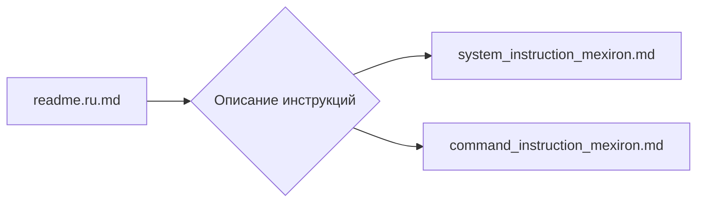

# Анализ кода из файла readme.ru.md

**1. <input code>**

```
В этой директории находятся инструкции и системнуе промпты для модели AI.
========================================================================
- Промпт загужается при инициализации модели и описывает поведение для инициализированной модели
 `system_instruction_mexiron.md`
- Инструкция - короткое указания модели, в которм описан шаблон ответа модели.
 `command_instruction_mexiron.md`
```

**2. <algorithm>**

Из предоставленного кода (который представляет собой текст, а не код на программирующем языке) нельзя построить блок-схему.  Данные представляют собой текстовые описания, не содержащие логических операций. Нет переменных, функций или классов, с которыми можно было бы взаимодействовать.

**3. <mermaid>**



**4. <explanation>**

Файл `readme.ru.md` представляет собой описание содержимого директории `hypotez/src/endpoints/kazarinov/instructions`.  Он описывает, что в данной директории находятся инструкции и системные промпты для модели AI.

* **Файлы:**
    * `system_instruction_mexiron.md`: Содержит промпт, загружаемый при инициализации модели. Этот промпт описывает поведение модели.
    * `command_instruction_mexiron.md`: Содержит инструкцию (команду), описывающую шаблон ответа модели.

* **Связь с другими частями проекта:**

    Связь с другими частями проекта неясна из предоставленного `readme.ru.md`.  Можно предположить, что эти инструкции используются  моделью AI для её обучения или работы, но для определения точного механизма взаимодействия потребуется больше контекста.  Необходимо знать, как эти файлы вызываются/используются другими частями кодовой базы.


* **Возможные ошибки/улучшения:**

    Нет ошибок в текстовом описании. Но для лучшего понимания было бы полезно добавить информацию о том, как эти инструкции используются и интегрируются в работу модели AI.  Например, как они загружаются, интерпретируются и применяются.
    Добавление комментариев, описывающих назначение и порядок использования файлов, существенно улучшило бы документирование.

**Вывод:**

Предоставленный `readme.ru.md` является текстовым описанием, а не кодом. Поэтому, анализ алгоритма и построение диаграммы невозможно.  Ключевой момент – это связь с другими частями проекта.  Для более подробного анализа необходимо посмотреть на код, который использует эти файлы.