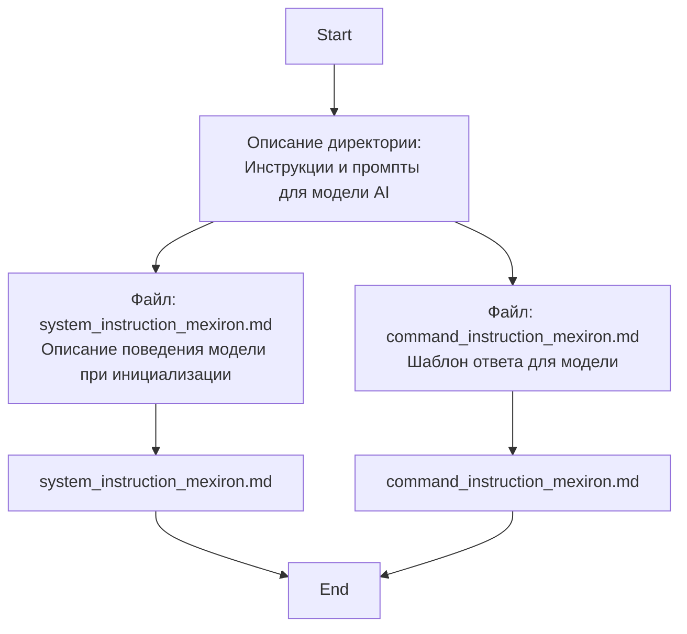

## ИНСТРУКЦИЯ:

Анализ предоставленного markdown-текста показывает, что он содержит описание назначения файлов внутри директории `hypotez/src/endpoints/kazarinov/instructions/`. Текст представляет собой документацию, объясняющую роль двух файлов: `system_instruction_mexiron.md` и `command_instruction_mexiron.md`.

### 1. **<алгоритм>**:

**Начало**: Анализ начинается с чтения представленного markdown-текста.

**Шаг 1**: Идентифицируется заголовок "ИНСТРУКЦИЯ:". Он указывает на начало документации.

**Шаг 2**:  Идентифицируется общее описание директории: "В этой директории находятся инструкции и системнуе промпты для модели AI." Это указывает на назначение файлов.

**Шаг 3**:  Идентифицируется описание первого файла: `system_instruction_mexiron.md`. Описание гласит: "Промпт загужается при инициализации модели и описывает поведение для инициализированной модели".
* **Пример**: Когда AI модель инициализируется, текст из `system_instruction_mexiron.md` загружается и определяет базовое поведение модели.

**Шаг 4**: Идентифицируется описание второго файла: `command_instruction_mexiron.md`. Описание гласит: "Инструкция - короткое указания модели, в которм описан шаблон ответа модели."
* **Пример**: Когда AI модель получает запрос, текст из `command_instruction_mexiron.md` описывает как модель должна формировать свой ответ.

**Конец**: Анализ завершен с пониманием назначения каждого файла.

### 2. **<mermaid>**:

**Объяснение `mermaid`**:

- `flowchart TD` определяет тип диаграммы как блок-схему.
- `Start` - Начало процесса анализа.
- `DirectoryDescription` - Описание назначения директории: содержатся инструкции и системные промпты для модели AI.
- `SystemInstructionDescription` - Описание файла `system_instruction_mexiron.md` - содержит промпт, загружаемый при инициализации модели и описывает ее поведение.
- `CommandInstructionDescription` - Описание файла `command_instruction_mexiron.md` - содержит короткую инструкцию с шаблоном ответа модели.
- `SystemInstructionFile` - Файл `system_instruction_mexiron.md`.
- `CommandInstructionFile` - Файл `command_instruction_mexiron.md`.
- `End` - Завершение процесса анализа.

### 3. **<объяснение>**:

- **Импорты**: В данном фрагменте кода нет импортов, так как это просто текстовый файл с описанием.
- **Классы**: В данном фрагменте кода нет классов.
- **Функции**: В данном фрагменте кода нет функций.
- **Переменные**: В данном фрагменте кода нет переменных.

**Объяснение:**

Данный документ описывает назначение двух файлов в директории `hypotez/src/endpoints/kazarinov/instructions/`.

- `system_instruction_mexiron.md`: Этот файл содержит *системную инструкцию* или *промпт* для AI модели. Этот промпт загружается при запуске модели и определяет ее общее поведение. Например, он может содержать описание роли модели, контекста работы или общие правила взаимодействия.

- `command_instruction_mexiron.md`: Этот файл содержит *инструкцию* или *шаблон ответа* для AI модели. Эта инструкция используется при генерации ответов на запросы пользователя. Она определяет структуру и формат, в котором модель должна предоставлять свои ответы.

**Взаимосвязь с другими частями проекта:**

Эти файлы являются частью конфигурации AI модели. Они используются при инициализации и во время работы модели для определения ее поведения и структуры ответов.
Взаимодействие может происходить следующим образом:
1. При инициализации модели, содержимое `system_instruction_mexiron.md` загружается и применяется.
2. Когда модель получает запрос, она использует `command_instruction_mexiron.md`, чтобы сформировать ответ.

**Потенциальные ошибки или области для улучшения:**

1.  **Отсутствие спецификации формата файлов:** В документации не указано, какой формат должны иметь файлы `system_instruction_mexiron.md` и `command_instruction_mexiron.md`. Это может привести к ошибкам, если эти файлы будут содержать неформатированный текст.
2.  **Нет проверки ошибок**: Нет информации о том, как обрабатываются ошибки, если файлы не найдены или содержат неверный формат.
3.  **Неясность контекста:** В тексте не описано, какая конкретно AI модель использует эти файлы. Добавление контекста помогло бы лучше понять их назначение.

В целом, данный фрагмент кода представляет собой документацию, объясняющую назначение файлов, влияющих на поведение и структуру ответов AI модели. Дальнейшее развитие документации должно включать спецификацию формата файлов, обработку ошибок и предоставление большего контекста.