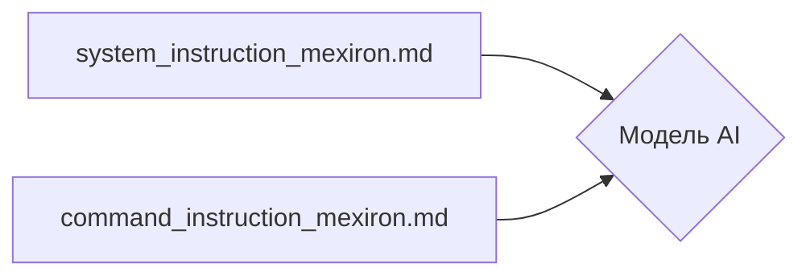

# Анализ кода (readme.ru.md)

В предоставленном коде представлены описания инструкций и системных промтов для модели искусственного интеллекта.  Сам код не содержит функционального кода, а представляет собой описание файлов, содержащих инструкции.

1. **<input code>**:

```
В этой директории находятся инструкции и системнуе промпты для модели AI.
========================================================================
- Промпт загужается при инициализации модели и описывает поведение для инициализированной модели
 `system_instruction_mexiron.md`
- Инструкция - короткое указания модели, в которм описан шаблон ответа модели.
 `command_instruction_mexiron.md`
```

2. **<algorithm>**:

Код не содержит алгоритма в привычном понимании. Он представляет собой текстовое описание файлов, содержащих данные, которые будут загружены и использованы моделью AI.  Блок-схема не применима.

3. **<mermaid>**:



4. **<explanation>**:

* **Импорты**:  В данном коде нет импортов, так как это текстовое описание.  
* **Классы**: Нет классов.
* **Функции**: Нет функций.
* **Переменные**: Нет переменных.
* **Комментарии**: Код представляет собой комментарии, описывающие структуру и назначение файлов в директории.
* **Возможные ошибки/улучшения**:  Нет ошибок.  Описания файлов можно было бы дополнить более подробной информацией о структуре и формате данных в `system_instruction_mexiron.md` и `command_instruction_mexiron.md`.


**Цепочка взаимосвязей с другими частями проекта**:

Файлы `system_instruction_mexiron.md` и `command_instruction_mexiron.md` являются важными компонентами для настройки и работы модели AI.  Их содержимое загружается и используется в коде модели, что определяет ее поведение и шаблон ответа. Без этих файлов модель не будет обладать заданными характеристиками. Взаимодействие происходит при инициализации модели и при ее работе.  Предполагается, что эти файлы содержат текстовые инструкции для модели AI и определяют ее поведение в разных контекстах.  Взаимодействие с другими частями проекта (моделью) происходит через загрузку и использование этих файлов.  Эти файлы играют роль конфигурационного ресурса или входных данных для модели.