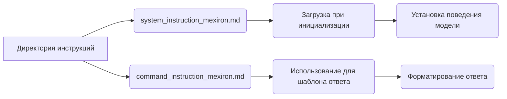

# Анализ кода: Структура инструкций и системных промптов

## 1. <алгоритм>

Представленный код описывает структуру каталога, предназначенного для хранения инструкций и системных промптов, используемых для инициализации и управления поведением AI-модели. Основной алгоритм заключается в организации файлов и разделении их по назначению.

1. **Начало**: Код начинается с текстового описания директории.
2. **Описание:**  Директория содержит:
   - **system_instruction_mexiron.md**:  Файл, содержащий системный промпт. Этот промпт загружается при инициализации модели и определяет её поведение.
   - **command_instruction_mexiron.md**:  Файл, содержащий инструкцию. Эта инструкция представляет собой короткое указание модели, описывающее шаблон ответа.

Пример использования:
*   При инициализации AI модели, из файла `system_instruction_mexiron.md` загружается промпт.
*   При запросе к AI модели, используется инструкция из файла `command_instruction_mexiron.md` для форматирования ответа.
*   Поток данных простой, загрузка файла в модель в зависимости от запроса.

## 2. <mermaid>

**Объяснение диаграммы:**

-   `Директория инструкций` (A): Представляет собой каталог, содержащий файлы с инструкциями и промптами.
-   `system_instruction_mexiron.md` (B): Файл, содержащий системный промпт для инициализации модели.
-   `command_instruction_mexiron.md` (C): Файл, содержащий инструкцию для формирования ответов.
-   `Загрузка при инициализации` (D): Описывает действие загрузки системного промпта при старте модели.
-   `Использование для шаблона ответа` (E): Описывает использование инструкции для форматирования ответа модели.
-    `Установка поведения модели` (F): Описывает влияние системного промпта на поведение модели.
-   `Форматирование ответа` (G): Описывает использование инструкций для формирования ответов.

## 3. <объяснение>

**Импорты**:

Представленный код не содержит импортов. Это описание структуры каталога, а не исполняемый код.

**Классы**:

В этом фрагменте кода нет классов. Это описание структуры директорий и файлов.

**Функции**:

В этом фрагменте кода нет функций. Это описание структуры директорий и файлов.

**Переменные**:

В данном коде переменных нет, он описывает структуру каталога.

**Детальное объяснение:**

*   Код описывает структуру каталога, предназначенного для хранения файлов инструкций и системных промптов для AI-модели.
*   `system_instruction_mexiron.md`: Этот файл содержит системный промпт, который определяет базовое поведение AI-модели. Этот промпт обычно загружается один раз при инициализации модели и задает её контекст и общие принципы работы.
*   `command_instruction_mexiron.md`: Этот файл содержит инструкцию, которая используется для форматирования ответов модели. Она определяет, как модель должна представлять свои ответы в различных ситуациях, то есть формирует шаблон ответа.

**Потенциальные ошибки и области для улучшения:**

*   В текущем виде код не представляет каких-либо исполняемых инструкций и не содержит ошибок.
*   Возможные улучшения могут заключаться в расширении документации с описанием форматов файлов и принципов написания инструкций.

**Взаимосвязи с другими частями проекта:**

*   Эти файлы используются при инициализации AI-модели и при формировании ответов. Таким образом, они являются критически важными компонентами, влияющими на поведение и функциональность модели.
*   Данные инструкции могут быть частью более крупной системы управления AI-моделью, где различные компоненты (например, модули обучения, API) могут использовать эти инструкции.

**В заключение:**

Код представляет собой текстовое описание структуры каталога инструкций и промптов для AI-модели. Он обеспечивает четкое разделение между системными инструкциями (задающими поведение) и инструкциями для шаблонов ответов. Это позволяет более эффективно управлять поведением AI-модели и настраивать её для различных задач.