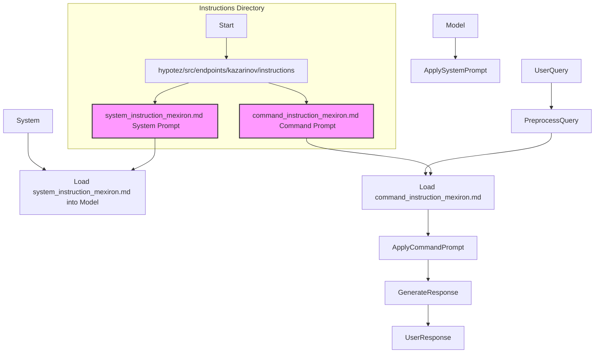

## ИНСТРУКЦИЯ:

Анализ предоставленного кода, представленного в виде текстового описания файлов, в директории `hypotez/src/endpoints/kazarinov/instructions/readme.ru.md`

### 1. <алгоритм>

Данный код не является исполняемым кодом на Python или другом языке программирования. Это, скорее, **описание содержимого директории** и ее функционального назначения. 

1.  **Описание директории**: Директория `hypotez/src/endpoints/kazarinov/instructions` содержит текстовые файлы, которые используются для управления поведением модели AI.
2.  **Файл `system_instruction_mexiron.md`**: Этот файл представляет собой **системный промпт**, который загружается при инициализации модели и задает ее общее поведение.
3.  **Файл `command_instruction_mexiron.md`**: Этот файл содержит **инструкцию-промпт**, которая предоставляет краткие указания модели относительно формата и структуры ответа.

**Пример использования:**

1.  При запуске AI-модели, ее движок загружает содержимое файла `system_instruction_mexiron.md` как базовый промпт.
2.  Когда пользователь отправляет запрос, движок модели анализирует его и подгружает соответствующую инструкцию из `command_instruction_mexiron.md`, чтобы сформировать ответ в нужном формате.

### 2. <mermaid>

**Объяснение диаграммы:**

*   `Instructions Directory`: Обозначает директорию, где находятся файлы инструкций.
*   `Dir`:  Представляет саму директорию.
*   `system_instruction_file`: Файл с системными инструкциями (`system_instruction_mexiron.md`).
*   `command_instruction_file`: Файл с командными инструкциями (`command_instruction_mexiron.md`).
*   `System`: Обозначает процесс инициализации системы
*   `LoadSystemPrompt`: Загрузка содержимого `system_instruction_mexiron.md` в модель.
*   `Model`: Обозначает модель AI
*   `ApplySystemPrompt`: Применение системного промпта к модели.
*   `UserQuery`: Входной запрос от пользователя.
*   `PreprocessQuery`: Предварительная обработка запроса.
*   `LoadCommandPrompt`: Загрузка командной инструкции из `command_instruction_mexiron.md`.
*   `ApplyCommandPrompt`: Применение командной инструкции к модели.
*   `GenerateResponse`: Генерация ответа моделью.
*   `UserResponse`: Результат, отправленный пользователю.
*   Стрелки показывают поток данных и зависимость между компонентами.

### 3. <объяснение>

**Импорты:**

Код, представленный в описании `readme.ru.md`, не содержит импортов, поскольку это не исполняемый код Python, а текстовое описание файлов. Однако, в рамках общего проекта `hypotez`, можно предположить, что эти файлы будут использоваться модулями, которые работают с AI-моделями и используют библиотеки для управления текстом или обработки естественного языка (NLP).

**Классы:**

В описании файлов классов также нет. Однако при взаимодействии с моделью AI, могут быть задействованы следующие концепции:

*   Класс, представляющий AI-модель.
*   Класс, отвечающий за загрузку и интерпретацию промптов и инструкций.
*   Класс, обрабатывающий запросы пользователя.

**Функции:**

Функции в контексте этого описания отсутствуют, но в процессе реализации работы с AI-моделью, скорее всего, будут использоваться следующие функции:

*   Функция загрузки содержимого файла (например, `load_file_content(filepath)`)
*   Функция загрузки промптов в модель (например, `load_prompt_to_model(prompt_text, model)`)
*   Функция генерации ответа моделью (например, `generate_response(query, model)`)

**Переменные:**

В коде отсутствуют явно объявленные переменные. Но могут использоваться переменные для хранения путей к файлам, текстов промптов и других параметров, необходимых для взаимодействия с AI-моделью.

**Потенциальные ошибки и области улучшения:**

*   **Управление версиями промптов**: В будущем, возможно, потребуется версионирование и управление изменениями промптов, а также отслеживание их использования в модели.
*   **Расширение инструкций**: Можно дополнить инструкции для более сложных сценариев работы модели, например, для управления диалогом.
*   **Локализация**: Можно добавить локализованные версии инструкций для поддержки разных языков.
*  **Обработка ошибок:** Необходимо добавить обработку ошибок, если загрузка промптов не удалась.

**Взаимосвязь с другими частями проекта:**

Файлы с инструкциями и промптами являются важным компонентом в рамках всего проекта `hypotez`. Эти файлы влияют на поведение AI-модели и используются в модулях, отвечающих за работу с моделью. Цепочка взаимодействия может быть следующей:

1.  **Модуль инициализации модели** загружает системные инструкции из `system_instruction_mexiron.md`.
2.  **Модуль обработки запросов** загружает командные инструкции из `command_instruction_mexiron.md` на основе типа запроса и контекста.
3.  **Модуль генерации ответа** использует модель, с загруженными системными и командными инструкциями, для генерации ответа пользователю.

Таким образом, инструкции и промпты, хранящиеся в `hypotez/src/endpoints/kazarinov/instructions`, являются ключевым элементом для работы и настройки AI-модели в рамках всего проекта.