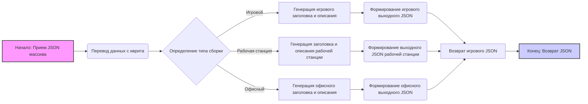

## **Анализ кода инструкции для сборки компьютера**

### **<алгоритм>**
Инструкция предназначена для создания ассистента по сборке компьютера, который получает данные о комплектующих на иврите в формате JSON, а затем генерирует структурированный ответ на целевом языке. Вот пошаговая блок-схема процесса:

1.  **Прием входных данных:**
    *   Получение JSON-массива, содержащего информацию о компонентах компьютера (на иврите).
    *   Пример:
        ```json
        [
          {
            "product_id": "<id1>",
            "product_title": "מעבד Intel Core i9-14900K",
            "product_description": "מעבד חזק במיוחד לגיימינג ועריכה",
            "specification": "8 ליבות, 16 תהליכונים, 3.2GHz",
            "image_local_saved_path": "<path1>"
          },
           {
            "product_id": "<id2>",
            "product_title": "כרטיס מסך NVIDIA RTX 4060 Ti",
            "product_description": "כרטיס מסך גיימינג מתקדם",
            "specification": "8GB GDDR6, Ray Tracing",
            "image_local_saved_path": "<path2>"
           }
         ]
        ```
2.  **Перевод данных:**
    *   Перевод всех текстовых данных (названий компонентов, описаний, характеристик) из иврита на целевой язык, указанный в инструкции.
    *   Пример:
        *   Иврит: "מעבד Intel Core i9-14900K"
        *   Русский: "Процессор Intel Core i9-14900K"
3.  **Определение типа сборки:**
    *   Анализ компонентов для определения наиболее вероятного типа сборки (например, игровой, офисный, рабочая станция).
    *   Пример:
        *   Наличие мощного процессора и видеокарты → высокий приоритет для "игровой" сборки.
4.  **Генерация заголовка и описания:**
    *   Создание заголовка и подробного описания сборки на целевом языке, учитывая ее тип.
    *   Пример:
        *   Заголовок: "Игровой ПК на базе Intel i9-14900K и RTX 4060 Ti"
        *   Описание: "Мощный игровой компьютер, предназначенный для требовательных игр и ресурсоемких задач. Обеспечивает высокую производительность и плавный игровой процесс."
5.  **Формирование выходного JSON:**
    *   Создание JSON-словаря с полями:
        *   `language_code`: Код целевого языка.
        *   `build_types`: Вероятностное распределение типов сборки (например, "gaming": 0.9, "workstation": 0.1).
        *   `title`: Заголовок сборки на целевом языке.
        *   `description`: Описание сборки на целевом языке.
        *   `products`: Массив объектов с информацией о компонентах (с переведенными названиями, описаниями и характеристиками).
        *   Пример:
        ```json
          {
            "ru": {
              "build_types": {
                "gaming": 0.9,
                "workstation": 0.1
              },
              "title": "Игровой ПК на базе Intel i9-14900K и RTX 4060 Ti",
              "description": "Мощный игровой компьютер, предназначенный для требовательных игр и ресурсоемких задач. Обеспечивает высокую производительность и плавный игровой процесс.",
              "products": [
                {
                  "product_id": "<id1>",
                  "product_title": "Процессор Intel Core i9-14900K",
                  "product_description": "Мощный процессор для игр и редактирования",
                  "specification": "8 ядер, 16 потоков, 3.2GHz",
                  "image_local_saved_path": "<path1>"
                },
                 {
                   "product_id": "<id2>",
                   "product_title": "Видеокарта NVIDIA RTX 4060 Ti",
                   "product_description": "Продвинутая игровая видеокарта",
                   "specification": "8GB GDDR6, Ray Tracing",
                   "image_local_saved_path": "<path2>"
                  }
              ]
            }
          }
        ```
6.  **Возврат ответа:**
    *   Возврат JSON-словаря в соответствии с указанным форматом.
7.  **Обработка отсутствующих данных**:
    *   При отсутствии данных в описании или характеристиках, модель должна либо заполнить недостающую информацию из интернета, либо оставить поле пустым с соответствующим заполнителям.

### **<mermaid>**


**Объяснение зависимостей:**
Диаграмма `mermaid` описывает поток данных и логику работы процесса, начинающегося с приема JSON-массива и заканчивающегося возвратом JSON-словаря. Зависимости отображают последовательность операций:

-   **Начало** → **Перевод данных:** Входные данные на иврите передаются для перевода на целевой язык.
-   **Перевод данных** → **Определение типа сборки:** Переведенные данные используются для анализа и определения типа сборки (игровой, рабочая станция, офисный).
-   **Определение типа сборки** → **Генерация заголовка и описания:** В зависимости от определенного типа сборки, генерируется соответствующий заголовок и описание.
-   **Генерация заголовка и описания** → **Формирование выходного JSON:** Сгенерированные заголовок, описание, и переведенные данные формируются в итоговый JSON.
-   **Формирование выходного JSON** → **Возврат JSON:** Сформированный JSON возвращается как результат.

**Имена переменных:**

*   `Начало: Прием JSON массива`: Начальная точка процесса, где принимается входной JSON-массив.
*   `Перевод данных с иврита`: Блок, отвечающий за перевод всех текстовых данных из иврита на целевой язык.
*   `Определение типа сборки`: Блок, анализирующий компоненты для определения типа сборки (игровой, рабочий, офисный).
*   `Генерация игрового заголовка и описания`: Блок, создающий заголовок и описание для игрового ПК.
*   `Генерация заголовка и описания рабочей станции`: Блок, создающий заголовок и описание для рабочей станции.
*   `Генерация офисного заголовка и описания`: Блок, создающий заголовок и описание для офисного компьютера.
*   `Формирование игрового выходного JSON`: Блок, формирующий JSON для игрового типа сборки.
*   `Формирование выходного JSON рабочей станции`: Блок, формирующий JSON для рабочей станции.
*    `Формирование офисного выходного JSON`: Блок, формирующий JSON для офисной сборки.
*   `Возврат игрового JSON`: Блок, возвращающий JSON для игрового ПК.
*   `Конец: Возврат JSON`: Конечная точка процесса, где возвращается результирующий JSON.

### **<объяснение>**

**Импорты:**
В предоставленной инструкции нет импортов, так как это текстовое описание, а не программный код. Инструкция описывает логику, которая будет реализована в коде.

**Классы:**
В инструкции не используются классы, так как это описание функциональности, а не реализация. Предполагается, что в коде будут использоваться классы, которые будут обрабатывать JSON, переводить текст, классифицировать сборки и формировать выходной JSON.

**Функции:**
Инструкция определяет ожидаемые функции, которые должны быть реализованы в коде:

*   **Функция приема JSON:** Принимает JSON-массив с данными о компонентах на иврите.
    *   Аргументы: JSON-массив.
    *   Возвращаемое значение: JSON-массив.
    *   Назначение: Загрузка входных данных.
*   **Функция перевода:** Переводит текст из иврита на целевой язык.
    *   Аргументы: Строка на иврите.
    *   Возвращаемое значение: Строка на целевом языке.
    *   Назначение: Перевод названий, описаний и характеристик.
*   **Функция определения типа сборки:** Анализирует компоненты и определяет тип сборки (игровой, рабочий, офисный).
    *   Аргументы: JSON-массив (или объект) с описанием компонентов.
    *   Возвращаемое значение: Словарь с вероятностным распределением типов сборки.
    *   Назначение: Классификация сборки на основе компонентов.
*   **Функция генерации заголовка и описания:** Создает текстовое описание сборки на целевом языке.
    *   Аргументы: Словарь с описанием компонентов, тип сборки, код целевого языка.
    *   Возвращаемое значение: Строка с заголовком и описанием сборки.
    *   Назначение: Генерация текстового описания.
*   **Функция формирования JSON:** Создает выходной JSON-словарь.
    *   Аргументы: Словарь с данными о сборке, код целевого языка.
    *   Возвращаемое значение: JSON-словарь.
    *   Назначение: Структурирование выходных данных.
*   **Функция поиска недостающей информации:** Поиск информации в интернете при неполных данных.
    *  Аргументы: Название компонента, описание компонента.
    *  Возвращаемое значение: Строка или словарь со спецификациями компонента.
    *  Назначение: Заполнение недостающих спецификаций.

**Переменные:**

*   `product_id`: Идентификатор компонента (строка, сохраняется без изменений).
*   `product_title`: Название компонента (строка, переводится).
*   `product_description`: Описание компонента (строка, переводится).
*   `specification`: Характеристики компонента (строка, переводится).
*   `image_local_saved_path`: Путь к изображению компонента (строка, сохраняется без изменений).
*   `language_code`: Код целевого языка (строка, например, "ru" для русского).
*   `build_types`: Вероятностное распределение типов сборки (словарь с типами и их вероятностями).
*   `title`: Заголовок сборки (строка, переводится).
*   `description`: Описание сборки (строка, переводится).
*   `products`: Массив объектов с информацией о компонентах.

**Потенциальные ошибки и области для улучшения:**

*   **Неоднозначность классификации:** Некоторые сборки могут подходить под несколько категорий.
*   **Точность перевода:** Качество перевода может влиять на понимание характеристик компонентов.
*   **Неполные данные:** Поиск недостающих данных в интернете может быть сложным и долгим, может возникнуть ситуация с неудовлетворительным результатом.
*   **Сложность формирования описаний:** Создание подробных и точных описаний может быть нетривиальной задачей.
*   **Ограничение по количеству языков:** Инструкция пока ограничивается одним целевым языком, хотя можно расширить на несколько.

**Взаимосвязь с другими частями проекта:**
Эта инструкция, скорее всего, является частью большего проекта, связанного со сборкой компьютеров. Она может взаимодействовать с другими модулями, которые отвечают за:

*   **Получение данных:** Загрузка данных о компонентах из базы данных или других источников.
*   **Хранение данных:** Сохранение обработанных данных и собранных JSON-ов в базе данных или файловой системе.
*   **Интерфейс пользователя:** Отображение сгенерированных данных в пользовательском интерфейсе.

**Общая цепочка взаимодействий:**
1.  Данные о комплектующих (на иврите) загружаются из базы данных или API.
2.  Инструкция обрабатывает данные, переводит, определяет тип сборки, генерирует заголовок и описание, формирует выходной JSON.
3.  Результат передается в модуль хранения данных, который сохраняет JSON в базе данных или файле.
4.  Модуль пользовательского интерфейса отображает информацию о собранных компьютерах.