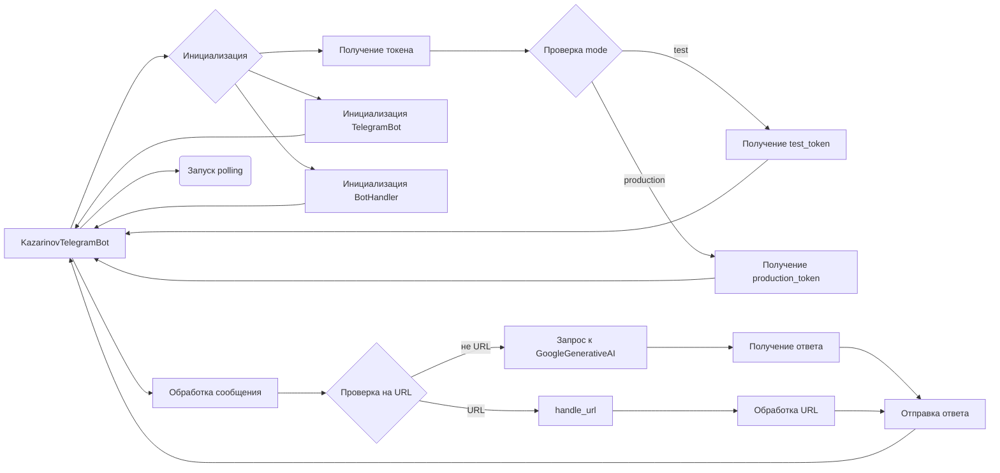

# <input code>

```python
## \file hypotez/src/endpoints/kazarinov/kazarinov_bot.py
# -*- coding: utf-8 -*-
#! venv/Scripts/python.exe
#! venv/bin/python/python3.12

"""
.. module: src.endpoints.kazarinov.kazarinov_bot 
	:platform: Windows, Unix
	:synopsis: KazarinovTelegramBot

Описание:
Модуль реализует Telegram-бота для проекта Kazarinov, поддерживающего 
различные сценарии обработки команд и сообщений. Бот взаимодействует 
с парсером Mexiron и моделью Google Generative AI, а также поддерживает 
обработку текстовых сообщений, документов и URL.

Основные возможности:
1. Инициализация и настройка Telegram-бота на основе конфигурационного JSON-файла.
2. Регистрация команд и обработчиков сообщений.
3. Маршрутизация текстовых сообщений по URL с возможностью обработки ссылок на OneTab и поставщиков.
4. Использование объекта Mexiron для парсинга данных товаров от поставщиков и генерации прайс-листов.
5. Генерация ответов на сообщения через Google Generative AI.
6. Логирование сообщений пользователей и их дальнейшая обработка.

"""
MODE = 'dev'
import asyncio
from pathlib import Path
from typing import List, Optional, Dict
from types import SimpleNamespace
from telegram import Update
from telegram.ext import Application, CommandHandler, MessageHandler, filters, CallbackContext

import header
from src import gs
from src.bots.telegram import TelegramBot
from src.endpoints.kazarinov.bot_handlers import BotHandler
from src.ai.openai import OpenAIModel
from src.ai.gemini import GoogleGenerativeAI
from src.utils.file import recursively_read_text_files, save_text_file
from src.utils.url import is_url
from src.utils.jjson import j_loads, j_loads_ns, j_dumps
from src.logger import logger

class KazarinovTelegramBot(TelegramBot, BotHandler):
    """Telegram bot with custom behavior for Kazarinov."""

    token: str
    config = j_loads_ns(gs.path.endpoints / 'kazarinov' / 'kazarinov.json')

    # system_instruction: str = Path(
    #     gs.path.endpoints / 'kazarinov' / 'instructions' / 'system_instruction_mexiron.md'
    # ).read_text(encoding='UTF-8')

    # mexiron_command_instruction: str = Path(
    #     gs.path.endpoints / 'kazarinov' / 'instructions' / 'command_instruction_mexiron.md'
    # ).read_text(encoding='UTF-8')

    # questions_list_path = config.questions_list_path

    model:GoogleGenerativeAI = GoogleGenerativeAI(api_key = gs.credentials.gemini.kazarinov, generation_config = {"response_mime_type": "text/plain"})

    def __init__(self, mode: Optional[str] = None, webdriver_name: Optional[str] = 'firefox'):
        """
        Initialize the KazarinovTelegramBot instance.

        Args:
            mode (Optional[str]): Operating mode, 'test' or 'production'. Defaults to 'test'.
            webdriver_name (Optional[str]): Webdriver to use with BotHandler. Defaults to 'firefox'.
        """
        # Set the mode
        mode = mode or self.config.mode
        # Initialize the token based on mode
        self.token = (
            gs.credentials.telegram.hypo69_test_bot
            if mode == 'test'
            else gs.credentials.telegram.hypo69_kazarinov_bot
        )

        # Call parent initializers
        TelegramBot.__init__(self, self.token)
        BotHandler.__init__(self, getattr(self.config , 'webdriver_name' , 'firefox') )


    async def handle_message(self, update: Update, context: CallbackContext) -> None:
        """Handle text messages with URL-based routing."""
        q = update.message.text
        user_id = update.effective_user.id
        if is_url(q):
            await self.handle_url(update, context)
            # <- add logic after url scenario ended
            ...
            return # <- 

        # log_path = gs.path.google_drive / 'bots' / str(user_id) / 'chat_logs.txt'
        # save_text_file(f"User {user_id}: {response}\n", Path(log_path), mode='a')

        if q in ('--next', '-next', '__next', '-n', '-q'):
            return await self.handle_next_command(update)

        answer = self.model.chat(q)
        await update.message.reply_text(answer)


if __name__ == "__main__":

    if gs.host_name == 'Vostro-3888':
        kt = KazarinovTelegramBot(mode='test')
    else:
        kt = KazarinovTelegramBot()
    asyncio.run(kt.application.run_polling())
```

# <algorithm>

**Шаг 1:** Импорт необходимых библиотек.

**Шаг 2:** Определение константы `MODE` (возможно, для настройки).

**Шаг 3:** Определение класса `KazarinovTelegramBot`.
   - Класс наследуется от `TelegramBot` и `BotHandler`, объединяя их функциональность.
   - Имеет атрибут `config` для доступа к конфигурации из файла `kazarinov.json`.
   - `model`: объект `GoogleGenerativeAI` для взаимодействия с моделью.
   - `__init__`: инициализирует бота, получая `mode` (тестовый или производственный) и `webdriver_name`.  В зависимости от `mode` устанавливает `token`.

**Шаг 4:** Определение метода `handle_message`:
   - Извлекает текст сообщения `q` и `user_id`.
   - Если `q` - URL, вызывает `handle_url`, если не URL - генерирует ответ от модели `GoogleGenerativeAI`.

**Шаг 5:** Если имя хоста - `Vostro-3888`, то инициализируется `KazarinovTelegramBot` в тестовом режиме (`mode='test'`). В противном случае - в производственном.


**Шаг 6:** Запуск `application.run_polling()` для запуска бота.

**Примеры данных:**

- Если `gs.host_name` равен `'Vostro-3888'`, то `kt` будет создан в тестовом режиме.
- Текст сообщения `q` может быть, например, запросом к базе данных или URL-адресом.
- В ответе бота `answer` будет текст, сгенерированный моделью `GoogleGenerativeAI`.


# <mermaid>



# <explanation>

**Импорты:**

- `asyncio`:  Для асинхронной работы, важного для обработки Telegram сообщений.
- `pathlib`: Для работы с файлами и путями.
- `typing`:  Для определения типов данных.
- `telegram`:  Для взаимодействия с Telegram API.
- `telegram.ext`:  Для создания и управления ботом.
- `header`: Скорее всего, содержит константы или импорты, связанные с настройкой проекта.  Связь с `src` неясна, без дополнительной информации.
- `src`:  Корневой пакет проекта. `gs`, `TelegramBot`, `BotHandler`, `OpenAIModel`, `GoogleGenerativeAI`, `recursively_read_text_files`, `save_text_file`, `is_url`, `j_loads`, `j_loads_ns`, `j_dumps`, `logger` -  судя по всему, это модули из собственного кода проекта. Необходимы для логирования, доступа к данным, работы с Google AI и пр.


**Классы:**

- `KazarinovTelegramBot`:  Основной класс бота. Наследуется от `TelegramBot` (для базовых функций) и `BotHandler` (для других возможностей). Хранит токен Telegram-бота и конфигурацию. Имеет метод `handle_message` для обработки сообщений и `__init__` для инициализации.

**Функции:**

- `handle_message`: Обрабатывает входящие текстовые сообщения, проверяя, является ли сообщение URL или командой. Если URL, то обрабатывает его с помощью `handle_url`, если не URL, то генерирует ответ от модели `GoogleGenerativeAI`.
- `__init__`: Инициализирует бота, определяя его токен и конфигурацию.


**Переменные:**

- `MODE`: Вероятно, константа для определения режима работы бота (например, 'dev', 'test', 'prod').
- `config`: Объект, содержащий данные из файла `kazarinov.json` (конфигурация).
- `token`: Токен доступа к Telegram API.
- `model`: Объект GoogleGenerativeAI для генерации ответов.


**Возможные ошибки/улучшения:**

- Отсутствует обработка ошибок при работе с файлами (например, при чтении `kazarinov.json`).
- Непонятно, как реализовано `handle_url` и `handle_next_command`.
- В коде присутствуют комментарии о дальнейшей реализации, которые должны быть заполнены.
- Логирование должно быть более подробным, особенно при обработке ошибок.
- Отсутствует описание работы с `gs` и другими модулями `src`.  Без документации к `src` сложно понять их работу и взаимодействие.


**Взаимосвязи с другими частями проекта:**

Код сильно зависит от пакета `src`.  Необходимо знать функциональность других модулей `src` (например, `gs`, `TelegramBot`, `BotHandler`, `GoogleGenerativeAI`) для полного понимания работы бота.  Например, `gs` вероятно хранит пути и другие константы, используемые проектом.