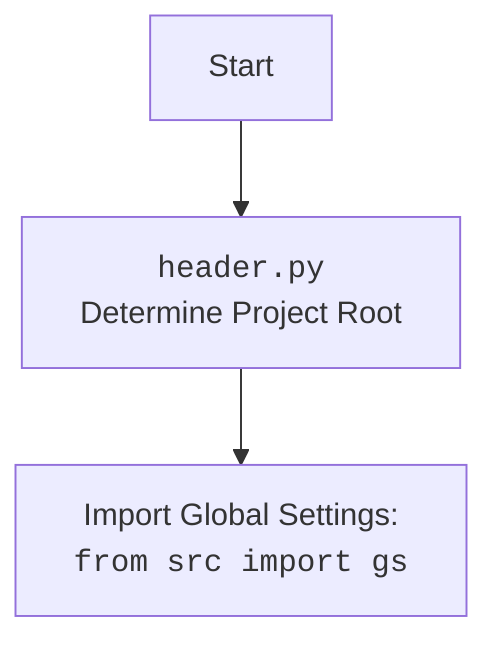

## АНАЛИЗ КОДА: `kazarinov_bot.py`

### 1. <алгоритм>

**Описание работы:**

1.  **Инициализация**:
    *   Бот инициализируется с помощью `KazarinovTelegramBot`, класс наследуется от `TelegramBot` и `BotHandler`.
    *   Определяется режим работы ('test' или 'production') через аргумент командной строки, значение по умолчанию 'test', или значение `config.mode`, или 'prod' если выполняется на хосте `'Vostro-3888'`.
    *   Токен Telegram-бота выбирается в зависимости от режима работы.
    *   Инициализируются базовые классы `TelegramBot` и `BotHandler`.
    *   Создается экземпляр модели `GoogleGenerativeAI`.
    
    *Пример:*
    `kt = KazarinovTelegramBot(mode='production')`

2.  **Обработка сообщений**:
    *   Функция `handle_message` обрабатывает входящие сообщения.
    *   Если сообщение равно `?`, отправляется изображение `user_flowchart.png`.

        *Пример:* Пользователь пишет `?`.
        
        *  _Результат_: бот отвечает картинкой `user_flowchart.png`.
    *   Если сообщение является URL, вызывается `self.handle_url`.
    *   Если сообщение является командой для перехода к следующему сообщению (извлеченному через парсер), вызывается `handle_next_command`.
        *Пример:* Пользователь пишет `-next`.
    *   В противном случае, сообщение отправляется в модель `GoogleGenerativeAI` для генерации ответа, который отправляется обратно пользователю.
        *Пример:* Пользователь пишет `Привет, как дела?`.
        *  _Результат_: бот отвечает сгенерированным ответом от `GoogleGenerativeAI`.
3.  **Запуск бота**:
    *   Скрипт парсит аргументы командной строки для режима работы.
    *   Создается экземпляр `KazarinovTelegramBot`.
    *   Бот запускается в режиме long polling с помощью `asyncio.run(kt.application.run_polling())`.
    
    *Пример*:
    `python kazarinov_bot.py -m production` (запуск в production режиме)

### 2. <mermaid>

```mermaid
flowchart TD
    Start[Start] --> InitBot[Initialize KazarinovTelegramBot]
    InitBot --> SetMode{Set Mode}
    SetMode -- "mode='test'" --> SetTokenTest[Set Test Token]
    SetMode -- "mode='production'" --> SetTokenProd[Set Production Token]
    SetTokenTest --> InitTelegramBot[Init TelegramBot]
    SetTokenProd --> InitTelegramBot
    InitTelegramBot --> InitBotHandler[Init BotHandler]
    InitBotHandler --> InitModel[Init GoogleGenerativeAI Model]
    InitModel --> StartPolling[Start Bot Polling]
    StartPolling --> HandleUpdate[Handle Incoming Update]
    HandleUpdate --> CheckQuestionMark{Message is "?"}
    CheckQuestionMark -- Yes --> SendImage[Send user_flowchart.png]
    SendImage --> HandleUpdate
    CheckQuestionMark -- No --> CheckURL{Message is URL?}
    CheckURL -- Yes --> HandleURL[Call self.handle_url()]
    HandleURL --> HandleUpdate
    CheckURL -- No --> CheckNextCommand{Message is next command?}
    CheckNextCommand -- Yes --> HandleNextCommand[Call self.handle_next_command()]
    HandleNextCommand --> HandleUpdate
    CheckNextCommand -- No --> SendToModel[Send message to GoogleGenerativeAI]
    SendToModel --> SendReply[Send Reply to User]
    SendReply --> HandleUpdate
    
    classDef mainClass fill:#f9f,stroke:#333,stroke-width:2px;
    class InitBot, SetMode, SetTokenTest, SetTokenProd, InitTelegramBot, InitBotHandler, InitModel, StartPolling mainClass;
```

**Описание диаграммы `mermaid`:**

*   **Start**: Начало процесса.
*   **Initialize KazarinovTelegramBot**: Создается экземпляр класса `KazarinovTelegramBot`.
*   **Set Mode**: Определяется режим работы бота ('test' или 'production').
*   **Set Test Token**: Устанавливается токен для тестового бота.
*  **Set Production Token**: Устанавливается токен для продакшн бота.
*   **Init TelegramBot**: Инициализируется базовый класс `TelegramBot`.
*   **Init BotHandler**: Инициализируется базовый класс `BotHandler`.
*    **Init GoogleGenerativeAI Model**: Инициализируется модель `GoogleGenerativeAI`.
*   **Start Bot Polling**: Запускается процесс long polling для получения обновлений от Telegram.
*   **Handle Incoming Update**: Обрабатывается входящее обновление (сообщение).
*   **Message is "?"**: Проверяется, является ли сообщение символом `?`.
*   **Send user_flowchart.png**: Отправляется изображение `user_flowchart.png`.
*   **Message is URL?**: Проверяется, является ли сообщение URL-адресом.
*   **Call self.handle_url()**: Вызывается метод `handle_url` для обработки URL.
*  **Message is next command?**: Проверяется, является ли сообщение командой для перехода к следующему.
*   **Call self.handle_next_command()**: Вызывается метод `handle_next_command` для перехода к следующему сообщению.
*   **Send message to GoogleGenerativeAI**: Сообщение отправляется в модель `GoogleGenerativeAI` для получения ответа.
*   **Send Reply to User**: Ответ, сгенерированный моделью, отправляется пользователю.

**Импортированные зависимости:**
* `asyncio`: Для асинхронного выполнения.
* `pathlib.Path`: Для работы с путями к файлам и каталогам.
* `typing.List, Optional, Dict, Self`: Для аннотации типов.
* `types.SimpleNamespace`: Для создания простых пространств имен.
* `telegram.Update`: Для обработки обновлений от Telegram.
* `telegram.ext.Application, CommandHandler, MessageHandler, filters, CallbackContext`: Для работы с Telegram ботом.
* `header`: Для определения корневой директории проекта и импорта глобальных настроек.
* `src.gs`: Глобальные настройки проекта.
* `src.endpoints.bots.telegram.bot_long_polling.TelegramBot`: Базовый класс для Telegram-бота (используется long polling).
* `src.endpoints.kazarinov.bot_handlers.BotHandler`: Обработчик действий бота.
* `src.ai.openai.OpenAIModel`: Модель OpenAI (не используется напрямую, но импортирована).
* `src.ai.gemini.GoogleGenerativeAI`: Модель Google Generative AI.
* `src.utils.file.recursively_read_text_files, save_text_file`: Для работы с файлами (не используется напрямую).
* `src.utils.url.is_url`: Для проверки, является ли строка URL-адресом.
* `src.utils.jjson.j_loads, j_loads_ns, j_dumps`: Для работы с JSON.
* `src.logger.logger.logger`: Для логирования.
* `argparse`: Для обработки аргументов командной строки.



### 3. <объяснение>

**Импорты:**

*   `asyncio`: Используется для асинхронного программирования, что необходимо для работы с Telegram ботом в режиме long polling.
*   `pathlib.Path`: Используется для работы с путями к файлам, облегчая работу с файловой системой.
*   `typing.List, Optional, Dict, Self`: Используется для аннотации типов, делая код более читаемым и понятным.
*   `types.SimpleNamespace`: Позволяет создавать объекты, атрибуты которых доступны по имени, что облегчает работу с конфигурационными данными.
*   `telegram.Update`, `telegram.ext.Application`, `telegram.ext.CommandHandler`, `telegram.ext.MessageHandler`, `telegram.ext.filters`, `telegram.ext.CallbackContext`: Используются для взаимодействия с Telegram API и обработки сообщений.
*   `header`: Используется для определения корневой директории проекта и импорта глобальных настроек.
*   `src.gs`: Содержит глобальные настройки проекта (пути, учетные данные и др.).
*   `src.endpoints.bots.telegram.bot_long_polling.TelegramBot`: Базовый класс для реализации Telegram-бота с использованием long polling.
*   `src.endpoints.kazarinov.bot_handlers.BotHandler`: Класс-обработчик, содержит логику для работы с парсером Mexiron и другими инструментами.
*   `src.ai.openai.OpenAIModel`: Используется для интеграции с моделью OpenAI (хоть и не используется напрямую в этом коде).
*   `src.ai.gemini.GoogleGenerativeAI`: Класс для работы с моделью Google Generative AI, используемой для генерации ответов.
*   `src.utils.file.recursively_read_text_files`, `src.utils.file.save_text_file`: Используется для рекурсивного чтения текстовых файлов и сохранения текста в файлы, но напрямую не используется в этом коде.
*   `src.utils.url.is_url`: Используется для проверки, является ли строка URL-адресом.
*   `src.utils.jjson.j_loads, j_loads_ns, j_dumps`: Используется для загрузки и сохранения JSON-данных, включая конфигурационные файлы.
*   `src.logger.logger`: Используется для логирования событий.
*   `argparse`: Используется для обработки аргументов командной строки, например, для выбора режима работы.

**Классы:**

*   **`KazarinovTelegramBot`**:
    *   Наследуется от `TelegramBot` и `BotHandler`.
    *   `token`: Содержит токен Telegram бота.
    *   `config`: Загружает конфигурацию из файла `kazarinov.json`.
    *   `model`: Экземпляр `GoogleGenerativeAI` для взаимодействия с моделью.
    *   `__init__`: Инициализирует бота, устанавливает режим работы, токен и вызывает конструкторы базовых классов.
    *   `handle_message`: Обрабатывает входящие текстовые сообщения, перенаправляя их на соответствующие обработчики. Проверяет наличие `?`, URL, команд перехода `-n, --next` и вызывает соответствующие методы.
*   `TelegramBot` (из `src.endpoints.bots.telegram.bot_long_polling`): Базовый класс для работы с Telegram ботом.
* `BotHandler` (из `src.endpoints.kazarinov.bot_handlers`): Класс, предоставляющий методы для обработки контента и взаимодействия с парсером.

**Функции:**

*   `__init__`: Конструктор класса `KazarinovTelegramBot`.
    *   Аргументы: `mode` (опционально, режим работы), `webdriver_name` (опционально, имя webdriver).
    *   Устанавливает режим работы и токен бота.
    *   Вызывает конструкторы базовых классов.
    *   Нет возвращаемого значения.
    *   *Пример:* `bot = KazarinovTelegramBot(mode='test')`
*   `handle_message`: Обрабатывает входящие текстовые сообщения.
    *   Аргументы: `update` (обновление Telegram), `context` (контекст).
    *   Извлекает текст из сообщения.
    *   Если сообщение `?`, отправляет картинку.
    *   Если сообщение URL, вызывает `self.handle_url`.
    *   Если команда перехода, вызывает `self.handle_next_command`.
    *   Иначе отправляет сообщение в `self.model` и отправляет ответ.
    *   Нет возвращаемого значения.
    *   *Пример:* Вызывается при получении сообщения от пользователя в Telegram.

**Переменные:**

*   `token`: Строка, представляющая токен Telegram бота.
*   `config`: Объект `SimpleNamespace`, содержащий конфигурационные параметры бота.
*   `model`: Экземпляр `GoogleGenerativeAI` для взаимодействия с моделью.
*   `mode`: Строка, представляющая режим работы бота ('test' или 'production').
*   `args`: Результат работы `ArgumentParser`.
* `kt`: экземпляр `KazarinovTelegramBot`
* `gs.host_name`: Имя хоста где запущен скрипт.

**Потенциальные ошибки и области для улучшения:**

*   Обработка ошибок в `handle_message` могла бы быть более подробной (например, обработка ошибок API Telegram, ошибок модели).
*   В коде есть комментарий `# <- add logic after url scenario ended`, что указывает на незавершенную реализацию обработки URL.
*   Использование `...` в коде может затруднить понимание логики.
*   Используется long polling, что может быть неэффективно при большом количестве пользователей. Возможно, стоит рассмотреть использование веб-хуков.
*   Не все импортированные модули используются напрямую, что может усложнить понимание зависимостей.

**Цепочка взаимосвязей с другими частями проекта:**

*   Зависит от `header.py` для определения корневой директории проекта.
*   Использует `src.gs` для глобальных настроек и учетных данных.
*   Использует `src.endpoints.bots.telegram.bot_long_polling.TelegramBot` в качестве базового класса для Telegram-бота.
*   Использует `src.endpoints.kazarinov.bot_handlers.BotHandler` для обработки контента.
*   Использует `src.ai.gemini.GoogleGenerativeAI` для генерации ответов.
*   Использует `src.utils.url.is_url` для проверки URL.
*   Использует `src.utils.jjson` для работы с JSON.
*   Использует `src.logger.logger` для логирования.

Этот код является частью более крупной системы, которая включает в себя модули для работы с Telegram, AI моделями и другими утилитами. Он обеспечивает основу для Telegram-бота, способного обрабатывать текстовые сообщения, URL-адреса и использовать модель Google Generative AI для генерации ответов.