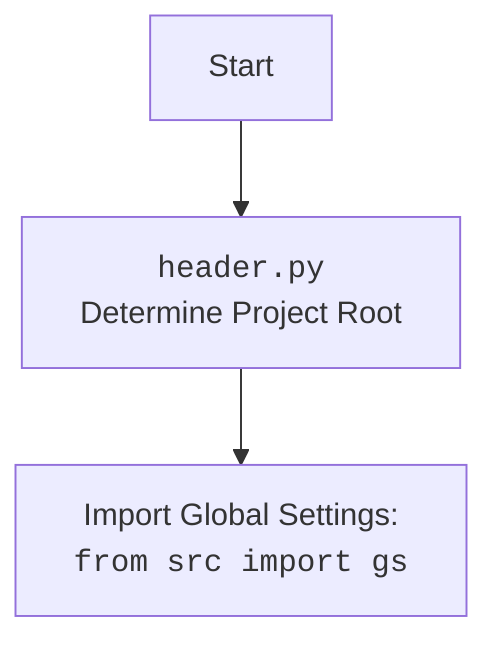

## <алгоритм>

1.  **Инициализация**:
    *   При запуске скрипта, сначала проверяется, является ли он точкой входа (`if __name__ == "__main__":`). Если да, то начинается процесс инициализации.
    *   Инициализируется `argparse` для разбора аргументов командной строки.  Принимается аргумент `-m` или `--mode`, который указывает режим работы бота ('test' или 'production').
    *   Определяется режим работы: если имя хоста `gs.host_name` равно `'Vostro-3888'`, то режим принудительно устанавливается в `'prod'`. В ином случае используется режим, переданный через аргумент командной строки или `'prod'` по умолчанию.
    *   Создается экземпляр `KazarinovTelegramBot`, передавая в него определенный ранее режим `mode`.
2.  **`KazarinovTelegramBot` Instance Creation**:
    *   В конструкторе `__init__` класса `KazarinovTelegramBot`:
        *   Определяется режим работы `mode`. Если аргумент не передан, используется значение `self.config.mode`, прочитанное из конфигурационного файла `kazarinov.json`.
        *   Токен бота извлекается на основе `mode`: для режима `'test'` используется токен тестового бота, для `'production'` - боевого.
        *   Инициализируется родительский класс `TelegramBot` с полученным токеном.
        *   Инициализируется родительский класс `BotHandler` c именем вебдрайвера.
    *   Экземпляр класса `KazarinovTelegramBot` теперь готов к обработке сообщений.
3.  **Запуск бота**:
    *   Вызывается `asyncio.run(kt.application.run_polling())` для запуска бота в режиме long polling. Бот начинает ожидать входящие сообщения.
4.  **Обработка сообщений** (`handle_message`):
    *   При получении нового сообщения:
        *   Извлекается текст сообщения `q`.
        *   Если `q == '?'`: Бот отправляет пользователю изображение `user_flowchart.png`.
        *   Если `q` является URL: Вызывается метод `handle_url` для обработки URL (логика не показана в данном коде, подразумевается обращение к методу родительского класса `BotHandler`, где и описана логика работы с вебдрайвером и парсером). После этого бот завершает обработку сообщения.
        *   Если `q` является командой  ('\--next', '\-next', '\_\_next', '\-n', '\-q'): вызывается метод `handle_next_command` (логика не показана в данном коде).
        *   В противном случае текст `q` отправляется в языковую модель (`self.model.chat(q)`), и полученный ответ отправляется обратно пользователю.

## <mermaid>

```mermaid
flowchart TD
    Start[Start Script Execution] --> ArgParse[Parse Command Line Arguments]
    ArgParse --> DetermineMode{Determine Mode: <br>Argument '-m' or Host Check}
    DetermineMode -- 'test' or 'prod' mode --> CreateBotInstance[Create KazarinovTelegramBot Instance]
    CreateBotInstance --> InitKazarinovBot[<code>KazarinovTelegramBot.__init__</code> <br> Load Config, Get Token, Init Parent Classes]
     InitKazarinovBot --> InitTelegramBot[<code>TelegramBot.__init__</code>]
    InitKazarinovBot --> InitBotHandler[<code>BotHandler.__init__</code>]
    InitTelegramBot --> StartLongPolling[<code>asyncio.run(kt.application.run_polling())</code>]
    StartLongPolling --> WaitForMessage[Wait for Telegram Message]
    WaitForMessage --> HandleMessage[<code>KazarinovTelegramBot.handle_message</code>]
    HandleMessage --> CheckForQuestion{Message is '?'}
    CheckForQuestion -- Yes --> SendFlowchart[Send User Flowchart Image]
    CheckForQuestion -- No --> CheckForURL{Message is URL?}
    CheckForURL -- Yes --> HandleURL[<code>self.handle_url</code><br>Handle URL]
    HandleURL --> EndMessageHandling[End Message Handling]
     CheckForURL -- No --> CheckForNextCommand{Message is Next Command?}
    CheckForNextCommand -- Yes --> HandleNextCommand[<code>self.handle_next_command</code><br>Handle next command]
     HandleNextCommand --> EndMessageHandling[End Message Handling]
    CheckForNextCommand -- No --> SendToModel[Send Message to Language Model <code>self.model.chat(q)</code>]
    SendToModel --> ReplyWithAnswer[Reply with Language Model Answer]
    ReplyWithAnswer --> EndMessageHandling[End Message Handling]
    EndMessageHandling --> WaitForMessage
```



## <объяснение>

**Импорты:**

*   `asyncio`: библиотека для асинхронного программирования, используется для работы с ботом в неблокирующем режиме.
*   `pathlib.Path`: класс для работы с путями к файлам и каталогам.
*   `typing.List, Optional, Dict, Self`: используются для аннотации типов, делая код более читаемым и помогая обнаруживать ошибки на этапе разработки.
*   `types.SimpleNamespace`: класс для создания простых объектов с атрибутами, используется для хранения настроек.
*   `telegram.Update, telegram.ext.*`:  классы и модули для взаимодействия с Telegram API.
*    `import header`: импортирует модуль `header.py` для определения корневого каталога проекта и загрузки глобальных настроек.
*   `from src import gs`: импортирует глобальные настройки проекта, включающие пути, ключи API и другие параметры.
*  `from src.endpoints.bots.telegram.bot_long_polling import TelegramBot`: Импортирует класс `TelegramBot` для управления Telegram ботом, использующим long polling.
*   `from src.endpoints.kazarinov.bot_handlers import BotHandler`: импортирует класс `BotHandler`, который, как предполагается, обрабатывает взаимодействие с веб-парсером.
*   `from src.ai.openai import OpenAIModel, from src.ai.gemini import GoogleGenerativeAI`: импортирует классы для работы с моделями генеративного AI от OpenAI и Google. В данном случае используется `GoogleGenerativeAI`.
*   `from src.utils.file import recursively_read_text_files, save_text_file`: импортирует функции для работы с файлами.
*   `from src.utils.url import is_url`: импортирует функцию для проверки, является ли строка URL.
*   `from src.utils.jjson import j_loads, j_loads_ns, j_dumps`: импортирует функции для работы с JSON.
*   `from src.logger.logger import logger`: импортирует объект `logger` для логирования.
*   `import argparse`: импортирует библиотеку для разбора аргументов командной строки.

**Классы:**

*   `KazarinovTelegramBot(TelegramBot, BotHandler)`:
    *   Наследует от `TelegramBot` для работы с Telegram API и `BotHandler` для обработки логики, связанной с веб-парсингом.
    *   `token: str`: токен Telegram бота.
    *   `config`: загружает конфигурацию из файла `kazarinov.json` в виде `SimpleNamespace`.
    *   `model: GoogleGenerativeAI`:  экземпляр класса `GoogleGenerativeAI` для обработки текстовых запросов.
    *   `__init__(self, mode: Optional[str] = None, webdriver_name: Optional[str] = 'firefox')`: инициализирует бота, устанавливает режим работы, получает токен и инициализирует родительские классы.
    *    `handle_message(self, update: Update, context: CallbackContext)`: обрабатывает входящие сообщения, проверяет, является ли сообщение URL, обрабатывает команды '\--next', '\-next', '\_\_next', '\-n', '\-q', или отправляет запрос в языковую модель, если не соответствует никаким условиям.

**Функции:**

*   `__init__(self, mode: Optional[str] = None, webdriver_name: Optional[str] = 'firefox')` : Конструктор класса `KazarinovTelegramBot`. Инициализирует объект класса:
    *   `mode`: Определяет режим работы бота ('test' или 'production'). Если не передан, используется значение `self.config.mode`, загруженное из `kazarinov.json`.
    *   `webdriver_name`: имя вебдрайвера для BotHandler, по умолчанию 'firefox'.
    *   Определяет токен бота, в зависимости от режима.
    *   Инициализирует родительские классы `TelegramBot` и `BotHandler`.
*  `handle_message(self, update: Update, context: CallbackContext)`: Функция для обработки входящих сообщений от Telegram. Принимает `update` (событие Telegram) и `context` (контекст выполнения).
   *   Извлекает текст сообщения из `update.message.text`.
   *   Если текст сообщения `?`, бот отправляет изображение-схему.
   *   Если текст сообщения является URL, то вызывается функция  `self.handle_url()` для обработки URL.
   *   Если текст сообщения является командой (`--next`, `-next`, `__next`, `-n`, `-q`), то вызывается метод `handle_next_command()`.
   *   В остальных случаях текст сообщения отправляется в модель `self.model.chat(q)` и ответ отправляется пользователю.

**Переменные:**

*   `token`: токен Telegram бота.
*   `config`:  конфигурация бота, загруженная из `kazarinov.json`, как `SimpleNamespace`.
*   `model`: экземпляр языковой модели `GoogleGenerativeAI`
*   `mode`: режим работы бота ('test' или 'production'), определяется аргументом командной строки или значением по умолчанию 'prod'.
*   `gs.credentials.telegram.hypo69_test_bot, gs.credentials.telegram.hypo69_kazarinov_bot`: токены Telegram для тестового и основного ботов, загружаются из глобальных настроек.
*   `parser`: экземпляр `argparse.ArgumentParser` для обработки аргументов командной строки.
*   `args`: объект, содержащий разобранные аргументы командной строки.
*  `kt`: экземпляр класса `KazarinovTelegramBot`.

**Потенциальные ошибки и области для улучшения:**

*   Отсутствует подробная обработка ошибок.
*   Логика методов `handle_url` и `handle_next_command` не описана в предоставленном коде.
*   Код может быть расширен для поддержки других типов сообщений и команд.
*   Жесткое кодирование имени хоста `Vostro-3888` может быть заменено на переменную окружения или конфигурацию.
*   Отсутствует обработка ошибок, которые могут возникнуть при работе с Telegram API, файловой системой, API языковой модели или веб-парсером.
*   Принудительное изменение `mode` на `'prod'` при запуске на хосте `'Vostro-3888'` может создать сложности при локальной разработке.

**Взаимосвязи с другими частями проекта:**

*   Бот использует глобальные настройки из модуля `src.gs`, что обеспечивает доступ к путям, ключам API и другим параметрам.
*   Бот использует классы из пакета `src.endpoints.bots.telegram` для работы с Telegram API, в частности `TelegramBot` для связи с ботом и `bot_long_polling` для обработки обновлений в режиме long-polling.
*   Бот взаимодействует с моделью `GoogleGenerativeAI` для обработки текстовых сообщений.
*   Бот использует модуль `BotHandler` для взаимодействия с веб-парсером, который должен быть реализован в методах класса `BotHandler`.
*   Бот использует функции из `src.utils.file` и `src.utils.url` для работы с файлами и URL соответственно.
*   Бот использует логирование через модуль `src.logger.logger`.

**Цепочка взаимосвязей:**

1.  Скрипт запускается (`__main__`).
2.  Инициализируется `argparse` и определяется режим работы (`test` или `production`).
3.  Создается экземпляр `KazarinovTelegramBot`.
4.  `KazarinovTelegramBot` инициализирует `TelegramBot` для работы с Telegram API и `BotHandler` для веб-парсинга.
5.  Запускается long-polling через `asyncio.run(kt.application.run_polling())`.
6.  Бот ожидает входящие сообщения.
7.  Полученное сообщение обрабатывается в `handle_message`.
8.  В зависимости от содержимого сообщения:
    *   Отправляется изображение-схема.
    *   Вызывается метод `handle_url`  класса `BotHandler` для обработки URL.
    *   Вызывается метод `handle_next_command` если сообщение является командой.
    *   Отправляется запрос в языковую модель `GoogleGenerativeAI`.
9.  Ответ отправляется пользователю.