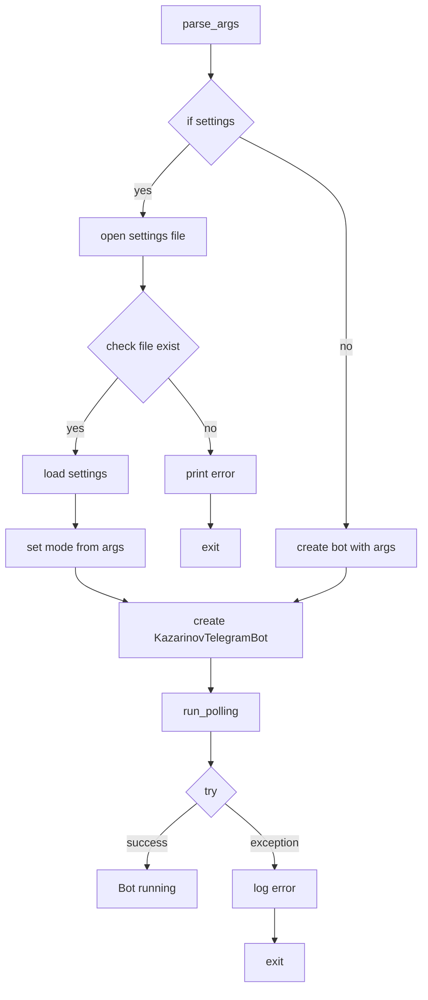

# <input code>

```python
## \file hypotez/src/endpoints/kazarinov/main.py
# -*- coding: utf-8 -*-\
#! venv/Scripts/python.exe
#! venv/bin/python/python3.12

"""
.. module: src.endpoints.kazarinov 
	:platform: Windows, Unix
	:synopsis:

"""
MODE = 'dev'

import argparse
import asyncio
import json
from pathlib import Path
from pydantic import BaseModel
from src.logger import logger
from .bot import KazarinovTelegramBot

def parse_args() -> dict:
    """Парсинг аргументов командной строки.

    Returns:
        dict: Словарь с параметрами запуска.
    """
    parser = argparse.ArgumentParser(description="Kazarinov's Telegram Bot CLI")

    parser.add_argument(
        "--settings",
        type=str,
        help="Путь к файлу настроек JSON.",
    )
    parser.add_argument(
        "--mode",
        type=str,
        choices=["test", "prod"],
        default="test",
        help="Режим работы бота (\'test\' или \'prod\').",
    )

    return vars(parser.parse_args())

def main():
    """Главная функция запуска KazarinovTelegramBot с параметрами из командной строки или файла настроек."""
    print("Starting Kazarinov's Telegram Bot...")

    args = parse_args()

    # Если указан файл настроек, загружаем параметры из него
    if args.get("settings"):
        settings_path = Path(args["settings"])
        if settings_path.exists():
            with open(settings_path, "r", encoding="utf-8") as file:
                settings = json.load(file)
            settings['mode'] = args.get("mode", "test")  # Дополнительно задаём режим
            bot = KazarinovTelegramBot(**settings)
        else:
            print(f"Файл настроек \'{settings_path}\' не найден.")
            return
    else:
        # Создаем экземпляр бота с параметрами из командной строки
        mode = args.get("mode", "test")
        bot = KazarinovTelegramBot(mode=mode)

    # Запуск бота
    try:
        asyncio.run(bot.application.run_polling())
    except Exception as ex:
        logger.error("Ошибка при запуске бота: %s", ex)


if __name__ == "__main__":
    main()
```

# <algorithm>



**Пример:**

Если запустить скрипт с аргументом `--settings settings.json`, алгоритм загрузит параметры из файла `settings.json` и создаст экземпляр бота `KazarinovTelegramBot` с этими параметрами. Если `--settings` не задан, будут использованы параметры, полученные из командной строки.

# <mermaid>

```mermaid
graph LR
    subgraph KazarinovTelegramBot
        KazarinovTelegramBot --> run_polling
    end
    subgraph src
        src.logger --> logger
        src.logger --> error
        logger --> main
    end
    subgraph endpoints
        kazarinov.main --> parse_args
        kazarinov.main --> KazarinovTelegramBot
        kazarinov.main --> asyncio
        kazarinov.bot --> KazarinovTelegramBot
        kazarinov.bot --> application
    end
    main --> args
    args --> KazarinovTelegramBot
    parse_args --> args
    json --> settings
    Path --> settings_path
    argparse --> parser
    asyncio --> run_polling
```

# <explanation>

**Импорты:**

- `argparse`: Для парсинга аргументов командной строки.
- `asyncio`: Для асинхронного выполнения задач, необходимого для работы Telegram бота.
- `json`: Для работы с файлами настроек в формате JSON.
- `pathlib`: Для работы с путями к файлам.
- `pydantic`: Вероятно для валидации и сериализации данных.
- `src.logger`: Модуль для логгирования, вероятно, реализован в другом файле проекта.
- `.bot`: Импорт модуля `KazarinovTelegramBot` из текущей папки.

**Классы:**

- `KazarinovTelegramBot`: Класс, представляющий Telegram бота. Он, вероятно, содержит атрибуты для хранения данных, необходимых для работы бота (например, токен API Telegram, настройки, обработчики событий), а также методы для управления работой бота (например, обработка сообщений, отправка сообщений). Подробности о реализации этого класса требуют анализа соответствующего файла `bot.py`.  Ключевой атрибут - `application`, вероятно, содержит объект, представляющий Telegram бота в библиотеке `python-telegram-bot`.


**Функции:**

- `parse_args()`: Парсит аргументы командной строки, использует `argparse` для определения аргументов `--settings` и `--mode`. Возвращает словарь с полученными аргументами.
- `main()`: Главная функция, которая запускает бота. Она обрабатывает полученные аргументы командной строки, либо читает настройки из файла, если задан путь в аргументах. Создает экземпляр класса `KazarinovTelegramBot` и запускает метод `run_polling()` для запуска бота.

**Переменные:**

- `MODE`: Глобальная переменная, хранит режим работы. 
- `args`: Словарь, содержащий аргументы, полученные при парсинге командной строки.
- `settings_path`: Путь к файлу настроек.
- `settings`: Загруженные настройки из файла.
- `bot`: Экземпляр класса `KazarinovTelegramBot`.


**Возможные ошибки и улучшения:**

- **Обработка ошибок:** Хотя используется `try...except`, обработка ошибок может быть улучшена, например, логирование более подробной информации об ошибках.
- **Документация:** Не хватает более подробной документации внутри кода (docstrings).
- **Валидация настроек:** Нет валидации загруженных настроек.  Использование `pydantic` для валидации JSON настроек сделало бы код более надежным.
- **Управление ресурсами:** Отсутствует явное закрытие файла при чтении настроек.  В данном случае `with open(...)` решает проблему.

**Связь с другими частями проекта:**

Код напрямую зависит от модуля `src.logger` и класса `KazarinovTelegramBot`, который, скорее всего, определен в другом файле (`bot.py`) в папке `hypotez/src/endpoints/kazarinov`.  Правильное использование `from .bot import KazarinovTelegramBot` предполагает, что `bot.py` находится в той же директории, что и `main.py`.