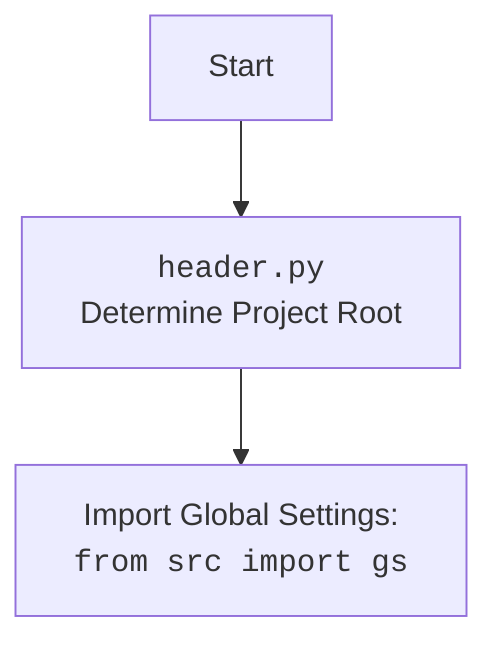

## АНАЛИЗ КОДА: `hypotez/src/endpoints/kazarinov/main.py`

### <алгоритм>
1. **Начало**: Выполняется скрипт `main.py`.
    *   Пример: `python hypotez/src/endpoints/kazarinov/main.py --mode test --settings settings.json`
2.  **`parse_args()`**:
    *   Разбирает аргументы командной строки с использованием `argparse`.
    *   Определяет, был ли предоставлен путь к файлу настроек (`--settings`) и режим работы (`--mode`).
    *   Возвращает словарь аргументов.
    *   Пример:
        *   Ввод: `--settings settings.json --mode prod`
        *   Вывод: `{"settings": "settings.json", "mode": "prod"}`
3.  **`main()`**:
    *   Вызывает `parse_args()` для получения аргументов.
    *   Проверяет, был ли передан путь к файлу настроек:
        *   Если путь есть и файл существует:
            *   Загружает настройки из JSON файла.
            *   Добавляет или перезаписывает `mode` из аргументов командной строки.
            *   Создает экземпляр `KazarinovTelegramBot` с настройками.
        *   Если файла нет, то выводит сообщение об ошибке и завершает работу.
    *   Если файла нет, то создает экземпляр `KazarinovTelegramBot` с параметром `mode` из командной строки.
        *   Пример: `KazarinovTelegramBot(mode='test')` или `KazarinovTelegramBot(mode='prod')`
    *   Запускает бота с использованием `asyncio.run()`:
        *   Вызывает `bot.application.run_polling()` для начала прослушивания входящих сообщений.
    *   Если возникает ошибка во время запуска бота, она регистрируется с использованием `logger.error()`.
4. **Завершение**: Работа скрипта завершается после остановки бота или ошибки.
    *   Пример: Бота остановили через консоль, или при возникновении ошибки.

### <mermaid>
```mermaid
flowchart TD
    Start(Start main.py) --> ParseArgs(parse_args())
    ParseArgs --> CheckSettingsPath{Settings Path Exists?}
    CheckSettingsPath -- Yes --> LoadSettings[Load Settings from JSON]
    LoadSettings --> UpdateMode[Update/Add Mode Setting]
    UpdateMode --> CreateBotWithSettings[Create KazarinovTelegramBot with settings]
    CheckSettingsPath -- No --> GetModeFromArgs[Get mode from command line arguments]
    GetModeFromArgs --> CreateBotWithMode[Create KazarinovTelegramBot with mode]
    CreateBotWithSettings --> RunBot[asyncio.run(bot.application.run_polling())]
    CreateBotWithMode --> RunBot
    RunBot --> End{End}
    RunBot -- Exception --> LogError[logger.error(exception)]
    LogError --> End
    
    style Start fill:#f9f,stroke:#333,stroke-width:2px
    style End fill:#ccf,stroke:#333,stroke-width:2px
    
```



### <объяснение>
#### Импорты
*   `argparse`: Используется для разбора аргументов командной строки. Позволяет пользователю задавать параметры запуска скрипта, такие как путь к файлу настроек и режим работы бота.
*   `asyncio`: Используется для асинхронного запуска бота, позволяя ему обрабатывать события телеграма в фоновом режиме без блокировки основного потока.
*   `json`: Используется для загрузки настроек бота из JSON-файла.
*   `pathlib.Path`: Используется для работы с путями к файлам и каталогам, обеспечивая кроссплатформенную совместимость.
*   `pydantic.BaseModel`:  Используется для валидации и управления типами данных, хотя напрямую не используется в этом файле, возможно, он используется в модуле `bot.py` для валидации настроек.
*   `src.logger.logger`:  Используется для логирования ошибок и событий. Позволяет отслеживать работу бота и диагностировать проблемы. Зависит от `src`.
*   `.bot.KazarinovTelegramBot`:  Импортирует класс `KazarinovTelegramBot`, который содержит логику работы телеграм-бота. Зависит от текущего пакета `src.endpoints.kazarinov`.

#### Функции
*   **`parse_args() -> dict`**:
    *   **Назначение**: Парсит аргументы командной строки, предоставляемые пользователем при запуске скрипта.
    *   **Аргументы**: Отсутствуют.
    *   **Возвращаемое значение**: `dict` - словарь, содержащий аргументы командной строки (например, `{"settings": "path/to/settings.json", "mode": "prod"}`).
    *   **Пример**: Если пользователь запустит скрипт с параметрами `python main.py --settings settings.json --mode test`, эта функция вернет словарь `{"settings": "settings.json", "mode": "test"}`.
*   **`main()`**:
    *   **Назначение**: Главная функция, отвечающая за запуск телеграм-бота. Она обрабатывает аргументы командной строки, загружает настройки и запускает бота.
    *   **Аргументы**: Отсутствуют.
    *   **Возвращаемое значение**: Отсутствует (None).
    *   **Пример**:
      1. Сначала вызывает `parse_args()` для получения параметров.
      2. Затем загружает настройки из JSON файла, если он указан.
      3. Создает экземпляр `KazarinovTelegramBot` с этими настройками.
      4. Наконец, вызывает `asyncio.run()` для запуска бота.

#### Переменные
*   `MODE`: Глобальная переменная, которая в данном коде используется для определения режима работы. В данном коде она определена как `dev`, но в дальнейшем перезаписывается параметрами командной строки или из файла настроек.
*   `args`: `dict` - словарь, полученный из `parse_args()`, содержащий аргументы командной строки.
*   `settings_path`: `pathlib.Path` - объект, представляющий путь к файлу настроек.
*    `settings`:  `dict` - словарь, содержащий настройки бота, загруженные из JSON-файла.
*    `bot`:  Экземпляр класса `KazarinovTelegramBot` - основной объект для управления телеграм ботом.
*   `mode`: `str` - режим работы бота ('test' или 'prod'), полученный из аргументов командной строки или настроек.

#### Потенциальные ошибки и области для улучшения
1. **Отсутствие обработки ошибок файла JSON**:  Может возникнуть ошибка, если файл JSON содержит невалидный формат. Необходимо добавить обработку исключений при загрузке файла с использованием `json.load()`.
2. **Отсутствие валидации настроек**:  Настройки из файла JSON не валидируются, что может привести к ошибкам, если в файле содержатся неправильные данные. Можно использовать `pydantic` для валидации настроек.
3. **Общий `try...except`**:  Блок `try...except` в `main()` перехватывает все исключения. Лучше перехватывать конкретные типы исключений (например, `FileNotFoundError`, `json.JSONDecodeError`) и обрабатывать их отдельно.
4. **Неявные зависимости**:  Код зависит от существования `KazarinovTelegramBot`, который не определен в этом файле. Необходимо убедиться, что данный модуль правильно импортируется и настроен.
5. **Константа `MODE`**:  Переменная `MODE` в начале файла не используется, поскольку далее переопределяется, стоит ее удалить.
6. **Отсутствие обработки ошибок CLI параметров**: Стоит добавить проверку на правильность переданных CLI параметров.

#### Взаимосвязи с другими частями проекта
*   Этот модуль зависит от `src.logger.logger` для логирования, и от `src.endpoints.kazarinov.bot.KazarinovTelegramBot` для управления ботом.
*   Модуль `bot.py` зависит от настроек, передаваемых в конструкторе `KazarinovTelegramBot`.
*  Этот модуль является частью `src.endpoints.kazarinov` и может использовать другие ресурсы, находящиеся в этой же директории.
*   Модуль может взаимодействовать с другими модулями проекта `hypotez` через общие файлы настроек и логирования.