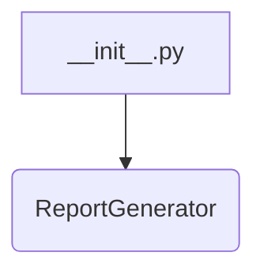

# <input code>

```python
## \file hypotez/src/endpoints/kazarinov/pricelist_generator/__init__.py
# -*- coding: utf-8 -*-\
#! venv/Scripts/python.exe
#! venv/bin/python/python3.12

"""
.. module: src.endpoints.kazarinov.pricelist_generator 
	:platform: Windows, Unix
	:synopsis:

"""
MODE = 'dev'


from .pricelist_generator import ReportGenerator
```

# <algorithm>

В данном коде представлен начальный модуль `pricelist_generator`.  Он импортирует класс `ReportGenerator` из подпапки `pricelist_generator`.  Алгоритм работы сводится к импорту, без каких-либо действий.  На данном этапе нет никакой логики обработки данных.  Любая работа с данными и генерацией прайс-листа будет реализована в классе `ReportGenerator`.



# <mermaid>


# <explanation>

* **Импорты**: Файл `__init__.py` в папке `pricelist_generator` отвечает за инициализацию подмодулей или классов, содержащихся в директории.  В данном случае он импортирует класс `ReportGenerator` из подпапки `pricelist_generator`. Это указывает, что основной функционал для генерации прайс-листа, вероятно, реализован в этом классе.  Обратите внимание на `from .pricelist_generator import ReportGenerator`.  `.` указывает на поиск в текущей папке.

* **Классы**:  `ReportGenerator` (не определен в данном файле) — это класс, содержащий логику для генерации прайс-листов.  Он, вероятно, будет принимать данные, обрабатывать их и возвращать сгенерированный прайс-лист. Подробности о `ReportGenerator` неизвестны без просмотра файла `pricelist_generator.py`.

* **Функции**: Нет функций в данном файле.  Все логика, вероятно, содержится в классе `ReportGenerator`.

* **Переменные**:  `MODE = 'dev'`.  Вероятно, эта переменная используется для определения режима работы (например, `dev` или `prod`), влияющего на логику или конфигурацию генерации прайс-листа.  Без контекста использования этого параметра, невозможно точно сказать, что это.

* **Возможные ошибки или области для улучшений**:
    * Отсутствие реализации логики.  Файл `__init__.py` только импортирует класс. Необходим код `pricelist_generator.py` для понимания алгоритма работы.
    *  Нет явной связи с другими частями приложения.  Необходимо дальнейшее исследование структуры проекта для понимания, как этот код взаимодействует с остальными компонентами (например, с контроллерами, хранилищами данных и т.д.).


**Цепочка взаимосвязей:**

1. Код в `__init__.py` импортирует `ReportGenerator`.
2. `ReportGenerator` (в `pricelist_generator.py`)  предположительно получает данные из базы данных, конфигурации или других источников.
3. `ReportGenerator` обрабатывает данные и генерирует прайс-лист.
4. Результат (сгенерированный прайс-лист) может быть использован другими частями приложения (например, API контроллерами) для предоставления пользователям.

**Заключение**:  Данный файл служит для импорта необходимой функциональности. Без реализации класса `ReportGenerator`, невозможно оценить полную функциональность кода.  Для лучшего понимания, необходимо рассмотреть код в файле `pricelist_generator.py`.