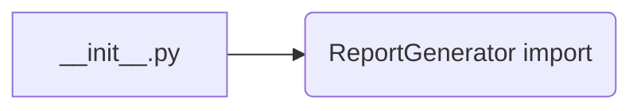
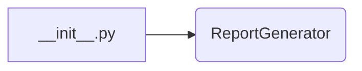

# <input code>

```python
## \file hypotez/src/endpoints/kazarinov/pricelist_generator/__init__.py
# -*- coding: utf-8 -*-
#! venv/Scripts/python.exe
#! venv/bin/python/python3.12

"""
.. module: src.endpoints.kazarinov.pricelist_generator 
	:platform: Windows, Unix
	:synopsis:

"""
MODE = 'dev'


from .pricelist_generator import ReportGenerator
```

# <algorithm>

Этот код представляет собой инициализирующий модуль для пакета `pricelist_generator`.  Он не содержит логики обработки данных, а лишь импортирует класс `ReportGenerator` из подпапки `pricelist_generator`.  Блок-схема крайне простая:



В данном случае, `A` — это файл `__init__.py`, а `B` — импортируемый класс.  Данные не передаются, так как это всего лишь импорт.

# <mermaid>



# <explanation>

* **Импорты:**
    * `from .pricelist_generator import ReportGenerator`: Этот импорт подключает класс `ReportGenerator` из модуля `pricelist_generator`.  `.` указывает на подпапку `pricelist_generator` в текущей директории.  Эта строка позволяет использовать класс `ReportGenerator` в других частях проекта.


* **Классы:**
    * `ReportGenerator`: Этот класс, вероятно, реализует логику генерации прайс-листов, но сам код этого класса отсутствует в предоставленном фрагменте.  Мы не можем сказать о его атрибутах и методах без просмотра его определения.

* **Функции:**
    * Нет функций.

* **Переменные:**
    * `MODE = 'dev'`:  Эта переменная, вероятно, определяет режим работы (например, `dev` — для разработки, `prod` — для производства).  Она используется для настройки поведения системы в зависимости от окружения.

* **Возможные ошибки или области для улучшений:**

    * Отсутствует код `ReportGenerator`, что делает непонятным точный функционал этого модуля.  Необходимо просмотреть файл `pricelist_generator.py` для понимания его работы.
    * Не указано, как эта функция взаимодействует с другими частями проекта.  Для этого, вероятно, есть другие модули или файлы, которые используют данный класс или переменную `MODE`.

* **Цепочка взаимосвязей с другими частями проекта:**

    Без доступа к другим модулям, трудно сказать наверняка.  Но, скорее всего, этот `__init__.py` нужен для того, чтобы другие части приложения могли использовать класс `ReportGenerator`.  Возможно, в других частях приложения (например, в файлах запросов API или в скриптах командной строки) будут импортироваться объекты и методы из этого класса для выполнения логики генерации.  Например, какой-то контроллер API может использовать `ReportGenerator` для создания прайс-листов в ответ на HTTP-запросы.


**Вывод:** Код представляет собой очень начальную часть модуля.  Для детального понимания необходимо увидеть исходный код `pricelist_generator.py` и контекст использования этого `__init__.py` в более широком проекте.