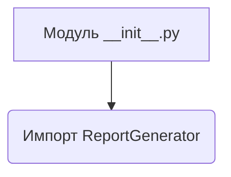
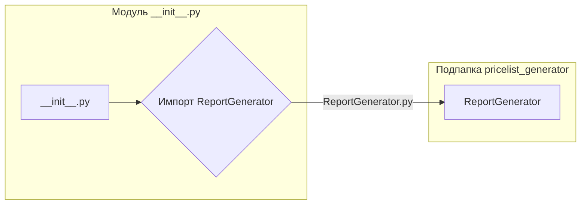

# <input code>

```python
## \file hypotez/src/endpoints/kazarinov/pricelist_generator/__init__.py
# -*- coding: utf-8 -*-
#! venv/Scripts/python.exe
#! venv/bin/python/python3.12

"""
.. module: src.endpoints.kazarinov.pricelist_generator 
	:platform: Windows, Unix
	:synopsis:

"""
MODE = 'dev'


from .pricelist_generator import ReportGenerator
```

# <algorithm>

Этот код представляет собой инициализационный модуль для пакета `pricelist_generator`.  Он, по сути, импортирует класс `ReportGenerator` из подпапки `pricelist_generator`.  Блок-схема проста:



Пример: Этот файл указывает, что в проекте существует класс `ReportGenerator`, который, предположительно, отвечает за генерацию отчетов по ценовым листам.  Файл `__init__.py` в папке просто сообщает импортирующим скриптам, что эти ресурсы доступны.

# <mermaid>



**Зависимости:**  Основная зависимость – это сам класс `ReportGenerator`, который предполагается определённым в файле `pricelist_generator.py` внутри папки `pricelist_generator`.


# <explanation>

* **Импорты:**
    * `from .pricelist_generator import ReportGenerator`: Эта строка импортирует класс `ReportGenerator` из подпапки `pricelist_generator`. `.` указывает, что нужно искать в текущей папке (в данном случае `hypotez/src/endpoints/kazarinov/pricelist_generator`). Этот импорт делает класс `ReportGenerator` доступным для использования в других частях проекта, которые импортируют данный модуль (`__init__.py`).

* **Классы:**
    * `ReportGenerator`:  Этот класс, определённый в файле `pricelist_generator.py`, вероятно, отвечает за логику генерации отчетов по ценовым спискам. Подробная информация о нём (атрибуты и методы) недоступна, так как исходный код класса не предоставлен.

* **Функции:**
    * Нет функций в данном файле.

* **Переменные:**
    * `MODE = 'dev'`:  Эта переменная, вероятно, определяет режим работы приложения (например, 'dev' - режим разработки, 'prod' - режим производства).  Значение используется для настройки других частей приложения (например, пути к файлам данных, конфигурационные параметры и т.д.).


**Возможные ошибки и улучшения:**

* **Не указан тип данных:**  Не указаны типы переменных (например, для `MODE`).


**Взаимосвязи с другими частями проекта:**

Этот модуль устанавливает зависимость от класса `ReportGenerator`.  Другие части проекта, которые используют генерацию отчетов по ценовым листам, будут импортировать этот модуль, чтобы получить доступ к классу `ReportGenerator`.  Например, в контроллерах API или других местах приложения, где требуется сгенерировать отчеты, будет производиться импорт из этого `__init__.py`.  Без доступа к остальным файлам проекта,  полноценный анализ взаимосвязей невозможен.