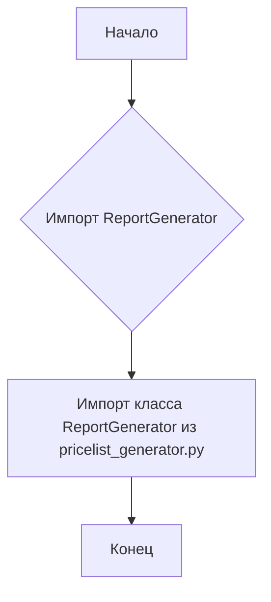
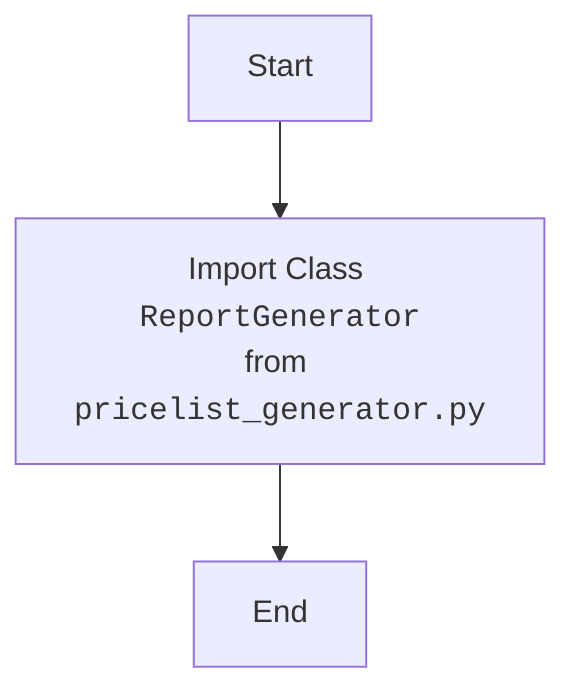

## АНАЛИЗ КОДА: `hypotez/src/endpoints/kazarinov/pricelist_generator/__init__.py`

### 1. <алгоритм>

**Описание:**

Файл `__init__.py` в Python используется для обозначения директории как пакета. В данном случае, он импортирует класс `ReportGenerator` из модуля `pricelist_generator.py`. Это позволяет использовать `ReportGenerator` через импорт пакета `src.endpoints.kazarinov.pricelist_generator`.

**Пошаговая блок-схема:**

**Примеры:**
1.  **Начало**: Исполнение кода начинается с файла `__init__.py` при импорте пакета `src.endpoints.kazarinov.pricelist_generator`.
2.  **Импорт ReportGenerator**: Операция импорта класса `ReportGenerator` из `pricelist_generator.py`. Например: `from .pricelist_generator import ReportGenerator`.
3.  **Конец**: После импорта класс `ReportGenerator` становится доступным для использования через импорт пакета.

### 2. <mermaid>

**Объяснение `mermaid` диаграммы:**

Диаграмма отражает простой процесс импорта класса `ReportGenerator` из файла `pricelist_generator.py`.
*   `Start`: Начало процесса импорта.
*   `ImportReportGenerator`: Импорт класса `ReportGenerator`.
*   `End`: Конец процесса импорта.

**Зависимости:**

В данном коде есть явная зависимость от `pricelist_generator.py`, откуда импортируется класс `ReportGenerator`.

### 3. <объяснение>

**Импорты:**

*   `from .pricelist_generator import ReportGenerator`:
    *   Импортирует класс `ReportGenerator` из модуля `pricelist_generator.py`, находящегося в той же директории.
    *   `.` (точка) означает, что модуль `pricelist_generator` находится в текущем пакете.
    *   Этот импорт позволяет использовать класс `ReportGenerator` в других частях проекта, импортировав этот пакет.

**Классы:**

*   `ReportGenerator`:
    *   Этот класс не определен в данном файле, а импортируется.
    *   Он, вероятно, содержит методы и атрибуты для генерации отчетов о прайс-листах.
    *   Его взаимодействие с другими компонентами проекта зависит от его реализации в `pricelist_generator.py`.

**Функции:**

*   В данном файле нет явно определенных функций, он служит как точка входа в пакет и для импорта.

**Переменные:**

*   В данном файле нет явно определенных переменных.

**Потенциальные ошибки и области для улучшения:**

*   **Отсутствие документации:** Файл не содержит достаточной документации о своем назначении и ожидаемом поведении.
*   **Зависимость от `pricelist_generator.py`:** Если файл `pricelist_generator.py` будет изменен или удален, это приведет к ошибкам.
*   **Отсутствие тестов:** Нет тестов для проверки правильности работы импорта.

**Взаимосвязь с другими частями проекта:**

*   Этот файл является частью пакета `src.endpoints.kazarinov.pricelist_generator`.
*   Он обеспечивает доступ к функциональности генерации прайс-листов для других частей проекта.
*   Другие части проекта могут импортировать этот пакет и использовать класс `ReportGenerator` для генерации отчетов.