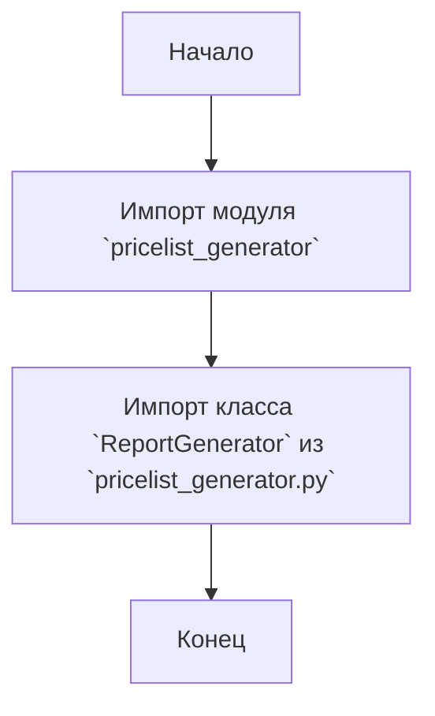

## Анализ кода `hypotez/src/endpoints/kazarinov/pricelist_generator/__init__.py`

### 1. <алгоритм>

1.  **Начало**: Инициализация модуля `src.endpoints.kazarinov.pricelist_generator`.
2.  **Импорт**: Импортируется класс `ReportGenerator` из модуля `pricelist_generator.py` (относительный импорт из текущей директории).
3.  **Конец**: Модуль готов к использованию, предоставляя доступ к классу `ReportGenerator`.

**Примеры:**

-   Пример использования: `from src.endpoints.kazarinov.pricelist_generator import ReportGenerator`.

### 2. <mermaid>

**Объяснение:**

- `Start`: Начало работы модуля.
- `ImportModule`: Обозначает процесс импорта модуля `pricelist_generator` из текущей директории.
- `ImportClass`: Обозначает процесс импорта конкретного класса `ReportGenerator` из импортированного модуля.
- `End`: Конец работы модуля, класс `ReportGenerator` доступен для использования.

### 3. <объяснение>

**Импорты:**

-   `from .pricelist_generator import ReportGenerator`: Этот импорт является относительным и означает, что из файла `pricelist_generator.py`, находящегося в той же директории, что и `__init__.py`, импортируется класс `ReportGenerator`. Это делается для того, чтобы сделать `ReportGenerator` доступным для использования при импорте самого пакета `src.endpoints.kazarinov.pricelist_generator`. Взаимосвязь с другими пакетами `src` заключается в том, что `pricelist_generator` является частью структуры пакетов проекта.

**Классы:**

-   `ReportGenerator`: Данный код импортирует класс, но не определяет его. Предполагается, что класс `ReportGenerator` определен в файле `pricelist_generator.py`. Вероятно, он отвечает за генерацию отчетов о прайс-листах. Информация о его атрибутах и методах отсутствует, поскольку он определен в другом файле.

**Функции:**

-   В данном файле нет определения функций, только импорт класса.

**Переменные:**

-   В данном файле нет определения переменных, только импорт класса.

**Потенциальные ошибки или области для улучшения:**

-   **Зависимость:**  Функциональность данного модуля полностью зависит от существования и корректной работы модуля `pricelist_generator.py`. Если `pricelist_generator.py` отсутствует или в нем есть ошибки, данный модуль также не будет работать.
-   **Недостаток документации:**  Отсутствует описание класса `ReportGenerator`, его атрибутов и методов. Это затрудняет понимание логики работы модуля и его использования.
-   **Отсутствие try/except:** Отсутствует обработка исключений, которые могут возникнуть при импорте. В случае возникновения проблем при импорте класса, программа может завершиться с ошибкой.

**Цепочка взаимосвязей с другими частями проекта:**

1.  Модуль `src.endpoints.kazarinov.pricelist_generator` является частью более крупной структуры проекта `src`.
2.  Модуль предоставляет доступ к классу `ReportGenerator`, который, вероятно, используется в других частях проекта для генерации отчетов о прайс-листах.
3.  Предполагается, что данный модуль взаимодействует с другими частями проекта, которые обращаются к `ReportGenerator`, но конкретные детали не видны в данном файле.

**Итоговое заключение:**

Файл `__init__.py` в директории `src/endpoints/kazarinov/pricelist_generator` является частью пакета и предназначен для упрощения импорта класса `ReportGenerator` из модуля `pricelist_generator.py`. Он действует как точка входа для данного модуля, позволяя другим частям проекта получать доступ к классу `ReportGenerator` через импорт этого пакета. Для более детального понимания необходимо анализировать файл `pricelist_generator.py`, в котором описана реализация `ReportGenerator`.