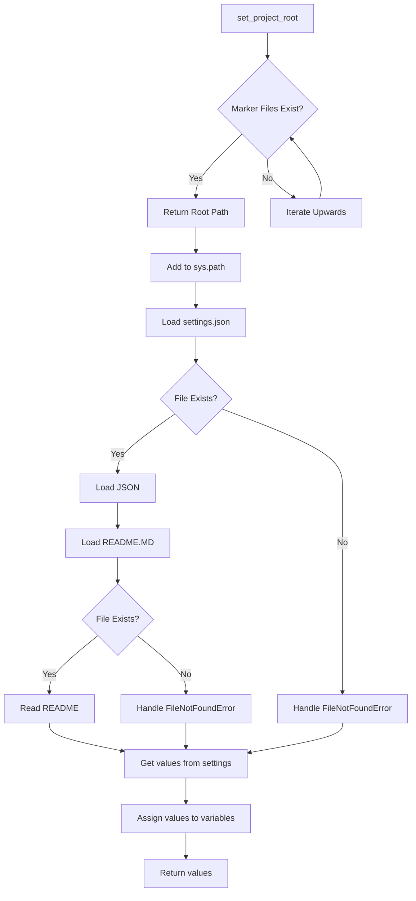

# <input code>

```python
## \file hypotez/src/endpoints/kazarinov/scenarios/header.py
# -*- coding: utf-8 -*-\
#! venv/Scripts/python.exe
#! venv/bin/python/python3.12

"""
.. module: src.endpoints.kazarinov.scenarios 
	:platform: Windows, Unix
	:synopsis:

"""
MODE = 'dev'

import sys
import json
from packaging.version import Version

from pathlib import Path
def set_project_root(marker_files=('pyproject.toml', 'requirements.txt', '.git')) -> Path:
    """
    Finds the root directory of the project starting from the current file's directory,
    searching upwards and stopping at the first directory containing any of the marker files.

    Args:
        marker_files (tuple): Filenames or directory names to identify the project root.
    
    Returns:
        Path: Path to the root directory if found, otherwise the directory where the script is located.
    """
    __root__:Path
    current_path:Path = Path(__file__).resolve().parent
    __root__ = current_path
    for parent in [current_path] + list(current_path.parents):
        if any((parent / marker).exists() for marker in marker_files):
            __root__ = parent
            break
    if __root__ not in sys.path:
        sys.path.insert(0, str(__root__))
    return __root__


# Get the root directory of the project
__root__ = set_project_root()
"""__root__ (Path): Path to the root directory of the project"""

from src import gs

settings:dict = None
try:
    with open(gs.path.root / 'src' /  'settings.json', 'r') as settings_file:
        settings = json.load(settings_file)
except (FileNotFoundError, json.JSONDecodeError):
    ...

doc_str:str = None
try:
    with open(gs.path.root / 'src' /  'README.MD', 'r') as settings_file:
        doc_str = settings_file.read()
except (FileNotFoundError, json.JSONDecodeError):
    ...


__project_name__ = settings.get("project_name", 'hypotez') if settings  else 'hypotez'
__version__: str = settings.get("version", '')  if settings  else ''
__doc__: str = doc_str if doc_str else ''
__details__: str = ''
__author__: str = settings.get("author", '')  if settings else ''
__copyright__: str = settings.get("copyrihgnt", '')  if settings else ''
__cofee__: str = settings.get("cofee", "Treat the developer to a cup of coffee for boosting enthusiasm in development: https://boosty.to/hypo69")  if settings else "Treat the developer to a cup of coffee for boosting enthusiasm in development: https://boosty.to/hypo69"
```

# <algorithm>

**Блок-схема:**

1. **Найти корень проекта (set_project_root):**
   - Начинает поиск от текущего файла.
   - Итерируется по родительским каталогам.
   - Проверяет существование файлов/каталогов из marker_files в каждом родительском каталоге.
   - Если найден, возвращает путь к родительскому каталогу и добавляет его в sys.path.
   - Если не найден, возвращает путь к текущему каталогу.
2. **Загрузить settings.json:**
   - Использует модуль gs для получения пути к файлу settings.json.
   - Пытается открыть файл и загрузить его содержимое в формате JSON в переменную `settings`.
   - Обрабатывает исключения FileNotFoundError и json.JSONDecodeError, если файл не найден или некорректно отформатирован, соответственно.
3. **Загрузить README.MD:**
   - Использует модуль gs для получения пути к файлу README.MD.
   - Пытается открыть файл и прочитать содержимое в переменную `doc_str`.
   - Обрабатывает исключения FileNotFoundError и json.JSONDecodeError, если файл не найден или некорректно отформатирован, соответственно.
4. **Получить значения из settings:**
   - Извлекает значения из словаря `settings` для переменных `__project_name__`, `__version__`, `__author__`, `__copyright__`, `__cofee__`, используя метод `get()` для обработки возможных ошибок.
   - Использует значения по умолчанию для переменных, если соответствующий ключ не найден.
   - Присваивает значения загруженных переменных.
5. **Возвращает значения:**
   - Возвращает полученные данные.


**Пример:**

Если файл `settings.json` находится в каталоге `myproject/src`, то `set_project_root()` найдет его, и остальные шаги будут работать корректно. Если `settings.json` не найден, будут обработаны исключения, и значения переменных будут установлены по умолчанию.


# <mermaid>



**Объяснение диаграммы:**

* `set_project_root`:  Находит корень проекта.
* `Load settings.json`/`Load README.MD`: Загружает данные из файлов.
* `Get values from settings`: Извлекает конфигурационные данные.
* `Assign values to variables`: Присваивает извлеченные значения переменным.
* `Return values`: Возвращает все загруженные данные.
* Зависимости: `gs` (возможно, для получения путей к файлам), `json` (для обработки JSON), `pathlib` (для работы с путями), `packaging.version` (для работы с версиями).


# <explanation>

**Импорты:**

* `sys`: Для управления системными переменными, в частности, для добавления пути к корню проекта в `sys.path`.
* `json`: Для работы с файлами JSON.
* `packaging.version`: Для работы с версиями пакетов.
* `pathlib`: Для работы с путями к файлам.
* `src.gs`:  Вероятно, это внутренний модуль, предоставляющий функции для работы с путями к файлам проекта.  Важная зависимость, т.к. обеспечивает работу с корнем проекта.


**Классы:**

В данном фрагменте кода нет определенных классов.


**Функции:**

* `set_project_root(marker_files)`:  Находит корневой каталог проекта, начиная с текущего файла и итерируясь вверх по родительским каталогам. Возвращает корневой каталог и добавляет его в `sys.path`.
    * Аргументы: кортеж `marker_files` с именами файлов/каталогов для идентификации корневого каталога.
    * Возвращаемое значение: `Path` к корневому каталогу.


**Переменные:**

* `__root__`: Хранит путь к корневому каталогу проекта.
* `settings`: Словарь, содержащий настройки проекта (из `settings.json`).
* `doc_str`: Содержимое файла `README.MD`.
* `__project_name__`, `__version__`, `__author__`, `__copyright__`, `__cofee__`:  Переменные, содержащие информацию о проекте, извлеченные из `settings.json`.  Используют значения по умолчанию, если соответствующие поля не найдены в JSON.
* `MODE`: Переменная, содержащая режим работы (в данном случае 'dev').


**Возможные ошибки и улучшения:**

* **Обработка ошибок:** Обработка `FileNotFoundError` и `json.JSONDecodeError` в блоках `try...except` - хорошо, но можно добавить более конкретные сообщения об ошибках для лучшей отладки.
* **Ясность кода:**  Можно улучшить комментарии, особенно для `gs.path.root`, чтобы было понятно, откуда берутся пути.
* **Использование `Path`:**  Использование `Path` для работы с путями - хорошая практика, но следует следить, чтобы типы данных соответствовали ожидаемому.
* **Доступность `gs`:** Необходимо описать, где и как используется `gs`.  Это существенная зависимость, и следует ее документировать.


**Цепочка взаимосвязей:**

Код взаимодействует с файлами конфигурации (`settings.json`, `README.MD`) для получения метаданных о проекте.  Функции из `gs` (по всей видимости) предоставляют методы работы с файловой системой проекта. Вероятно, код проекта использует данные, полученные из этого файла (например, для настройки параметров работы).