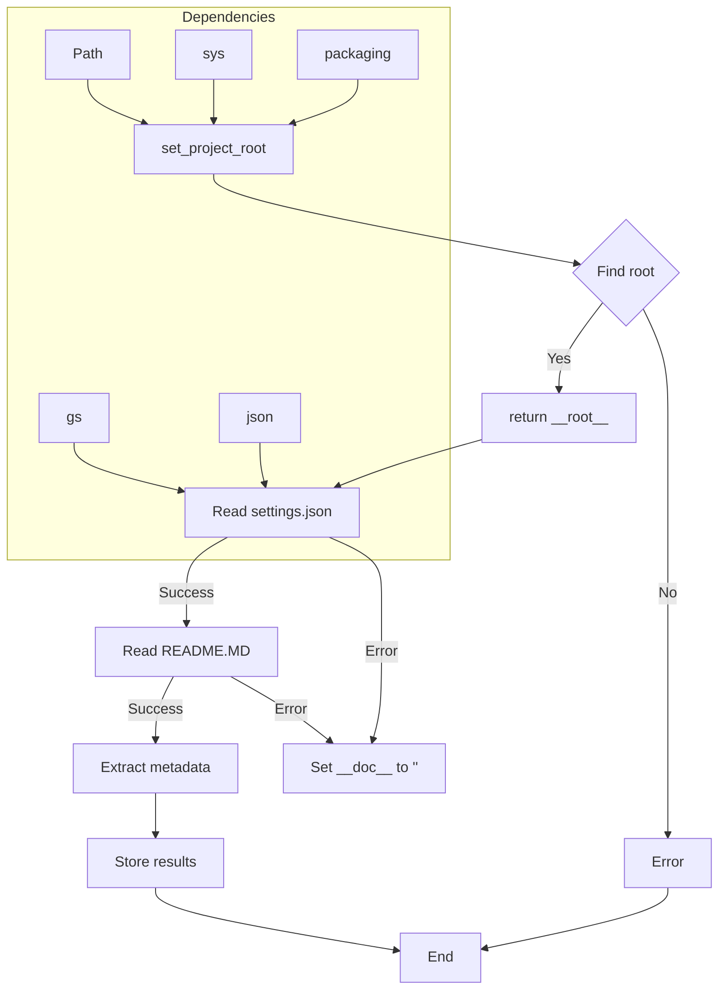

```MD
# <input code>

```python
## \file hypotez/src/endpoints/kazarinov/scenarios/header.py
# -*- coding: utf-8 -*-
#! venv/Scripts/python.exe
#! venv/bin/python/python3.12

"""
.. module: src.endpoints.kazarinov.scenarios 
	:platform: Windows, Unix
	:synopsis:

"""
MODE = 'dev'

import sys
import json
from packaging.version import Version

from pathlib import Path
def set_project_root(marker_files=('pyproject.toml', 'requirements.txt', '.git')) -> Path:
    """
    Finds the root directory of the project starting from the current file's directory,
    searching upwards and stopping at the first directory containing any of the marker files.

    Args:
        marker_files (tuple): Filenames or directory names to identify the project root.
    
    Returns:
        Path: Path to the root directory if found, otherwise the directory where the script is located.
    """
    __root__:Path
    current_path:Path = Path(__file__).resolve().parent
    __root__ = current_path
    for parent in [current_path] + list(current_path.parents):
        if any((parent / marker).exists() for marker in marker_files):
            __root__ = parent
            break
    if __root__ not in sys.path:
        sys.path.insert(0, str(__root__))
    return __root__


# Get the root directory of the project
__root__ = set_project_root()
"""__root__ (Path): Path to the root directory of the project"""

from src import gs

settings:dict = None
try:
    with open(gs.path.root / 'src' /  'settings.json', 'r') as settings_file:
        settings = json.load(settings_file)
except (FileNotFoundError, json.JSONDecodeError):
    ...

doc_str:str = None
try:
    with open(gs.path.root / 'src' /  'README.MD', 'r') as settings_file:
        doc_str = settings_file.read()
except (FileNotFoundError, json.JSONDecodeError):
    ...


__project_name__ = settings.get("project_name", 'hypotez') if settings  else 'hypotez'
__version__: str = settings.get("version", '')  if settings  else ''
__doc__: str = doc_str if doc_str else ''
__details__: str = ''
__author__: str = settings.get("author", '')  if settings else ''
__copyright__: str = settings.get("copyrihgnt", '')  if settings else ''
__cofee__: str = settings.get("cofee", "Treat the developer to a cup of coffee for boosting enthusiasm in development: https://boosty.to/hypo69")  if settings else "Treat the developer to a cup of coffee for boosting enthusiasm in development: https://boosty.to/hypo69"
```

# <algorithm>

**Шаг 1:** Определение корневой директории проекта.

*   Функция `set_project_root` ищет корневой каталог проекта, начиная с текущей директории и двигаясь вверх по иерархии директорий.
*   Она проверяет наличие файлов `pyproject.toml`, `requirements.txt` или `.git` в каждой родительской директории.
*   Если один из этих файлов найден, функция возвращает путь к родительской директории.
*   В противном случае, возвращает путь к текущей директории.
*   Добавляет найденный корневой каталог в `sys.path`.

**Пример:** Если скрипт находится в `hypotez/src/endpoints/kazarinov/scenarios`, функция найдет `hypotez` как корневой каталог и добавит его в `sys.path`.

**Шаг 2:** Чтение настроек из файла `settings.json`.

*   Функция пытается загрузить данные из файла `settings.json` в переменную `settings`.
*   Если файл не найден или данные в нем некорректны, исключение `FileNotFoundError` или `json.JSONDecodeError` обрабатывается, и `settings` остается `None`.

**Шаг 3:** Чтение документации из файла `README.MD`.

*   Функция пытается прочитать содержимое файла `README.MD` в переменную `doc_str`.
*   Если файл не найден или возникла ошибка чтения, исключение обрабатывается, и `doc_str` остается `None`.

**Шаг 4:** Извлечение метаданных из `settings`.

*   Если `settings` не `None`, извлекаются значения из настроек (`project_name`, `version`, `author`, `copyrihgnt`, `cofee`), иначе используются значения по умолчанию.
*   Значения сохраняются в переменных: `__project_name__`, `__version__`, `__doc__`, `__details__`, `__author__`, `__copyright__`, `__cofee__`.


# <mermaid>



**Объяснение зависимостей в диаграмме:**

*   `gs`:  Библиотека или модуль, вероятно, определенный в других частях проекта `hypotez`, необходимый для получения пути к корневому каталогу (`gs.path.root`).
*   `json`: Модуль Python для работы с JSON.
*   `Path`: Модуль из `pathlib` для работы с путями.
*   `sys`: Модуль Python для доступа к системным переменным, включая `sys.path`.
*   `packaging`: Модуль для работы с версиями пакетов.
*   Функция `set_project_root` использует переменную `__root__` для доступа к файловой системе (посредством `Path`).


# <explanation>

**Импорты:**

*   `sys`: Модуль для доступа к системным переменным, в том числе `sys.path`, что используется для добавления корневого каталога проекта в путь поиска модулей.
*   `json`: Модуль для работы с JSON-файлами, используется для чтения настроек из `settings.json`.
*   `packaging.version`: Модуль для работы с версиями, не используется прямо, но импортируется.
*   `pathlib.Path`: Модуль для работы с путями в стиле Unix, используется для работы с файлами и директориями.
*   `gs`:  Вероятно, пользовательский модуль, определяющий пути к ресурсам проекта.


**Классы:**

Нет определенных классов.

**Функции:**

*   `set_project_root(marker_files=...)`:  Ищет корневой каталог проекта, начиная с текущей директории. Принимает кортеж `marker_files` для определения маркеров проекта. Возвращает `Path` до корневого каталога.

**Переменные:**

*   `__root__`:  Путь к корневому каталогу проекта, определяемый функцией `set_project_root`.
*   `settings`: Словарь, содержащий настройки проекта, загружаемые из `settings.json`.
*   `doc_str`: Строка, содержащая содержимое файла `README.MD`, если файл найден.


**Возможные ошибки и улучшения:**

*   **Обработка исключений:** Обработка исключений (`FileNotFoundError`, `json.JSONDecodeError`) в `try...except` блоках является хорошей практикой, но можно добавить более информативные сообщения об ошибках, чтобы разработчик знал, в чем проблема.
*   **Проверка типов:**  В коде можно добавить типы данных в аннотациях, например, `__root__: Path`, что сделает код более читаемым и позволит использовать средства статического анализа.


**Взаимосвязь с другими частями проекта:**

Функция использует модуль `gs`, что указывает на его интеграцию с другими частями проекта, которые определяют пути и другие ресурсы проекта.  `settings.json` и `README.MD` вероятно содержат настройки и документацию, используемые другими частями проекта.  `sys.path` используется для импорта необходимых модулей из корневого каталога проекта.