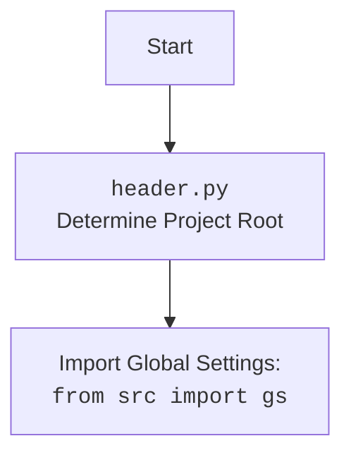

## АНАЛИЗ КОДА

### 1. <алгоритм>

**Функция `set_project_root(marker_files)`:**

1.  **Начало**: Функция `set_project_root` вызывается с кортежем `marker_files` (по умолчанию `('__root__',)`).
2.  **Определение текущего пути:**
    -   Определяется абсолютный путь к директории, в которой находится текущий файл (`header.py`).
    -   Пример: Если файл находится в `/home/user/hypotez/src/endpoints/kazarinov/scenarios/header.py`, то `current_path` будет равен `/home/user/hypotez/src/endpoints/kazarinov/scenarios`.
3.  **Поиск корневой директории:**
    -   Начиная с `current_path` и двигаясь вверх по родительским директориям, проверяется наличие любого файла или директории из `marker_files` (например, `__root__`).
    -   Пример: Проверяются директории `/home/user/hypotez/src/endpoints/kazarinov/scenarios`, `/home/user/hypotez/src/endpoints/kazarinov`, `/home/user/hypotez/src/endpoints`, `/home/user/hypotez/src`, `/home/user/hypotez`.  Если, например, файл `__root__` найден в `/home/user/hypotez`, то эта директория будет считаться корневой.
4.  **Установка корневой директории:**
    -   Как только одна из родительских директорий содержит маркер, она устанавливается как `__root__`.
    -   Цикл `for` прерывается.
5.  **Добавление в `sys.path`:**
    -   Если `__root__` ещё не в `sys.path`, он добавляется в начало, чтобы импорты из корневой директории работали корректно.
6.  **Возврат:** Функция возвращает объект `Path`, представляющий корневую директорию.

**Основной блок кода:**

1.  **Вызов `set_project_root`:** Вызывается `set_project_root` для определения корневой директории, результат сохраняется в переменной `__root__`.
2.  **Импорт `gs`:**
    -   Импортируются глобальные настройки из `src.gs`.
3.  **Чтение `settings.json`:**
    -   Пытается открыть и прочитать файл `settings.json` из директории `src` относительно корневой директории.
    -   Пример: Если `__root__`  равен `/home/user/hypotez/`, то будет прочитан файл `/home/user/hypotez/src/settings.json`.
    -   В случае ошибки (файл не найден, ошибка декодирования JSON), выполняется `...` (пропуск обработки исключения).
4.  **Чтение `README.MD`:**
    -   Аналогично, пытается открыть и прочитать файл `README.MD` из директории `src` относительно корневой директории.
    -   Пример: Если `__root__` равен `/home/user/hypotez/`, то будет прочитан файл `/home/user/hypotez/src/README.MD`.
    -   В случае ошибки, выполняется `...`.
5.  **Извлечение данных:**
    -   Извлекаются различные параметры из `settings` (`project_name`, `version`, `author`, `copyright`, `cofee`), если `settings` не `None`.
    -   Если settings == None, тогда устанавливаются дефолтные значения.
    -   Извлечённый текст из `README.MD` устанавливается в переменную `__doc__`, если `doc_str` не `None`.
6.  **Определение глобальных переменных**:
    -   Устанавливаются глобальные переменные проекта с полученными значениями.

### 2. <mermaid>

```mermaid
flowchart TD
    Start --> FindRoot[<code>set_project_root()</code><br>Determine Project Root]
    FindRoot --> CheckMarkers[Check for Marker Files in Parent Directories]
    CheckMarkers --> RootFound{Marker File Found?}
    RootFound -- Yes --> SetRoot[Set Project Root]
    SetRoot --> AddToSysPath[Add Root to <code>sys.path</code>]
    RootFound -- No -->  NextParent[Check Next Parent Directory]
    NextParent -- Still Has Parents --> CheckMarkers
    NextParent -- No Parents --> SetCurrentAsRoot[Set Current Directory As Root]
    SetCurrentAsRoot --> AddToSysPath
    AddToSysPath --> EndFindRoot[Return Project Root Path]
    EndFindRoot --> ImportGS[Import Global Settings: <br><code>from src import gs</code>]
    ImportGS --> ReadSettingsFile[Read <code>settings.json</code>]
    ReadSettingsFile --> SettingsLoaded{Settings Loaded Successfully?}
    SettingsLoaded -- Yes --> ReadReadmeFile[Read <code>README.MD</code>]
     SettingsLoaded -- No --> ReadReadmeFile
    ReadReadmeFile --> ReadmeLoaded{Readme Loaded Successfully?}
    ReadmeLoaded -- Yes --> ExtractSettings[Extract Settings and Documentation]
    ReadmeLoaded -- No --> ExtractSettings
    ExtractSettings --> SetGlobalVariables[Set Global Variables]
    SetGlobalVariables --> End
    
    style FindRoot fill:#f9f,stroke:#333,stroke-width:2px
    style CheckMarkers fill:#ccf,stroke:#333,stroke-width:2px
    style RootFound fill:#cfc,stroke:#333,stroke-width:2px
    style SetRoot fill:#ccf,stroke:#333,stroke-width:2px
    style AddToSysPath fill:#ffc,stroke:#333,stroke-width:2px
        style SetCurrentAsRoot fill:#ccf,stroke:#333,stroke-width:2px
      style NextParent fill:#ccf,stroke:#333,stroke-width:2px
    style EndFindRoot fill:#f9f,stroke:#333,stroke-width:2px
    style ImportGS fill:#f9f,stroke:#333,stroke-width:2px
    style ReadSettingsFile fill:#ffc,stroke:#333,stroke-width:2px
    style ReadReadmeFile fill:#ffc,stroke:#333,stroke-width:2px
        style SettingsLoaded fill:#ccf,stroke:#333,stroke-width:2px
        style ReadmeLoaded fill:#ccf,stroke:#333,stroke-width:2px
    style ExtractSettings fill:#f9f,stroke:#333,stroke-width:2px
        style SetGlobalVariables fill:#f9f,stroke:#333,stroke-width:2px
```



**Объяснение:**

*   **`Start`**: Начало выполнения скрипта.
*   **`FindRoot`**: Вызов функции `set_project_root`, которая определяет корневую директорию проекта.
*   **`CheckMarkers`**: Поиск marker-файлов в текущей директории и ее родительских директориях.
*   **`RootFound`**: Условный блок, который проверяет, был ли найден маркер-файл.
*   **`SetRoot`**: Устанавливает родительскую директорию, где был найден маркер, в качестве корневой директории.
*   **`AddToSysPath`**: Добавляет найденную корневую директорию в `sys.path`, чтобы обеспечить правильную работу импортов.
*  **`NextParent`**: Переход к проверке следующей родительской директории.
*   **`SetCurrentAsRoot`**: Установка текущей директории в качестве корня, если не найдено маркеров.
*   **`EndFindRoot`**: Функция возвращает найденный или текущий корень проекта.
*   **`ImportGS`**: Импорт глобальных настроек из модуля `src.gs`.
*  **`ReadSettingsFile`**: Пытается прочитать данные из `settings.json`.
*   **`SettingsLoaded`**: Проверка успешности загрузки данных из `settings.json`.
*   **`ReadReadmeFile`**: Пытается прочитать данные из `README.MD`.
*   **`ReadmeLoaded`**: Проверка успешности загрузки данных из `README.MD`.
*   **`ExtractSettings`**: Извлечение данных и параметров из `settings.json` и `README.MD`.
*   **`SetGlobalVariables`**: Устанавливает глобальные переменные, используя извлеченные данные.
*   **`End`**: Завершение выполнения скрипта.

Диаграмма описывает весь процесс от определения корневой директории проекта, загрузки данных из файлов настроек до установки глобальных переменных.

### 3. <объяснение>

**Импорты:**

*   `sys`: Модуль для доступа к параметрам и функциям, специфичным для интерпретатора Python, в основном используется для изменения `sys.path`.
*   `json`: Модуль для работы с данными в формате JSON, используется для загрузки настроек из `settings.json`.
*   `packaging.version.Version`: используется для работы с версиями пакетов.
*   `pathlib.Path`: Модуль для работы с путями в файловой системе, упрощает операции с путями.

    -   `sys` добавляет путь к корневой директории проекта в список путей импорта.
    -   `json` используется для парсинга файла настроек.
    -   `packaging.version.Version`: Не используется.
    -   `pathlib.Path` обеспечивает удобное управление путями к файлам и директориям.

**Функция `set_project_root(marker_files)`:**

*   **Аргументы:** `marker_files` — кортеж строк с именами файлов или директорий, которые обозначают корень проекта (по умолчанию `('__root__',)`).
*   **Возвращает:** Объект `pathlib.Path`, представляющий путь к корневой директории проекта.
*   **Назначение:** Находит корневую директорию проекта, поднимаясь вверх по иерархии каталогов от текущего файла, пока не будет найден маркерный файл/директория. Это позволяет запускать скрипты из любой поддиректории проекта без проблем с импортом.
*   **Пример:** Если структура проекта такая:
    ```
    hypotez/
      __root__
      src/
        endpoints/
          kazarinov/
            scenarios/
              header.py
    ```

    и `header.py` запускается, то функция вернёт путь к `hypotez/`.

**Переменные:**

*   `__root__` (`Path`): Хранит путь к корневой директории проекта.
*   `settings` (`dict`): Словарь, содержащий настройки проекта, загруженные из `settings.json`. Может быть `None`, если файл не удалось прочитать.
*   `doc_str` (`str`): Содержит текст из `README.MD` файла. Может быть `None`, если файл не удалось прочитать.
*   `__project_name__` (`str`): Имя проекта, взятое из настроек или 'hypotez' по умолчанию.
*    `__version__` (`str`): Версия проекта, взятая из настроек или '' по умолчанию.
*    `__doc__` (`str`): Документация проекта, взятая из  `README.MD`.
*    `__details__` (`str`): Не используется.
*    `__author__` (`str`): Автор проекта, взятый из настроек или '' по умолчанию.
*   `__copyright__` (`str`): Информация о копирайте проекта, взятая из настроек или '' по умолчанию.
*   `__cofee__` (`str`): Строка с призывом поддержать разработчика, взятая из настроек или дефолтная строка.

**Взаимосвязь с другими частями проекта:**

*   Модуль использует `src.gs`, предполагается, что `src` — это директория в корне проекта, которую мы определили через `set_project_root()`. `gs` - это модуль, который содержит глобальные настройки.
*   Функция `set_project_root` обеспечивает, что все остальные модули проекта могут быть импортированы независимо от того, из какой директории запускается скрипт.
*   Загрузка `settings.json` позволяет конфигурировать проект через файл.

**Потенциальные ошибки и области для улучшения:**

*   **Обработка ошибок:** Блоки `try-except` с `...` в случае ошибок обработки файлов JSON или `README.MD` могут скрывать проблемы. Лучше явно обрабатывать исключения и логировать ошибки.
*   **Файлы настроек:** Если файл `settings.json` не найден, большинство глобальных переменных получат значения по умолчанию. Возможно, стоит предусмотреть какой-то механизм для валидации настроек и выдачи предупреждений, если отсутствуют ключевые параметры.
*   **Маркерные файлы:** Функция `set_project_root` использует только маркерные файлы, это можно было бы дополнить возможностью использовать маркерные директории.
*   **Читаемость кода:** Можно добавить type hints для более наглядного определения типов переменных, что увеличит читаемость кода.

**Цепочка взаимосвязей:**

1.  `header.py` ищет корень проекта.
2.  `header.py` импортирует `src.gs` (глобальные настройки).
3.  `header.py` загружает и анализирует `settings.json` и `README.MD`.
4.  `header.py` устанавливает глобальные переменные проекта, используемые в других модулях.

Этот анализ предоставляет полное понимание кода, его функционирования, структуры, зависимостей и возможных улучшений.