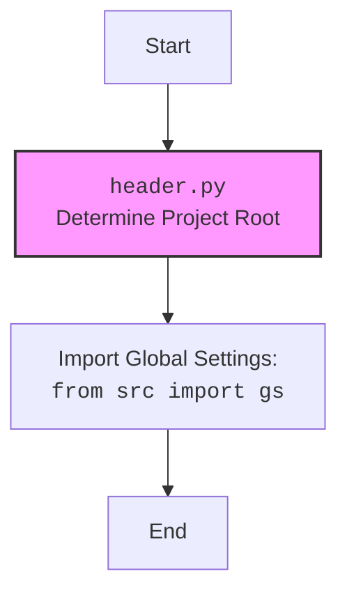

## Анализ кода `header.py`

### 1. <алгоритм>

**Функция `set_project_root`:**

1.  **Начало:** Функция `set_project_root` принимает кортеж `marker_files` в качестве аргумента, который по умолчанию установлен как `('__root__', '.git')`.
2.  **Определение текущего пути:** Определяется абсолютный путь к директории, где находится текущий скрипт (файл `header.py`) и присваивается переменной `current_path`.
    *   _Пример_: Если `header.py` находится в `/home/user/project/src/endpoints/kazarinov/scenarios/`, то `current_path` будет `/home/user/project/src/endpoints/kazarinov/scenarios/`.
3.  **Инициализация корневого пути:**  Переменной `__root__` присваивается значение `current_path`, предполагая, что начальный корень проекта - это директория, где находится скрипт.
4.  **Поиск корневой директории:**
    *   Цикл `for` проходит по текущей директории `current_path` и всем ее родительским директориям.
    *   На каждой итерации проверяется, существует ли в текущей родительской директории какой-либо из маркерных файлов или директорий (элементов `marker_files`).
    *   _Пример_: Если `marker_files` содержит `__root__` и директория `/home/user/project` содержит файл с таким названием, то родительский каталог `/home/user/project`  будет назначен  `__root__`.
    *   Если маркерный файл или папка найден,  `__root__` обновляется и цикл прерывается.
5.  **Добавление в sys.path:** Если найденный корневой путь `__root__` отсутствует в `sys.path` (список путей для импорта модулей), то он добавляется в начало списка.
    *  _Пример_: если `sys.path` не содержит `/home/user/project`, то после работы функции в начало `sys.path` будет добавлен путь `/home/user/project`.
6.  **Возврат:** Функция возвращает путь к корневой директории проекта `__root__`.

**Основная часть кода:**

1.  **Вызов `set_project_root`:** Функция `set_project_root` вызывается для определения корневого пути проекта, результат сохраняется в глобальной переменной `__root__`.
2.  **Чтение настроек из `settings.json`:**
    *   Пытается открыть файл `settings.json`, находящийся в директории `src` относительно корневой директории, используя переменную `gs.path.root`, которая является атрибутом объекта глобальных настроек.
    *   При успешном чтении JSON-данные сохраняются в переменную `settings`.
    *   При ошибке (файл не найден или ошибка декодирования JSON), блок `try-except` просто пропускает ошибку, и `settings` остаётся `None`.
3. **Чтение README.MD:**
    *   Аналогично, пытаемся прочитать файл `README.MD` и сохранить его содержимое в переменную `doc_str`
    *   При ошибке `doc_str` остаётся `None`.
4.  **Инициализация глобальных переменных:** Глобальные переменные `__project_name__`, `__version__`, `__doc__`, `__details__`, `__author__`, `__copyright__` и `__cofee__`  инициализируются значениями из файла `settings.json` (если он был успешно прочитан), в противном случае используются значения по умолчанию.

### 2. <mermaid>
```mermaid
flowchart TD
    Start[Start] --> ProjectRootDetermination[Determine Project Root: <code>set_project_root()</code>]
    ProjectRootDetermination --> CheckMarkerFiles[Check for Marker Files in Parent Directories: '__root__' or '.git']
    CheckMarkerFiles --Found--> UpdateRoot[Update Project Root Path]
    CheckMarkerFiles --NotFound--> MoveToNextParent[Move to next parent directory]
    MoveToNextParent --> CheckMarkerFiles
    UpdateRoot --> AddToSysPath[Add Project Root to sys.path]
    AddToSysPath --> ReadSettings[Read Settings from `settings.json`]
    ProjectRootDetermination --> AddToSysPath
    ReadSettings --Success--> ReadDoc[Read doc_str from `README.MD`]
    ReadSettings --Fail--> ReadDoc
    ReadDoc --Success--> SetGlobals[Set Global Variables from Settings]
    ReadDoc --Fail--> SetGlobals
    SetGlobals --> End[End]
    End --> Finish

    classDef fileFill fill:#f9f,stroke:#333,stroke-width:2px
    class ProjectRootDetermination, ReadSettings, ReadDoc fileFill
```



**Объяснение `mermaid`:**

*   **`flowchart TD`**: Определяет тип диаграммы как блок-схему (flowchart) с направлением сверху вниз (TD).
*   **`Start`**: Начальная точка процесса.
*   **`ProjectRootDetermination`**: Блок, представляющий функцию `set_project_root()`, которая определяет корень проекта.
*    **`CheckMarkerFiles`**: Проверяет, существуют ли маркерные файлы или директории в родительских директориях.
*    **`UpdateRoot`**: Обновляет путь к корню проекта, если маркерные файлы найдены.
*    **`MoveToNextParent`**: Переходит к следующей родительской директории для поиска маркерных файлов.
*   **`AddToSysPath`**: Добавляет корень проекта в `sys.path`, чтобы модули проекта могли быть импортированы.
*    **`ReadSettings`**: Читает настройки из файла `settings.json`.
*   **`ReadDoc`**: Читает `doc_str` из файла `README.MD`.
*   **`SetGlobals`**: Устанавливает глобальные переменные из прочитанных настроек.
*    **`End`**: Конечная точка процесса.
    *   **`Finish`**: Указывает завершение работы блока
*   `classDef fileFill fill:#f9f,stroke:#333,stroke-width:2px`: Определяет стиль заливки и обводки для блоков, представляющих операции с файлами.
*   `class ProjectRootDetermination, ReadSettings, ReadDoc fileFill`: Применяет стиль `fileFill` к блокам, представляющим работу с файлами.

*   **Диаграмма для импорта `header`**:
    *   **`Start`**: Начало процесса.
    *   **`Header`**: Блок, представляющий файл `header.py` и его роль в определении корня проекта.
    *   **`ImportGlobalSettings`**:  Блок, обозначающий импорт глобальных настроек из `from src import gs`.
    *   **`End`**: Завершение импорта `header.py`.
*   `class Header fileFill`: Применяет стиль `fileFill` к блоку `Header`

### 3. <объяснение>

**Импорты:**

*   `import sys`: Модуль `sys` используется для работы с системными переменными и функциями, в частности, для добавления пути к корневой директории проекта в `sys.path`. Это позволяет Python находить модули проекта.
*   `import json`: Модуль `json` используется для работы с данными в формате JSON, включая чтение файла `settings.json`.
*   `from packaging.version import Version`: Импортирует класс `Version` для сравнения версий. В текущем коде не используется, что может указывать на его возможное использование в будущем.
*   `from pathlib import Path`: Модуль `pathlib` используется для работы с путями к файлам и директориям в объектно-ориентированном стиле, что делает код более читаемым и безопасным.
*  `from src import gs`: Импортирует глобальные настройки проекта, переменная `gs` используется для доступа к путям и другим настройкам, которые применяются во всем проекте.

**Функция `set_project_root`:**

*   **Назначение**: Функция предназначена для определения корневой директории проекта. Она ищет ее, начиная с директории, где расположен скрипт, и поднимаясь вверх по иерархии каталогов до тех пор, пока не найдет маркерный файл или директорию.
*   **Аргументы**:
    *   `marker_files` (tuple, необязательный): Кортеж имен файлов или директорий, которые используются для идентификации корня проекта. По умолчанию `('__root__', '.git')`.
*   **Возвращаемое значение**:
    *   `Path`: Объект `Path`, представляющий путь к корневой директории проекта. Если маркерные файлы не найдены, возвращается путь к директории, где расположен скрипт.
*   **Примеры**:
    *   Если скрипт находится в `/home/user/project/src/endpoints/kazarinov/scenarios/` и в директории `/home/user/project` есть файл `__root__`, то функция вернет `Path('/home/user/project')`.
    *   Если скрипт находится в `/home/user/project/src/endpoints/kazarinov/scenarios/` и директория `/home/user/project` содержит поддиректорию `.git`, то функция вернет `Path('/home/user/project')`.

**Глобальные переменные:**

*   `__root__`: Объект `Path`, хранящий путь к корневой директории проекта, вычисленный функцией `set_project_root`.
*   `settings`: Словарь (dict), содержащий настройки проекта, прочитанные из файла `settings.json`.  Если чтение файла не удалось, значением будет `None`.
*   `doc_str`: Строка (str), содержащая содержимое файла `README.MD`. Если чтение файла не удалось, значением будет `None`.
*   `__project_name__`: Строка (str), содержащая имя проекта (по умолчанию `'hypotez'`).
*    `__version__`: Строка (str), содержащая версию проекта.
*   `__doc__`: Строка (str), содержащая описание проекта из `README.MD`.
*   `__details__`: Строка (str), на данный момент не используется, пустая строка (`''`).
*   `__author__`: Строка (str), содержащая имя автора проекта.
*   `__copyright__`: Строка (str), содержащая информацию об авторских правах.
*   `__cofee__`: Строка (str), содержащая сообщение с призывом поддержать разработчика, если файл настроек не прочитан или если в файле настроек нет поля `cofee`  то используется значение по умолчанию

**Потенциальные ошибки и области для улучшения:**

*   **Обработка ошибок при чтении файлов**: В текущем коде ошибки при чтении `settings.json` и `README.MD` игнорируются. Это может затруднить отладку. Стоит добавить логирование ошибок для более детального анализа проблем.
*   **Использование `gs.path.root`**: Код предполагает, что `gs.path.root` уже определен и корректен. Необходимо убедиться, что `gs` и его атрибуты настроены до вызова кода `header.py`.
*   **Отсутствие проверки на типы данных**: Код предполагает определенный формат данных в `settings.json`. Возможно стоит добавить проверку типов данных при присвоении значений переменным.
* **Отсутствие использования `packaging.version`**: Хотя импорт `Version` присутствует, он не используется. Возможно его стоит либо удалить, либо добавить функциональность.
*   **Жестко заданные пути**: Путь `src` жестко задан в коде. Если структура проекта изменится, это нужно будет менять вручную.
*   **Отсутствие комментариев**: Код не имеет достаточного количества комментариев, описывающих логику и назначение отдельных блоков. Это может затруднить понимание кода для других разработчиков.

**Взаимосвязь с другими частями проекта:**

*   `header.py` является общим модулем, предоставляющим информацию о проекте и его настройках. Он используется другими частями проекта, импортируя глобальные переменные, определенные в `header.py`.
*   Он использует глобальные настройки `src.gs`, что говорит о зависимости от настроек всего проекта.
*   Функция `set_project_root` обеспечивает правильное определение путей к файлам, что важно для корректной работы других модулей проекта.

Этот подробный анализ и объяснение поможет понять функциональность и структуру кода, а также выявить потенциальные проблемы и возможности для улучшения.