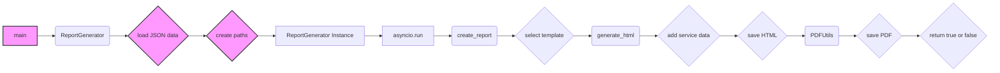

## Анализ кода `hypotez/src/endpoints/kazarinov/react/pricelist_generator.py`

### <алгоритм>

1.  **Инициализация:**
    *   Устанавливается режим ``.
    *   Импортируются необходимые модули и библиотеки (dataclasses, json, pathlib, jinja2, pdfkit, asyncio, и др.).
    *   Определяется класс `ReportGenerator`, который отвечает за генерацию отчетов.
    *   Создаётся экземпляр `Environment` из `jinja2` для работы с шаблонами.

2.  **Загрузка данных и подготовка:**
    *   Функция `main` принимает `mexiron` и `lang` (язык).
    *   Формируется путь `base_path` к директории с данными мехирона.
    *   Загружаются данные из JSON файла `f'{lang}.json'` с помощью функции `j_loads`.
    *   Формируются пути `html_file` и `pdf_file` для сохранения отчета.
    *   Создается экземпляр класса `ReportGenerator`.

3.  **Генерация HTML:**
    *   Метод `generate_html` класса `ReportGenerator` получает данные и язык.
    *   Выбирается имя файла шаблона (`template_table_he.html` для 'he', `template_table_ru.html` для 'ru').
    *   Формируется полный путь `template_path` к файлу шаблона.
    *   Шаблон загружается из файла.
    *   HTML-контент генерируется с использованием шаблона Jinja2 и переданных данных.

4.  **Подготовка данных для отчёта (Сервис):**
    *   Метод `create_report` получает данные, язык, пути для html и pdf файлов.
    *   Извлекает данные для текущего языка из входного `data`.
    *   Создает словарь `service_dict` с информацией о сервисе.
    *   В `service_dict` добавляется `product_title`, `specification` (HTML-содержимое из файла), и `image_local_saved_path`(случайное изображение).
    *   Добавляет `service_dict` в список `products` в данных.

5.  **Сохранение HTML:**
    *   Сгенерированный HTML сохраняется в файл `html_file`.

6.  **Генерация PDF:**
    *   Создаётся экземпляр `PDFUtils`.
    *   HTML-контент преобразуется в PDF-файл `pdf_file` с помощью метода `save_pdf_pdfkit` из `PDFUtils`.
    *   Если PDF не скомпилировался, логируется ошибка и функция возвращает `False`.

7.  **Запуск генерации:**
    *   В функции `main` вызывается `asyncio.run`, чтобы запустить корутину `create_report` в асинхронном режиме.

8.  **Пример использования:**
    *   В блоке `if __name__ == "__main__":` устанавливаются значения `mexiron` и `lang` для тестового запуска функции `main`.

### <mermaid>

**Анализ `mermaid` диаграммы:**

*   `A[main]`: Начальная функция, точка входа программы. Отвечает за подготовку данных и вызов генератора отчётов.
*   `B(ReportGenerator)`: Класс, инкапсулирующий логику генерации отчетов.
*   `C{load JSON data}`: Загружает данные из JSON-файла, используя `j_loads`.
*   `D{create paths}`: Создает пути к файлам HTML и PDF.
*   `E[ReportGenerator Instance]`: Создает экземпляр класса `ReportGenerator`.
*    `F[asyncio.run]`: Запускает асинхронную функцию `create_report`.
*   `G(create_report)`: Метод, который управляет полным циклом создания отчета (HTML и PDF).
*   `H{select template}`: Выбирает шаблон HTML в зависимости от языка.
*   `I(generate_html)`: Генерирует HTML-контент из шаблона и данных.
*    `J{add service data}`: Добавляет данные о сервисе в структуру данных.
*   `K{save HTML}`: Сохраняет сгенерированный HTML в файл.
*   `L(PDFUtils)`: Класс, предоставляющий функционал для конвертации HTML в PDF.
*   `M{save PDF}`: Преобразует HTML в PDF и сохраняет его.
*   `N{return true or false}`: Возвращает результат выполнения процесса создания отчета.

### <объяснение>

**Импорты:**

*   `header`: Импортируется, но не используется. Возможно, это заготовка для будущего использования.
*   `asyncio`: Используется для асинхронного выполнения операций.
*   `dataclasses`: Используется для создания классов данных, таких как `ReportGenerator`.
*   `src.gs`: Предположительно, содержит глобальные настройки и константы проекта, включая пути к файлам.
*   `json`: Используется для работы с JSON.
*   `pathlib`: Используется для работы с файловыми путями.
*   `jinja2`: Используется для шаблонизации HTML.
*   `pdfkit`: Используется для конвертации HTML в PDF.
*   `src.utils.jjson.j_loads`: Функция для загрузки JSON из файла.
*   `src.utils.file.read_text_file`, `src.utils.file.save_text_file`: Функции для чтения и сохранения текстовых файлов.
*    `src.utils.pdf.PDFUtils`: Класс для конвертации HTML в PDF.
*   `src.utils.convertors.html.html2pdf`: Функция для конвертации HTML в PDF (не используется в коде, но импортирована).
*   `src.utils.image.random_image`: Функция для получения случайного пути к изображению.
*   `src.utils.printer.pprint`: Функция для красивого вывода (не используется в коде, но импортирована).
*   `src.logger.logger`: Логгер для записи ошибок и отладочной информации.

**Классы:**

*   `ReportGenerator`:
    *   **Роль:** Класс управляет процессом генерации HTML и PDF отчетов на основе JSON данных и шаблонов.
    *   **Атрибуты:**
        *   `env` (`jinja2.Environment`): Объект окружения Jinja2 для работы с шаблонами. Инициализируется при создании экземпляра.
    *   **Методы:**
        *   `__init__`: Конструктор класса, инициализирует окружение Jinja2.
        *   `generate_html(self, data: dict, lang: str) -> str`: Генерирует HTML-контент на основе шаблона и данных. Принимает данные и язык отчета. Возвращает HTML в виде строки.
        *   `create_report(self, data: dict, lang: str, html_file: str | Path, pdf_file: str | Path) -> bool`: Запускает полный цикл генерации отчета. Принимает данные, язык, путь к html и pdf файлам. Возвращает `True`, если отчёт сгенерирован успешно, иначе `False`.

**Функции:**

*   `main(mexiron: str, lang: str) -> bool`:
    *   **Аргументы:** `mexiron` (строка), `lang` (строка).
    *   **Возвращаемое значение:** `bool` (успех или неудача генерации).
    *   **Назначение:** Главная функция, управляющая процессом генерации отчета. Принимает имя мехирона и язык отчёта, формирует необходимые пути, загружает данные, создаёт экземпляр `ReportGenerator` и запускает процесс генерации отчёта.

**Переменные:**

*   `MODE`:  Режим работы, установлен в `'dev'`.
*    `base_path`: Путь к директории с данными мехирона (тип `pathlib.Path`).
*   `data`: Словарь с данными, загруженными из JSON (тип `dict`).
*   `html_file`, `pdf_file`: Пути к файлам HTML и PDF (тип `pathlib.Path`).
*   `r`: Экземпляр класса `ReportGenerator`.
*   `template`, `template_path`, `template_string`: Переменные для работы с шаблонами Jinja2.
*   `service_dict` : словарь, содержащий данные о сервисе, который будет добавлен в отчёт
*   `_data`: данные для конкретного языка из переданных данных.
*  `html_content` :  сгенерированный html контент.
*   `pdf` : экземпляр класса `PDFUtils`.

**Потенциальные ошибки и области для улучшения:**

1.  **Обработка ошибок:**
    *   Код имеет некоторую обработку ошибок (например, проверка на успешную компиляцию PDF), но можно добавить больше проверок и логирования.
    *   Использование `...` в блоке `except` является некорректным и должно быть заменено на адекватную обработку ошибки.
2.  **Константы и пути:**
    *   Пути к шаблонам и другим ресурсам заданы явно в коде. Желательно вынести их в конфигурационные файлы или переменные окружения.
3.  **Унификация работы с шаблонами:**
    *   Код напрямую читает шаблон из файла.  Можно реализовать более гибкий подход для загрузки шаблонов.
4.  **Использование `pdfkit`:**
    *   Использование `pdfkit` может иметь проблемы с зависимостями. Возможно, стоит рассмотреть другие библиотеки или сервисы для генерации PDF, такие как `weasyprint`, `reportlab` или облачные решения.
5.  **Сложная логика `create_report`:**
    *   Метод `create_report` выполняет несколько действий. Возможно, стоит разбить его на несколько меньших методов для улучшения читаемости.
6.  **Отсутствие тестирования:**
    *   В коде нет тестов, что затрудняет отладку и проверку работоспособности.

**Взаимосвязи с другими частями проекта:**

*   Код использует модули из пакета `src`, например, `src.gs`, `src.utils.jjson`, `src.utils.file`, `src.utils.pdf`, `src.utils.convertors`, `src.utils.image`, `src.utils.printer` и `src.logger`, что указывает на интеграцию с остальной частью системы.
*   Код предполагает, что данные для отчетов находятся в JSON файлах в определенной директории, которая зависит от `gs.path.external_storage`.
*   Путь к шаблонам также является частью структуры проекта.

В целом, данный код представляет собой функциональный генератор отчетов, но требует доработки в области обработки ошибок, гибкости настроек, разделения ответственности и тестирования.