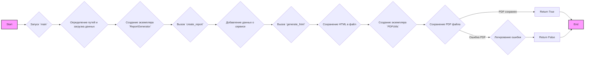
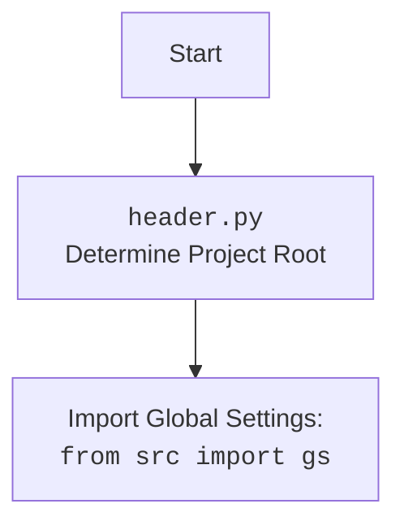

## АНАЛИЗ КОДА: `hypotez/src/endpoints/kazarinov/react/pricelist_generator.py`

### 1. <алгоритм>

**Блок-схема:**



**Примеры для каждого логического блока:**

*   **A. Start**: Начало выполнения скрипта.
*   **B. Запуск `main`**: Функция `main` вызывается с аргументами `mexiron` (например, '24\_12\_01\_03\_18\_24\_269') и `lang` (например, 'ru').
*   **C. Определение путей и загрузка данных**:
    *   `base_path` формируется как путь к директории данных для конкретного мехирона. Пример: `.../external_storage/kazarinov/mexironim/24_12_01_03_18_24_269`.
    *   `data` загружается из JSON-файла. Например, `.../external_storage/kazarinov/mexironim/24_12_01_03_18_24_269/ru.json`.
    *   `html_file` формируется как путь к HTML файлу. Пример: `.../external_storage/kazarinov/mexironim/24_12_01_03_18_24_269/24_12_01_03_18_24_269_ru.html`.
    *   `pdf_file` формируется как путь к PDF файлу. Пример: `.../external_storage/kazarinov/mexironim/24_12_01_03_18_24_269/24_12_01_03_18_24_269_ru.pdf`.
*   **D. Создание экземпляра `ReportGenerator`**: Создается объект класса `ReportGenerator`.
*   **E. Вызов `create_report`**: Метод `create_report` вызывается с данными, языком и путями к HTML и PDF файлам.
*   **F. Добавление данных о сервисе**:
    *   Создается словарь `service_dict`, содержащий данные о сервисе на выбранном языке (русском или иврите).
    *   Изображение для сервиса выбирается случайным образом из заданной директории.
    *   Словарь `service_dict` добавляется в список `products` в `data`.
*   **G. Вызов `generate_html`**: Метод `generate_html` создает HTML контент, используя шаблон и данные. Выбор шаблона зависит от языка (русский или иврит).
*   **H. Сохранение HTML в файл**: HTML контент сохраняется в указанный файл.
*   **I. Создание экземпляра `PDFUtils`**: Создаётся объект класса `PDFUtils`.
*   **J. Сохранение PDF файла**:
    *   Метод `save_pdf_pdfkit` конвертирует HTML в PDF и сохраняет его в указанный файл.
    *   Если PDF не сгенерировался, возвращается `False` и логируется ошибка.
*  **K. Return True**: PDF успешно сгенерирован.
*   **L. Логирование ошибки**: Выводится сообщение об ошибке, если PDF не скомпилировался.
*   **M. Return False**: PDF не был сгенерирован.
*   **N. End**: Завершение выполнения скрипта.

### 2. <mermaid>

```mermaid
flowchart TD
    Start(Start) --> MainFunctionCall{Вызов функции <code>main(mexiron, lang)</code>}
     MainFunctionCall --> PathAndDataSetup{Установка путей и загрузка JSON данных}
    PathAndDataSetup --> ReportGeneratorInstance{Создание экземпляра класса <code>ReportGenerator</code>}
    ReportGeneratorInstance --> CreateReportCall{Вызов метода <code>create_report(data, lang, html_file, pdf_file)</code>}
     CreateReportCall --> ServiceDataPreparation{Подготовка данных о сервисе}
     ServiceDataPreparation --> GenerateHTMLCall{Вызов метода <code>generate_html(data,lang)</code>}
    GenerateHTMLCall --> SaveHTMLToFile{Сохранение HTML контента в файл}
    SaveHTMLToFile --> PDFUtilsInstance{Создание экземпляра класса <code>PDFUtils</code>}
    PDFUtilsInstance --> SavePDFCall{Вызов метода <code>save_pdf_pdfkit(html_content, pdf_file)</code>}
    SavePDFCall -- PDF Success --> ReturnTrue{Возврат <code>True</code>}
    SavePDFCall -- PDF Fail --> LogError{Логирование ошибки}
    LogError --> ReturnFalse{Возврат <code>False</code>}
    ReturnTrue --> End(End)
    ReturnFalse --> End
    
    style Start fill:#f9f,stroke:#333,stroke-width:2px
    style End fill:#f9f,stroke:#333,stroke-width:2px
```

**Анализ зависимостей:**

*   **`header`**: (Предположительно) Модуль для определения корневого пути проекта.
*   **`asyncio`**: Используется для асинхронного запуска метода `create_report`.
*   **`dataclasses`**: Используется для создания класса `ReportGenerator` с автоматическим созданием методов `__init__`, `__repr__` и т. д.
*   **`src.gs`**: Модуль `gs` из `src`, предположительно, содержит глобальные настройки и константы, в частности пути к различным директориям.
*   **`json`**: Модуль для работы с JSON-форматом.
*   **`pathlib.Path`**: Используется для представления путей к файлам и директориям, обеспечивает кроссплатформенность.
*   **`jinja2`**: Используется для шаблонизации HTML-кода.
*   **`pdfkit`**: Модуль для конвертации HTML в PDF.
*   **`src.utils.jjson.j_loads`**: Функция для загрузки данных из JSON-файла.
*   **`src.utils.file.read_text_file` и `save_text_file`**: Функции для работы с файлами.
*  **`src.utils.pdf.PDFUtils`**: Класс для работы с PDF файлами.
*   **`src.utils.convertors.html.html2pdf`**: Функция для конвертации HTML в PDF.
*   **`src.utils.image.random_image`**: Функция для выбора случайного изображения.
*   **`src.utils.printer.pprint`**: Функция для форматированного вывода (не используется напрямую в текущем коде).
*   **`src.logger.logger`**: Модуль для логирования.



### 3. <объяснение>

**Импорты:**

*   `header`: Определяет корневой каталог проекта, используется для определения путей к другим модулям и файлам.
*   `asyncio`: Библиотека для асинхронного программирования, необходима для запуска `create_report` асинхронно.
*   `dataclasses`: Библиотека для создания классов данных, используется для определения класса `ReportGenerator`.
*   `src.gs`: Модуль глобальных настроек, предоставляет доступ к конфигурационным данным (пути, константы и т.д.).
*   `json`: Стандартная библиотека для работы с JSON-данными.
*   `pathlib`: Стандартная библиотека для работы с путями к файлам и директориям.
*   `jinja2`: Шаблонизатор для генерации HTML из шаблонов.
*   `pdfkit`: Библиотека для конвертации HTML в PDF (использует wkhtmltopdf).
*    `src.utils.jjson`: Содержит функцию `j_loads` для безопасной загрузки JSON-файлов, обеспечивая корректную обработку ошибок и корректную загрузку данных.
*   `src.utils.file`: Содержит функции `read_text_file` для чтения текстовых файлов и `save_text_file` для их сохранения.
*  `src.utils.pdf.PDFUtils`: Предоставляет инструменты для работы с PDF, включая создание PDF из HTML.
*   `src.utils.convertors.html`: Содержит функцию `html2pdf` для конвертации HTML в PDF.
*   `src.utils.image`: Содержит функцию `random_image` для выбора случайного изображения.
*   `src.utils.printer`: Содержит функцию `pprint` для форматированного вывода.
*   `src.logger.logger`: Модуль для логирования событий и ошибок.

**Классы:**

*   **`ReportGenerator`**:
    *   **Роль**: Класс для генерации HTML и PDF отчетов.
    *   **Атрибуты**:
        *   `env`: Экземпляр `jinja2.Environment` для работы с шаблонами. Инициализируется с `FileSystemLoader`, который указывает, что шаблоны будут загружаться из текущей директории.
    *   **Методы**:
        *   `__init__`: Конструктор класса, инициализирует окружение Jinja2.
        *   `generate_html(self, data: dict, lang: str) -> str`: Метод для генерации HTML из шаблона. Выбирает шаблон в зависимости от языка. Принимает словарь данных и код языка. Возвращает HTML в виде строки.
        *    `create_report(self, data: dict, lang:str, html_file:str | Path, pdf_file:str | Path) -> bool`:  Метод для генерации полного отчета (HTML и PDF). Принимает данные, язык, пути к файлам HTML и PDF. Добавляет данные о сервисе, генерирует HTML, сохраняет его в файл, затем генерирует PDF. Возвращает `True`, если PDF успешно сгенерирован, иначе `False`.

**Функции:**

*   **`main(mexiron: str, lang: str) -> bool`**:
    *   **Аргументы**:
        *   `mexiron`: Строка с идентификатором мехирона.
        *   `lang`: Строка с языком отчета ('ru' или 'he').
    *   **Возвращаемое значение**: `bool` результат выполнения отчета.
    *   **Назначение**: Главная функция, которая загружает данные, создает экземпляр `ReportGenerator` и запускает процесс генерации отчета.
    *   **Пример**: `main('24_12_01_03_18_24_269', 'ru')` сгенерирует отчет для мехирона '24\_12\_01\_03\_18\_24\_269' на русском языке.

**Переменные:**

*   `base_path`:  `pathlib.Path`, путь к каталогу мехирона, где находятся данные и будут сгенерированы отчеты.
*   `data`:  `dict`, словарь, содержащий данные, загруженные из JSON-файла.
*   `html_file`: `pathlib.Path`, путь к HTML-файлу, который будет сгенерирован.
*   `pdf_file`: `pathlib.Path`, путь к PDF-файлу, который будет сгенерирован.
*  `r`: Экземпляр класса `ReportGenerator`
*  `service_dict`: Словарь с данными о сервисе, который добавляется к данным отчёта.

**Потенциальные ошибки и области для улучшения:**

1.  **Обработка ошибок:**
    *   В коде есть только логирование ошибки при неудачной генерации PDF.
    *   Не хватает общей обработки ошибок при загрузке данных или чтении файлов.
    *   Стоит добавить обработку исключений, например, `FileNotFoundError`, `json.JSONDecodeError`.

2.  **Конфигурация `wkhtmltopdf`:**
    *   Конфигурация `pdfkit` закомментирована, что означает, что `pdfkit` будет использовать системную установку `wkhtmltopdf`.
    *   Лучше явно указывать путь к исполняемому файлу `wkhtmltopdf`, чтобы гарантировать корректную работу в разных средах.
    *   Путь к `wkhtmltopdf` можно получить из `gs`.

3. **Читаемость:**
    *  Следует использовать константы для часто используемых строк.

4.  **Асинхронность:**
    *  Функция `main` вызывает асинхронный метод `create_report` синхронно, что может быть неэффективно.
    *  Следует реализовать полную асинхронную цепочку или использовать `await` при вызове `create_report`.

5. **Шаблоны:**
   *    Следует использовать более гибкую систему шаблонов.

**Цепочка взаимосвязей с другими частями проекта:**

*   Использует `src.gs` для получения путей и настроек.
*   Зависит от модулей `src.utils.jjson`, `src.utils.file`, `src.utils.pdf`, `src.utils.convertors.html` и `src.utils.image`.
*   Логирует ошибки через `src.logger.logger`.
*   Предполагается, что загружает JSON данные из директории, заданной в `gs.path.external_storage`.
*   Сохраняет HTML и PDF отчеты в ту же директорию.

**Заключение:**

Этот код представляет собой генератор отчетов на основе HTML-шаблонов и данных JSON, с возможностью конвертации в PDF. Он использует несколько библиотек и модулей для выполнения своих задач, включая `jinja2` для шаблонизации, `pdfkit` для генерации PDF и `asyncio` для асинхронности. Несмотря на свою функциональность, код нуждается в улучшении обработки ошибок, конфигурации `wkhtmltopdf`, читаемости и правильном использовании асинхронности.