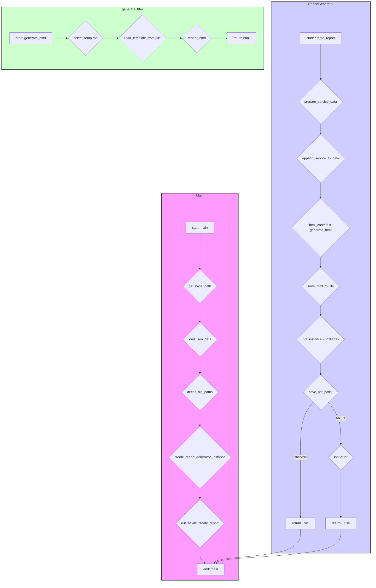

## АНАЛИЗ КОДА: `hypotez/src/endpoints/kazarinov/pricelist_generator/pricelist_generator.py`

### 1. <алгоритм>

**Блок-схема:**

```mermaid
graph LR
    A[Начало: `main` функция] --> B{Определение `base_path`: Путь к данным};
    B --> C{Загрузка данных: `j_loads(base_path / f'{lang}.json')`};
    C --> D{Определение путей: `html_file`, `pdf_file`};
    D --> E{Создание экземпляра: `ReportGenerator`};
    E --> F{Запуск асинхронного метода: `asyncio.run(r.create_report(...))`};
    
    F --> G[Начало: `create_report` метод];
    G --> H{Подготовка сервисных данных (словарь)};
    H --> I{Добавление сервиса в `data['products']`};
    I --> J{Вызов `generate_html(data, lang)`};

    J --> K[Начало: `generate_html` метод];
    K --> L{Выбор шаблона: `template_table_he.html` или `template_table_ru.html`};
    L --> M{Чтение шаблона: `Path(template_path).read_text(encoding = 'UTF-8')`};
    M --> N{Рендеринг HTML: `template.render(**data)`};
    N --> O[Возврат: HTML-контент];

    O --> P{Запись HTML в файл: `Path(html_file).write_text(...)`};
    P --> Q{Создание экземпляра: `PDFUtils`};
    Q --> R{Конвертация HTML в PDF: `pdf.save_pdf_pdfkit(html_content, pdf_file)`};
    R -- PDF создан --> S[Возврат: `True`];
    R -- PDF не создан --> T{Логирование ошибки};
    T --> U[Возврат: `False`];
    S --> V[Конец: `create_report` метод];    
    V --> W[Конец: `main` функция];
    U --> W;    
```

**Примеры:**

*   **Блок B**: `base_path` может быть `/external_storage/kazarinov/mexironim/24_12_01_03_18_24_269`.
*   **Блок C**: `data` будет JSON-словарем, загруженным из `/external_storage/kazarinov/mexironim/24_12_01_03_18_24_269/ru.json`.
*   **Блок L**: если `lang` равно `he`, будет выбран шаблон `template_table_he.html`, иначе - `template_table_ru.html`.
*   **Блок N**: на основе данных из `data` и содержимого шаблона будет сформирован HTML.
*   **Блок R**: HTML-содержимое конвертируется в PDF-файл.

### 2. <mermaid>



**Импортированные зависимости:**

*   `header`: Используется для определения корневой директории проекта. (см. следующий `mermaid`)
*   `asyncio`: Для асинхронного выполнения `create_report`.
*   `dataclasses`: Для создания `ReportGenerator` с использованием декоратора `@dataclass`.
*   `src.gs`: Для доступа к глобальным настройкам, таким как пути к файлам.
*   `json`: Для работы с JSON-файлами.
*   `pathlib.Path`: Для удобной работы с путями к файлам.
*   `jinja2`: Для рендеринга HTML из шаблонов.
*   `pdfkit`: Для генерации PDF-файлов (хотя в коде используется `src.utils.pdf.PDFUtils`).
*   `src.utils.jjson`: Для загрузки данных из JSON-файлов.
*   `src.utils.file`: Для чтения и записи текстовых файлов.
*   `src.utils.pdf`: Для конвертации HTML в PDF.
*   `src.utils.convertors.html`: Для конвертации HTML в PDF (также).
*   `src.utils.image`: Для получения случайных изображений.
*   `src.utils.printer`: Для вывода отладочной информации (не используется в предоставленном коде).
*    `src.logger.logger`: Для логирования ошибок.

**Дополнительно: `header.py`**


### 3. <объяснение>

**Импорты:**

*   `header`: Как упоминалось ранее, используется для определения корневой директории проекта.
*   `asyncio`: Используется для асинхронного запуска метода `create_report`, что позволяет не блокировать поток выполнения программы.
*   `dataclasses`: Модуль для автоматического создания методов (`__init__`, `__repr__` и т.д.) в классах, использующих декоратор `@dataclass`. В данном случае, для класса `ReportGenerator`.
*   `src.gs`: Модуль `gs`, вероятно, содержит глобальные настройки проекта, такие как пути к различным директориям. Это позволяет легко обращаться к нужным файлам, не прописывая пути вручную.
*   `json`: Модуль для работы с JSON. Используется для загрузки данных из JSON-файлов.
*   `pathlib.Path`: Модуль `Path` позволяет работать с путями к файлам и директориям как с объектами, что делает код более читаемым и удобным.
*   `jinja2`: Шаблонизатор для генерации динамического HTML-контента на основе шаблонов и данных.
*   `pdfkit`: Библиотека для генерации PDF из HTML. **ВНИМАНИЕ:** В коде используется кастомный класс `src.utils.pdf.PDFUtils`, который может иметь собственную реализацию pdfkit.
*   `src.utils.jjson`: Кастомная утилита для загрузки JSON-файлов. Скорее всего, содержит дополнительные обработки.
*   `src.utils.file`: Кастомная утилита для чтения и записи файлов.
*   `src.utils.pdf`: Кастомный класс `PDFUtils` для работы с PDF.
*   `src.utils.convertors.html`: Кастомная утилита для конвертации HTML в PDF. **Обратите внимание:** возможно дублирование функционала с `src.utils.pdf`.
*   `src.utils.image`: Кастомная утилита для получения случайных изображений.
*    `src.utils.printer`: Кастомная утилита для красивого вывода в консоль.
*   `src.logger.logger`: Кастомный модуль для логирования ошибок и другой информации.

**Классы:**

*   `ReportGenerator`: Класс, отвечающий за генерацию отчётов.
    *   `env: Environment`: Атрибут для хранения настроек Jinja2 Environment. Задается через `default_factory`, что бы экземпляр класса не хранил один и тот же объект.
    *   `generate_html(data: dict, lang:str) -> str`: Асинхронный метод, генерирующий HTML-код из шаблона и данных.
    *   `create_report(data: dict, lang:str, html_file:str| Path, pdf_file:str |Path) -> bool`: Асинхронный метод, реализующий полный цикл генерации отчёта, включая создание HTML, добавление сервисной информации и генерацию PDF.

**Функции:**

*   `main(mexiron: str, lang: str) -> bool`: Основная функция для запуска генерации отчета.
    *   Аргументы: `mexiron` (имя папки), `lang` (язык).
    *   Возвращает: `bool` - признак успешного завершения.
    *   Назначение: Инициализирует пути к файлам, загружает данные, создаёт экземпляр `ReportGenerator` и запускает процесс создания отчета.

**Переменные:**

*   `template`: Имя HTML-шаблона.
*   `template_path`: Полный путь к HTML-шаблону.
*    `template_string`: Содержимое шаблона
*   `html_content`: Сгенерированный HTML-контент.
*   `html_file`: Путь к HTML-файлу.
*   `pdf_file`: Путь к PDF-файлу.
*   `data`: Словарь с данными из JSON-файла.
*    `service_dict`: Словарь с сервисными данными.
*   `r`: Экземпляр класса `ReportGenerator`.
*    `pdf`: Экземпляр класса `PDFUtils`

**Потенциальные ошибки и области для улучшения:**

*   **Дублирование функционала:** Есть дублирование функциональности конвертации HTML в PDF в `src.utils.pdf.PDFUtils` и `src.utils.convertors.html`. Необходимо унифицировать это.
*   **Обработка ошибок:** Обработка ошибок при генерации PDF (если PDF не создан). Можно сделать более детальную обработку.
*   **Конфигурация `pdfkit`:** В коде есть закомментированная строка с конфигурацией `pdfkit`. В текущем виде `pdfkit` может использовать не тот бинарник `wkhtmltopdf`
*   **Магические строки:** Использование "template_table_he.html" и "template_table_ru.html", а также "Сервис" и "שירות" можно вынести в константы.
*   **Зависимости:** Жесткие зависимости от `gs.path` необходимо сделать более гибкими.
*   **Унификация параметров:** `create_report` и `generate_html` принимают много параметров. Необходимо посмотреть на возможность создать класс для параметров.

**Цепочка взаимосвязей с другими частями проекта:**

*   Использует `src.gs` для получения путей.
*   Использует `src.utils.jjson`, `src.utils.file`, `src.utils.pdf`, `src.utils.convertors.html`, `src.utils.image` для выполнения конкретных задач.
*   Использует `src.logger.logger` для логирования.

Таким образом, данный код представляет собой модуль для генерации HTML- и PDF-отчётов на основе шаблонов и JSON-данных с использованием Jinja2 и pdfkit.