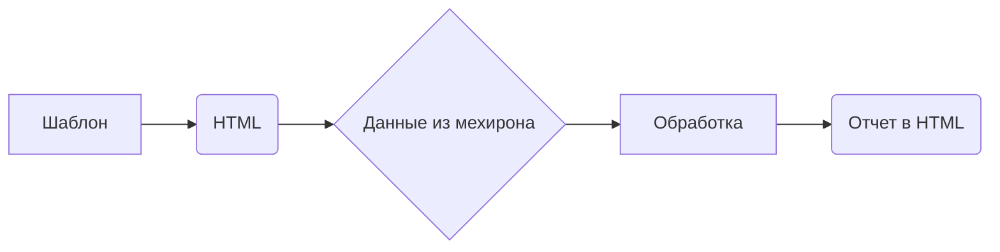

```MD
# Анализ шаблона для генерации HTML отчета из сценария мехирона

## <input code>

```
Шаблон для создания HTML отчета из сценария мехирона
```

## <algorithm>

К сожалению, предоставленный код пустой.  Невозможно построить блок-схему или диаграмму без кода.  Чтобы проанализировать алгоритм, необходимо предоставить сам шаблон.  Предполагается, что этот шаблон будет содержать HTML-разметку, возможно, с встраиванием данных из сценария мехирона.

## <mermaid>



**Описание диаграммы:**

*   **Шаблон (A):**  Представляет собой исходный шаблон для генерации HTML-отчета.
*   **HTML (B):**  Представляет собой HTML-разметку, которая формирует структуру отчета.
*   **Данные из мехирона (C):**  Представляют собой данные, извлекаемые из сценария мехирона.  Эти данные могут быть различными (строки, числа, массивы, и т.д.) в зависимости от сценария.
*   **Обработка (D):**  Эта часть отвечает за подстановку данных из мехирона в шаблон HTML.
*   **Отчет в HTML (E):**  Представляет собой готовый HTML-отчет, сформированный из шаблона и данных.


## <explanation>

Без кода невозможно дать подробное объяснение.  Однако, можно предположить, что шаблон будет включать:

*   **HTML-теги:** `<html>`, `<head>`, `<body>`, `<table`, `<div>` и т.д.
*   **Переменные или placeholders:**  Места, где будут подставляться данные из сценария мехирона.  Например, `{{ цена }}`, `{{ дата }}`.
*   **Логика встраивания данных:**  Код, отвечающий за извлечение данных из сценария мехирона и их вставку в определенные места шаблона.

**Возможные ошибки и области для улучшений:**

*   **Отсутствие валидации данных:**  Нужно убедиться, что данные, получаемые из мехирона, соответствуют ожидаемым типам и форматам.  В противном случае, это может привести к ошибкам в генерации отчета.
*   **Недостаточная гибкость:** Шаблон может быть не очень гибким, если нужно генерировать различные виды отчетов.  Более структурированный подход (например, с использованием шаблонов Jinja2 или подобных библиотек) может улучшить гибкость.
*   **Без обработки ошибок:** Необходимо добавить механизмы обработки ошибок, чтобы программа могла корректно реагировать на исключительные ситуации (например, отсутствие данных, некорректный формат данных).

**Цепочка взаимосвязей:**

Цепочка взаимосвязей будет зависеть от конкретной реализации.  Скорее всего, сценарий мехирона (или соответствующая ему программа) будет передавать данные в функцию или метод, отвечающий за генерацию HTML. Затем, этот метод использует шаблон и данные для формирования готового отчета.  Готовый отчет может затем быть сохранен в файл, отправлен в базу данных или использован другим компонентом программы.

**В заключение:**  Пожалуйста, предоставьте код шаблона для более подробного анализа.