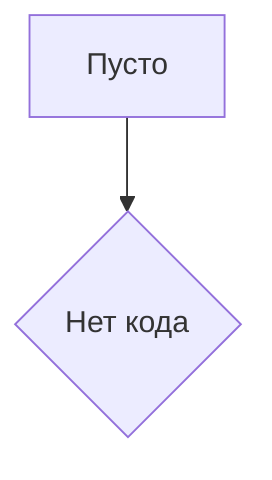

# <input code>

```Шаблон для создания HTML отчета из сценария мехирона```

# <algorithm>

К сожалению, предоставленный код пуст и не содержит никакой информации о коде.  Поэтому алгоритм работы, блок-схема и примеры построить невозможно.  Для анализа необходимо предоставить сам код.

# <mermaid>



# <explanation>

Указанный фрагмент кода представляет собой лишь описание задачи — создание HTML отчета из сценария мехирона.  Сам код отсутствует.  Поэтому невозможно проанализировать импорты, классы, функции, переменные и т.д.  Для полноценного объяснения предоставьте, пожалуйста, сам код.

**Для корректного анализа кода необходимо предоставить сам код.**