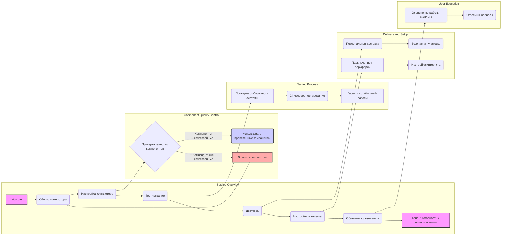

## Анализ кода `service_as_product_he.html`

### 1. <алгоритм>

**Описание алгоритма:**

Представленный HTML-код описывает услуги по сборке и настройке компьютера, предоставляемые специалистом. Код структурирован в виде списка из шести шагов, каждый из которых является отдельным этапом процесса оказания услуги.

**Блок-схема:**

```mermaid
graph LR
    A[Начало: Вывод описания услуги] --> B(Шаг 1: Сборка компьютера);
    B --> C{Проверка качества компонентов};
    C -- Да --> D(Использование проверенных компонентов);
    D --> E(Шаг 2: Полная настройка);
    E --> F(Установка ОС, драйверов и программ);
    F --> G(Обновление ПО);
    G --> H(Шаг 3: Тестирование в течение 24 часов);
    H --> I{Тестирование под нагрузкой};
    I -- Да --> J(Гарантия стабильной работы);
    J --> K(Шаг 4: Доставка);
    K --> L(Упаковка для безопасной транспортировки);
    L --> M(Шаг 5: Подключение и настройка на месте);
    M --> N(Подключение к периферии, настройка интернета);
    N --> O(Шаг 6: Объяснение работы системы);
    O --> P(Инструктаж пользователя);
    P --> Q(Конец: Готовность к использованию);
    C -- Нет --> R(Замена компонентов);
    R --> B;
```

**Примеры:**

* **Шаг 1: Сборка компьютера:** Специалист собирает компьютер, выбирая компоненты, соответствующие требованиям клиента. Пример: сборка системного блока из материнской платы, процессора, оперативной памяти, видеокарты и т.д.
* **Шаг 2: Полная настройка:** Установка операционной системы Windows, необходимых драйверов для устройств (звук, видео, сеть), и установка стандартного набора программ (браузер, офис).
* **Шаг 3: Тестирование в течение 24 часов:** Запуск стресс-тестов для проверки стабильности работы компьютера при максимальных нагрузках. Пример: тестирование процессора и видеокарты в играх или бенчмарках.
* **Шаг 4: Доставка:** Персональная доставка собранного компьютера клиенту. Пример: доставка в офис клиента в заранее оговоренное время.
* **Шаг 5: Подключение и настройка на месте:** Подключение компьютера к монитору, клавиатуре, мыши, и настройка интернета. Пример: настройка Wi-Fi подключения к сети клиента.
* **Шаг 6: Объяснение работы системы:** Инструктаж пользователя о том, как пользоваться новым компьютером, запуск программ, и ответы на вопросы. Пример: демонстрация основных функций операционной системы, работа с файловой системой и т.д.

### 2. <mermaid>

**Объяснение `mermaid` диаграммы:**

* **`Service Overview`:** Основной граф, отображающий последовательность шагов предоставления услуги, от `Начала` до `Конца`.
*   **`Component Quality Control`**: Подграф, отображающий процесс контроля качества компонентов, где некачественные компоненты заменяются.
*   **`Testing Process`**: Подграф, отображающий процесс тестирования системы на стабильность.
*  **`Delivery and Setup`**: Подграф, отображающий процесс доставки и настройки компьютера на месте у клиента.
*  **`User Education`**: Подграф, отображающий процесс обучения пользователя.
*   **Стилизация:**  Начало и конец процесса выделены цветом (`#f9f`)  для визуального различия, а также `K` заполняется красным.
*   **Связи:**  Стрелки показывают последовательность этапов и взаимосвязи между ними.

Диаграмма `mermaid` демонстрирует общую структуру процесса предоставления услуги, начиная со сборки компьютера и заканчивая обучением пользователя, с особым вниманием на контроль качества компонентов, тестирование системы и доставку.

### 3. <объяснение>

**Импорты:**
В данном коде нет импортов, так как это HTML-файл, предназначенный для отображения контента, а не для выполнения программного кода.

**Классы:**
В данном коде нет классов, так как он представляет собой статическую структуру HTML, используемую для отображения текста и форматирования.

**Функции:**
В данном коде нет функций, поскольку это HTML-файл. HTML-файлы используются для описания структуры и содержимого веб-страницы, а не для выполнения каких-либо действий.

**Переменные:**
В данном коде нет переменных в смысле переменных программирования. HTML-теги и атрибуты можно рассматривать как структурные элементы, но это не переменные в контексте программирования.

**Подробное объяснение:**

Представленный HTML-код является шаблоном для описания услуги по сборке и настройке компьютера. Он представляет собой структурированный текст, разделенный на несколько частей:

1.  **Заголовок (`<h3>`)**: "שירותי הרכבה והגדרת מחשב" — это заголовок, обозначающий основную тему страницы: "Услуги по сборке и настройке компьютера".
2.  **Подзаголовки (`<h4>`):** Представляют собой этапы оказания услуги:
    *   "1. הרכבת המחשב" — "1. Сборка компьютера". Описание процесса сборки, где специалист подбирает и устанавливает комплектующие.
    *   "2. הגדרה מלאה" — "2. Полная настройка". Описание процесса настройки, включающей установку операционной системы, драйверов и программ.
    *   "3. הרצה וניסוי למשך 24 שעות" — "3. Запуск и тестирование в течение 24 часов". Описание процесса тестирования системы для проверки стабильности работы.
    *   "4. משלוח" — "4. Доставка". Описание процесса доставки компьютера клиенту.
    *   "5. חיבור והגדרה במקום" — "5. Подключение и настройка на месте". Описание процесса подключения компьютера у клиента.
    *   "6. הסבר על תפעול המערכת" — "6. Объяснение работы системы". Описание процесса обучения пользователя.
3.  **Текстовые абзацы (`
`)**: Подробно описывают каждый этап услуги. Важным элементом является абзац с классом `"note"`, который содержит примечание о лицензировании программного обеспечения.
4.  **Примечание о лицензировании (`
`)**: Указывает, что лицензии на операционную систему и другое программное обеспечение не включены в стоимость услуги.
5.  **Заключительное утверждение (`
<strong>`)**: Подчеркивает готовность компьютера к немедленному использованию после установки.

**Потенциальные ошибки и области для улучшения:**

*   **Отсутствие динамического контента:** HTML-код статический. Для большей интерактивности и адаптации к различным условиям (например, разные цены на услуги, различные конфигурации компьютеров) потребовалось бы добавить динамические элементы с использованием серверного языка программирования или JavaScript.
*   **Отсутствие структурированных данных**:  Информация представлена в основном в виде текста. Для более эффективного использования, например, в системах автоматизированной обработки данных, можно было бы использовать структурированные данные (JSON или XML).
*   **Локализация:** Хотя текст на иврите, в нем могут быть использованы переменные для более удобной локализации под разные языки.

**Взаимосвязи с другими частями проекта:**

*   **Шаблонизатор:** Этот HTML-файл, вероятно, является шаблоном, который будет использоваться шаблонизатором для создания динамических страниц. Он может быть частью большей системы, которая управляет отображением веб-сайта.
*   **База данных:** Информация о ценах и конфигурациях может быть динамически получена из базы данных.
*   **Скрипты:** На страницу могут быть добавлены скрипты для обработки пользовательских взаимодействий (например, отправка формы заказа).

**Цепочка взаимосвязей:**

1.  Пользователь посещает веб-страницу, где отображается описание услуги.
2.  Шаблонизатор извлекает данные из базы данных и вставляет их в HTML-шаблон.
3.  Браузер отображает полученную HTML-страницу.
4.  Пользователь может связаться с поставщиком услуг по указанному номеру телефона.

**Заключение:**

HTML-код описывает структуру и содержание веб-страницы, предназначенной для описания услуги по сборке и настройке компьютера. Он структурирован логически и информативно, но является статическим, поэтому не может изменять свое содержание без дополнительных инструментов.