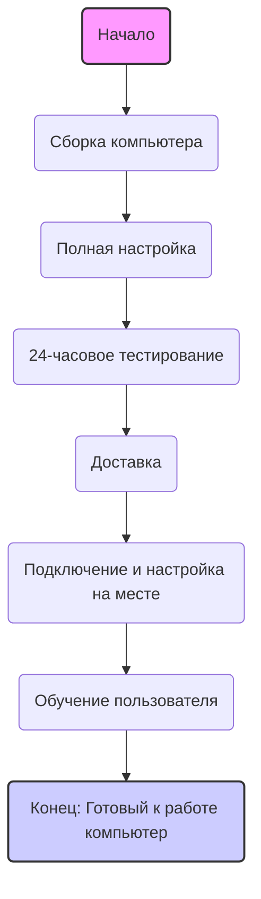

## Анализ HTML-кода для услуги сборки и настройки компьютера

### 1. <алгоритм>
Этот HTML-код представляет собой описание услуги сборки и настройки компьютера, предназначенной для конечного пользователя. Блок-схема отражает этапы предоставления услуги, начиная от сборки компьютера и заканчивая обучением пользователя.

**Этапы:**

1.  **Начало**: Пользователь обращается за услугой.
    *   _Пример:_ Пользователь заказывает услугу на сайте или связывается по телефону.

2.  **Сборка компьютера**: Сборка всех необходимых компонентов компьютера.
    *   _Пример:_ Выбор и установка процессора, материнской платы, оперативной памяти и т.д.

3.  **Полная настройка**: Установка операционной системы, драйверов и необходимого программного обеспечения.
    *   _Пример:_ Установка Windows, драйверов для видеокарты, принтера и т.д.

4.  **24-часовое тестирование**: Тестирование производительности и стабильности системы в течение 24 часов.
    *   _Пример:_ Проведение тестов под нагрузкой для проверки стабильной работы.

5.  **Доставка**: Доставка компьютера пользователю.
    *   _Пример:_ Доставка на дом или в офис в согласованное время.

6.  **Подключение и настройка на месте**: Подключение компьютера к монитору, клавиатуре, мыши и настройка интернета.
    *   _Пример:_ Подключение всех устройств и проверка их корректной работы.

7.  **Обучение пользователя**: Объяснение основных функций системы.
    *   _Пример:_ Инструктаж по использованию интерфейса Windows, запуску программ и т.д.

8. **Конец**: Пользователь может начинать работу с готовым компьютером.

### 2. <mermaid>

### 3. <объяснение>
**Импорты:**
В предоставленном коде импорты не используются. Это просто статический HTML-код, предназначенный для отображения текстовой информации об услуге.

**Классы:**
В данном HTML коде классы не используются.
Присутствуют классы css - "note" для стилизации элемента с пояснением про лицензии.

**Функции:**
В данном HTML коде функции не используются.
Смысл HTML кода - описание услуги в виде структурированного текста с заголовками и абзацами.

**Переменные:**
Переменные в коде HTML не используются.
В коде присутсвуют теги, которые влияют на визуальное отображения.

**Детальное объяснение:**

1.  **Структура HTML:**
    *   `<h3>`: Заголовок верхнего уровня, представляющий название услуги: "שירותי הרכבה והגדרת מחשב" ("Услуги по сборке и настройке компьютера").
    *   `<h4>`: Заголовки четвертого уровня, обозначающие отдельные этапы услуги:
        *   "הרכבת המחשב" (Сборка компьютера)
        *   "הגדרה מלאה" (Полная настройка)
        *   "הרצה וניסוי למשך 24 שעות" (24-часовое тестирование)
        *   "משלוח" (Доставка)
        *   "חיבור והגדרה במקום" (Подключение и настройка на месте)
        *   "הסבר על תפעול המערכת" (Обучение пользователя)
    *   `
`: Абзацы, предоставляющие подробное описание каждого этапа услуги.
    *   `
`: Абзац, содержащий примечание о том, что лицензии на операционную систему и программы не включены в стоимость услуги.
    *   `<strong>`: Выделение текста жирным шрифтом для акцентирования ключевого сообщения: "המחשב שלכם יהיה מוכן לשימוש מיד לאחר ההתקנה." ("Ваш компьютер будет готов к использованию сразу после установки.").

2.  **Язык:**
    *   Текст представлен на иврите (hebrew).

3.  **Функционал:**
    *   Код служит для отображения пользователю описания услуги. Он не содержит никакого динамического поведения или интерактивности.

**Потенциальные ошибки и области для улучшения:**

1.  **Отсутствие динамики:** HTML-код является статичным и не позволяет взаимодействовать с пользователем. Для улучшения можно использовать JavaScript для добавления интерактивных элементов, таких как кнопки "Заказать услугу" или формы обратной связи.
2.  **Стилизация:** Вид представленного текста не адаптирован под конкретную платформу. Необходимо добавить CSS-стили для оформления текста и адаптации под экраны различных размеров.
3.  **Локализация:** Для глобального использования текста необходима возможность его перевода на другие языки. Для этого можно использовать систему управления контентом или другие методы локализации.

**Цепочка взаимосвязей с другими частями проекта:**
Данный HTML-код, скорее всего, будет частью веб-страницы или другого веб-приложения. Его задача - отображение информации об услуге. Он может взаимодействовать с другими частями проекта, например:
    *   **Страница услуги:** HTML-код будет включен в раздел услуги на сайте.
    *   **Система управления контентом (CMS):** Текст может быть получен из CMS.
    *   **База данных:** Данные об услуге могут храниться в базе данных.
    *   **Модуль оформления заказа:** Страница может содержать кнопки для заказа услуги, которые будут взаимодействовать с системой оформления заказа.